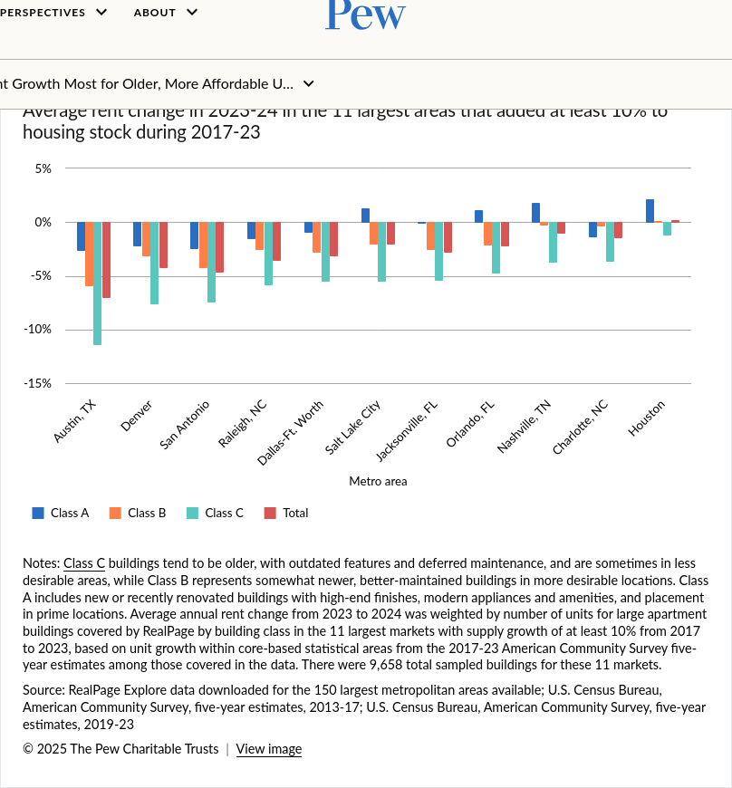

```{r}
#| echo: FALSE

library(tidyverse)
library(ggpattern)
library(ggplot2)
library(readxl)
library(scales)
library(ggrepel)
library(patchwork)


```


## Overview


For this assignment, you are assuming the role for a data scientist working for a city government and you have been tasked with providing technical advice to the mayor and city council about whether or not permitting reform could help address housing affordability. You have access to a dataset which
which provides demographic and economic information at a number of different 
organizational levels across the country. The assignment will consist of parts where you will answer questions about visualizations that are presented to you, and other parts where you improve upon them to make them more informative or so that they tell a better story.

## Background

In recent years, many parts of the United States have experienced an
increase in housing costs. The Harvard University Joint Center for Housing Studies published a 
report on the State of the Nation's Housing in 2026. Amongst the [10 takeaways](https://www.jchs.harvard.edu/blog/ten-takeaways-2026-state-nations-housing) from that report include a major decline in _residual income_ for renters earning under $30,000 dollars per year, record high median homeownership costs, and an increase in price of the cheapest rental units. High housing prices have been implicated as a cause of homelessness and other major problems in large metro areas, according to a [report by the Pew Foundation](https://www.pew.org/en/research-and-analysis/articles/2023/08/22/how-housing-costs-drive-levels-of-homelessness). 

Many different policies have been proposed to address this issue, including permitting reform. 
Recent data suggests that increased permitting slows or reverses increases in housing 
prices, with rent declines in fast-growing sun-belt cities such as Austin being held up as exemplars of this policy, see for example [Austin's Surge of New Housing Construction Drives Down Rents](https://www.pew.org/en/research-and-analysis/articles/2026/03/18/austins-surge-of-new-housing-construction-drove-down-rents), which describes the issue in Austin primarily, and [New Housing Slows Rent Growth Most for Older, More Affordable Units](https://www.pew.org/en/research-and-analysis/articles/2025/07/31/new-housing-slows-rent-growth-most-for-older-more-affordable-units). However, this is still an area of active research where there is much debate about the causal factors of housing costs. If you want to learn more about the nuances here are some references:

1. E. Glaeser and J. Gyourko. [_The Economic Implications of Housing Supply_](https://pubs.aeaweb.org/doi/pdfplus/10.1257/jep.32.1.3). **JEP** (2018). 32:1
2. V. Been, I. Gould Ellen, and K. O'Reagan. [_Supply Skepticism Revisited](https://www.tandfonline.com/doi/full/10.1080/10511482.2024.2418044). **Housing Policy Debate**. (2025). 35.1
3. A. Damiano. [Supply Skepticism or Supply Realism?](https://www.tandfonline.com/doi/full/10.1080/10511482.2024.2418059). **Housing Policy Debate**. (2025). 35.1

## Problem 1: Bars and Dots

Consider Figure 2 from _New Housing Slows Rent Growth Most for Older, More Affordable Units_:



(a) This figure allows you to make two types of comparisons: (1) differences in rent changes across
different building classes within the same city and (2) differences in rent changes across different cities. Which perceptual visualization tasks might you use when making these comparisons using Figure 2?

(b) The data is available to you in the file [pew_fig2_rent_change_class.csv](https://raw.githubusercontent.com/georgehagstrom/DATA608Fall2026/main/website/assignments/stories/data/story_1/pew_fig2_class_rent_change.csv), with [pew_fig2_dict.qmd](https://raw.githubusercontent.com/georgehagstrom/DATA608Fall2026/main/website/assignments/stories/data/story_1/pew_fig2_dict.qmd) describing the data source and variables. Visualize this data in two different ways: (1) using a Cleveland dot plot and (2) splitting the bar-plots onto multiple axes (see [UCRs dot-plot page](https://uc-r.github.io/cleveland-dot-plots) or [Wilke chapter 6](https://clauswilke.com/dataviz/visualizing-amounts.html) ). Compare these two images to the original Figure 2, what are the pros and cons of each?


## Problem 2: Fixing a Bad Figure


(a) _Analyze the problems with a bad figure_. Your predecessor on the data team had been working on a presentation about permiting reform
and left you the following figure. There are a number of problems with the figure, and it has a surprising conclusion given the recent research. Take a close look at the figure and code and list all of the ways that the figure is bad/ugly/wrong.

```{r}

msa = read_csv("https://raw.githubusercontent.com/georgehagstrom/DATA608Fall2026/main/website/assignments/stories/data/story_1/MSA_permits_demography.csv")
zori = read_csv("https://raw.githubusercontent.com/georgehagstrom/DATA608Fall2026/main/website/assignments/stories/data/story_1/zori_lab1.csv")

# Lets make a bad figure

zori

raw <- zori |>  
  mutate(year = year(date)) |> 
  group_by(cbsa,Region,year) |> 
  summarise(zori = mean(zori,na.rm=TRUE),.groups="drop") 
raw

raw |> 
  ggplot(aes(year,zori)) +
  geom_col(aes(fill=year)) +
  facet_wrap(~Region)
  


p1 = msa |> filter(year == 2025,
              population > 100000) |> 
  arrange(units_total) |> rename(RegionName = Region) |> left_join(raw,by=c('cbsa','year')) |> head(10) |> 
  ggplot(aes(RegionName,zori)) +
  geom_col_pattern(pattern = "image",
                   pattern_filename = "/home/georgehagstrom/work/Teaching/2026_Fall/DATA608Fall2026/website/assignments/stories/data/story_1/skyscraper.png",
                   pattern_type = 'tile') +
  labs(title = "Low Permit Metros") +
  coord_cartesian(ylim = c(750, 3500)) +
  theme(axis.text.y = element_blank()) +
  theme(axis.text.x = element_blank()) +
  theme(text = element_text(family = "Lobster Two", size = 20),
        plot.title = element_text(family = "Lobster Two", size = 30, colour = "#1A9850"),
        panel.grid.major = element_line(colour = "#1A9850"),
        panel.border = element_rect(colour = "#1A9850", fill = NA, linewidth = 1.5))
  

p2 = msa |> filter(year == 2025,
              population > 100000) |> 
  arrange(desc(units_total)) |> rename(RegionName = Region) |> left_join(raw,by=c('cbsa','year')) |> head(10) |> 
  ggplot(aes(RegionName,zori)) +
  geom_col_pattern(pattern = "image",
                   pattern_filename =  "/home/georgehagstrom/work/Teaching/2026_Fall/DATA608Fall2026/website/assignments/stories/data/story_1/skyscraper.png",
                   pattern_type = 'tile') +
  labs(title="High Permit Metros") +
  coord_cartesian(ylim = c(750, 3500)) +
  theme(axis.text.y = element_blank()) +
  theme(axis.text.x = element_blank()) +
  theme(text = element_text(family = "Roboto Condensed", size = 20),
        plot.title = element_text(family = "Roboto Condensed", face="bold", size = 30, colour = "#A50026"),
  panel.grid.major = element_line(colour = "#A50026"),
  panel.border = element_rect(colour = "#A50026", fill = NA, linewidth = 1.5))

p1 + p2


```
::: {.callout-note appearance="simple" icon=false}
Figure compares the average rent in 2025 as measured by the Zillow Observed Rent Index of the metropolitan statistical areas with the lowest number of permitted units (left) and the highest number of permitted units (right) in 2025. The metros that permitted the highest number of units had the highest rents, suggesting that permitting fewer units is the best policy.
:::


(b) _Create a data story about this data_. You have been given datasets with information about 
rent, building permits, and demographics (population and net-migration) in metropolitan statistical areas, covering a period from 2015 to 2026 (rents) and 2021 to 2025 (permits and demographics). You should create several figures (2-3) to explain whether or not building permits policy can help reduce rents. Assume that your audience is the city government at a large city in the United States (e.g. New York City). Your story must be entirely told by your figures, though you may use text sparingly in the title/subtitle and annotations to enhance your story. Provide a one to two paragraph explanation of the choices you made for your figure. Do not include exploratory figures/discussion. 
