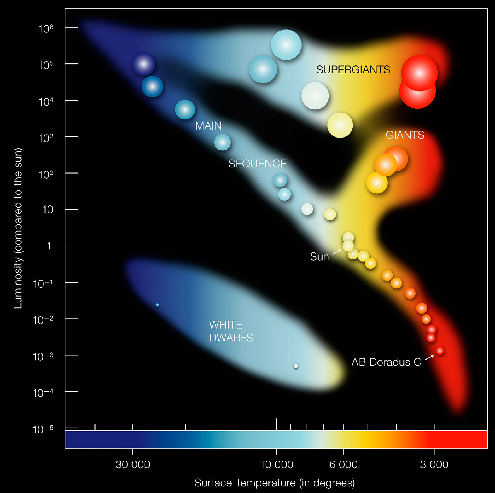
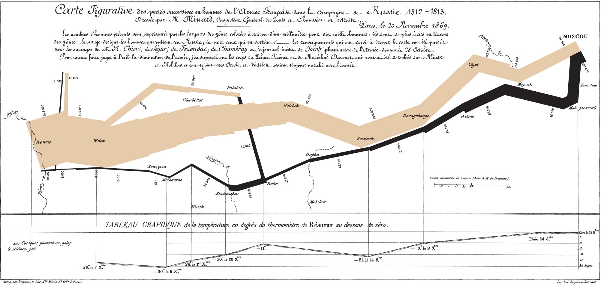

```{r}
#| echo: False
#| output: False
library(tidyverse)
library(kableExtra)
library(ggrepel)
library(lubridate)
library(scales)
library(patchwork)
library(ggthemes)
library(DT)

```

## Why Visualizations Matter

- Graphs are the main way we communicate data
- Your visualizations are how people will remember your analysis, can make or break your recommendations to decision makers.
- Two goals of the class:
  1. Learn how to tell stories with graphs
  2. Learn to make good visualizations

## Why do we need a class on this?

- People are not naturally good at telling stories using data
{width=40%}


## Why do we need a class on this?

- The world is full of awful visualizations

{width=50%}

## Why do we need a class on this?

- The world is full of awful visualizations

{width=50%}


## Why do we need a class on this?

- The world is full of awful visualizations

{width=60%}

## Why do we need a class on this?

- The world is full of awful visualizations

{width=60%}


## Case Study

- Your firm had two employees leave in May
- This caused a backlog of work

{width=70%}

## Case Study

- Highlight the key features to tell a story

{width=70%}

## Course Website and Meetup

:::: {.columns}

::: {.column width="50%"}

-  Brightspace to submit homework
- Course Meetup: Monday 8:00-9:00PM
- [Zoom Link](https://us02web.zoom.us/j/6211354884?omn=86938044575)


:::

::: {.column width="50%"}


:::
::::

## Slack Channel

:::: {.columns}
::: {.column width="50%"}
- Course slack channel for messaging and rapid communications
  - [https://cuny-msds.slack.com](https://cuny-msds.slack.com)
  - [Invite Link](https://join.slack.com/t/cuny-msds/shared_invite/zt-3ans1b3dz-5HhIols06wNraCMUhZ~jXw)

:::

::: {.column width="50%"}

:::
::::

## Textbooks

:::: {.columns}
::: {.column width="50%"}
Two most important textbooks:

1. [Fundamentals of Data Visualization](https://clauswilke.com/dataviz/)

2. [Data Visualization: A Practical Introduction](https://socviz.co/)
:::

::: {.column width="50%"}


:::

::::


## Textbooks

:::: {.columns}
::: {.column width="50%"}
Two most important textbooks:

1. [Fundamentals of Data Visualization](https://clauswilke.com/dataviz/)

2. [Data Visualization: A Practical Introduction](https://socviz.co/)
:::

::: {.column width="50%"}


:::

::::


## Textbooks

:::: {.columns}


:::: {.columns}
::: {.column width="50%"}

- For _pythonistas_

1. [Scientific Visualization: Python + Matplotlib](https://inria.hal.science/hal-03427242/document)

:::

::: {.column width="50%"}


:::

::::


## Textbooks


:::: {.columns}
::: {.column width="50%"}

Useful for the story/business framing

4. Storytelling with data
  - Available free online at library [Storytelling](https://onlinelibrary-wiley-com.remote.baruch.cuny.edu/doi/book/10.1002/9781119055259)
:::

::: {.column width="50%"}

:::


## Textbooks


:::: {.columns}
::: {.column width="50%"}

Useful for the story/business framing

4. Storytelling with data
  - Available free online at library [Storytelling](https://onlinelibrary-wiley-com.remote.baruch.cuny.edu/doi/book/10.1002/9781119055259)
:::

::: {.column width="50%"}

:::
::::


## Assignments

- 6 Lab Assignments (60\%)
  - Submit a qmd source and rendered slides to brightspace
  - 'R' or 'python' choice
- 6 Figure Corrections (18\%)
  - Opportunity to correct figures from lab assignment
- Short Interactive Project (22\%)
  - Shiny App on dataset of your choosing


## Week Plan: Readings

- Chapters 1 and 2 of Fundamentals of Dataviz
- Preface and part of Chapter 1 of Healy's Data Visualization:
  - Why look at data?
  - What makes figures look bad?
  - Problems of honesty and judgement


## Week Plan: Assignments
  
- Due in two weeks: Data Story 1

## Week Plan: Key Concepts

- Methods for creating a story (Storytelling)
- What makes a quality figure (Wilke, Healy)

## Context: Purposes of Visualizations

:::: {.columns}

::: {.column width="40%"}

- [Exploratory]{style="color:red;"}
- Explanatory
- Inferential

:::

::: {.column width="60%"}


:::
::::


## Context: Purposes of Visualizations

:::: {.columns}

::: {.column width="40%"}

- Exploratory
- [Explanatory]{style="color:red;"}
- Inferential

:::

::: {.column width="60%"}


:::
::::


## Context: Purposes of Visualizations

:::: {.columns}

::: {.column width="40%"}

- Exploratory
- Explanatory
- [Inferential]{style="color:red;"}

:::

::: {.column width="60%"}


:::

::::

## Context: Who, What, and How

Before you begin, start with three questions

- Who will see your figure?
  - You would make different choices presenting to experts,
  decision makers/stakeholders, your supervisor, or the general public


## Context: Who, What, and How

- Figure for Decision Makers (IPCC SPM):


## Context: Who, What, and How

- Figure for other scientists (IPCC)


## Context: Who, What, and How

- Figure for other scientists (IPCC)


## Context: Who, What, and How

Before you begin, start with three questions

- What do you want your audience to know or do?
  - There needs to be a point or story beyond "this is interesting"


## Context: Who, What, and How

- Consider the Mechanism
- More details in written comms than presentations


## Context: Who, What, and How

Before you begin, start with three questions

- How?
  - What data will you use to accomplish this?
- Don't hide non-supporting data
  - Trust is built over time but destroyed in an instant
  - Building trust is key for convincing people to take action on your recommendations, in all sorts of settings

## The Elevator Pitch and Big Idea

- If you had just 3 minutes to tell your audience what they need to know,
what would you say?
  - What is the overall topic/problem (get into it fast)
  - Why is it important (bring emotion into it)
  - Try to find a good punchline to complete the narrative

## Big Idea: Single Sentence Summary

- Convey your unique point of view
- Must convey what is at stake


## The Storyboard

- Storyboard is like a visual outline of the story you want to tell
- Arose in TV, film, and other narrative media
- Sketch out the narrative and visual elements of your data story.
- 2-6 elements
- Problem, Research Question, Data, Insights, Recommendation/Conclusion

## The Storyboard


## Why Stories?

- Humans are wired to hear and tell stories, it is how we relate
- Neuroscience research backs this up
- Good stories create synchrony across multiple brain regions between storyteller and listener
 
 

## Why Stories?

- Humans are wired to hear and tell stories, it is how we relate
- Neuroscience research backs this up
- Good stories create synchrony across multiple brain regions between storyteller and listener
 
 


## Bad, Ugly, and Wrong Figures

```{r fig.height=8, fig.width = 12}

library(palmerpenguins)


good = penguins |> ggplot(aes(x=species)) + 
  geom_bar() +
  theme_bw(base_size = 24) +
  labs(title = "Good",
       y = "Count",
       x = "Species")

ugly = penguins |> ggplot(aes(x=species,fill=species)) +
  geom_bar(show.legend = FALSE) +
  scale_fill_brewer(palette = "Pastel1") +
  theme(text=element_text(size=38,  family="Arial",color="Purple")) +
  labs(title = "Ugly",
       y = "Count",
       x = "Species")


bad = penguins |> ggplot(aes(x=species)) + 
  geom_bar() +
  theme_bw(base_size = 24) +
  labs(title = "Bad",
       y = "Count",
       x = "Species") +
  coord_cartesian(ylim = c(55, 150))

  wrong = penguins |> filter(body_mass_g <4300, sex == "female") |>   ggplot(aes(x=species)) + 
  geom_bar() +
    theme_bw() +
    theme(axis.title.x=element_blank(),
        axis.text.y=element_blank(),
        axis.ticks.y=element_blank(),
        text = element_text(size=24)) +
  labs(title = "Wrong",
       y ="",
       x = "")

(good + ugly)/(bad + wrong)

```

## What Makes Bad Figures Bad

- Healy: _Aesthetic_, _Substantive_, _Perceptual_
- Next weeks will address these specifically


## What About Great Figures?

- There are no principles/rules for going from good to great 
- Perfect the good first, then your creativity can help you make something great




## What About Great Figures?

- There are no principles/rules for going from good to great 
- Perfect the good first, then your creativity can help you make something great




## Advert

- Once per month (Tuesday, Wedneday, Thursday) "field trips" to New York Open Statistical Computing Meetup
- Send me a DM I'll add you to the email list
- [nyhackr.org](nyhackr.org)


## Thanks!


