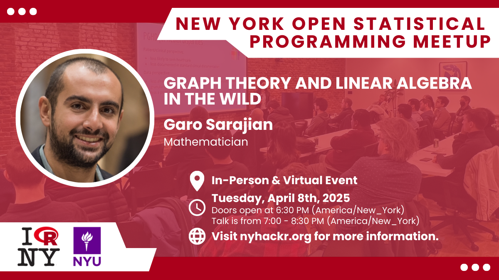
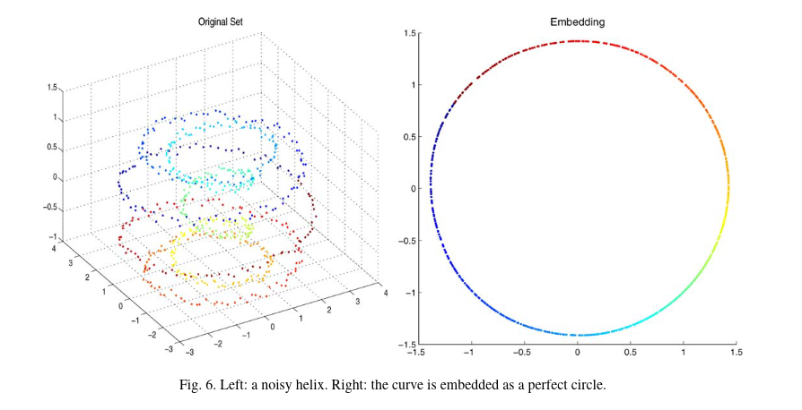
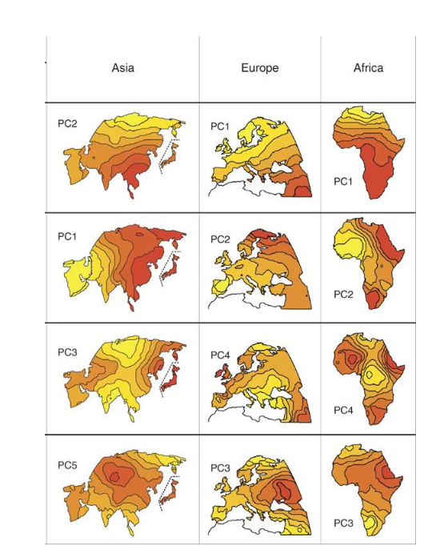
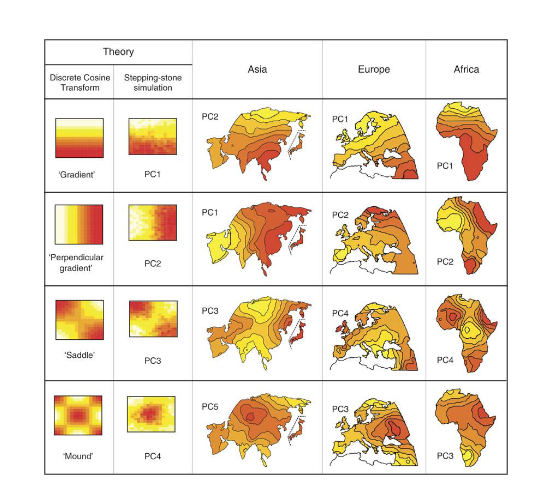

```{r}
#| echo: false
library(tidyverse)
library(ggplot2)
library(broom)
library(marginaleffects)
library(ggplot2)
library(GGally)
library(cowplot)

okabeito <- c('#E69F00', '#56B4E9', '#009E73', '#F0E442', '#0072B2', '#D55E00', '#CC79A7', '#999999', '#000000')
options(ggplot2.discrete.fill = okabeito)
options(ggplot2.discrete.colour = okabeito)

```


## Week Summary

- Data Story 5 is Due this Sunday at Midnight
- Reading is Section 12.3 of Fundamentals of Data Visualization
- What to do when the data has too many variables to visualize?

## NY Open Statistical Computing Meetup

- April 8th 6:30-8:30+
- Great Networking/Learning Opportunity



## Many variables?

- Pair Plot?

```{r}

library(readr)
library(lubridate)
library(ggrepel)
library(DAAG)
data(ais)
aus_athletes = tibble(ais)

#ais |> ggpairs()

ais |> select(-sex,-sport) |>  ggpairs() + 
  theme_minimal(base_size=12)


```

## Pair Plots are Limited

- Data is physiological properties of Australian Olympians
- Takes time to read
- Other options like correlograms also somewhat limited
- We could use an alternative even though these techniques are useful


## Hopeless when data increases more

- Here is a dataset of biomarker measurements from both ovarian cancer patients and healthy controls
- There are 4000 variables
- There will be no pair-plots

```{r}
oc_data = read_csv("DATA/ovariancancer_obs.csv")
oc_data


```


## Dimensionality Reduction

- Many datasets have a large number of variables
- We often have intuition that the data follows simpler patterns 
- Otherwise we couldn't understand it
- This motivates a search for simpler representations, which can be powerful visualization tools


## Low-D Representation

- Using a tool called Principal Component Analysis, can separate the groups neatly

```{r}
oc_group = read_csv("/home/georgehagstrom/work/Teaching/DATA608/Meetup10/DATA/ovariancancer_grp.csv")
pca_fit = oc_data |> 
  select(where(is.numeric))  |>  
  prcomp(scale = TRUE)


pca_fit |> 
 augment(oc_data)  |> 
  bind_cols(oc_group) |> 
  ggplot(aes(.fittedPC1, .fittedPC2, color =Cancer)) + 
  geom_point(size = 1.5) +
  scale_color_manual(
    values = c(Cancer = "#D55E00", Normal = "#0072B2")
  ) +
  theme_minimal(base_size=16) +
  labs(title="PCA Coordinates separate two classes well",
       x = "PC 1", y= "PC 2",subtitle = "Ovarian Cancer Status")

```


## 3D Representation

- 3D Neatly separates them

```{r}
#| fig-width: 8
library(plotly)


fig = pca_fit |> 
 augment(oc_data)  |> 
  bind_cols(oc_group) |> plot_ly(
    x=~.fittedPC1, y=~.fittedPC2, z=~.fittedPC3, color = ~Cancer, colors = c("#D55E00", "#0072B2"),size=2)
fig <- fig |>  add_markers()
fig <- fig |> layout(scene = list(xaxis = list(title = "PC1"),
                     yaxis = list(title = 'PC2'),
                     zaxis = list(title = 'PC3'))
                     )

fig

```


## Principal Component Analysis (PCA)

- PCA finds a new coordinate system
- New directions called `Principal Components`
- Each PC is a combination/rotation of other ones
- PCs ordered based variability of the data


## Simple PCA example

- Make a "1D" dataset in two dimensions
- Data lies along a straight line with some noise

```{r}


x = runif(100,-1,1)
y = .6*x + rnorm(length(x),mean=0,sd = 0.1)

data = tibble(x=x,y=y)

data |> ggplot(aes(x=x,y=y)) + geom_point() + 
  theme_minimal(base_size=16) +
  labs(title = "One Dimensional Dataset")
```

## Simple PCA Example

- PCA looks for vectors along which the "variance" is maximized

```{r}

data = data |> mutate(y2 = 0)


data |> ggplot(aes(x=x,y=y)) + geom_point() + 
  geom_line(aes(x=x,y=y2),color="red") +
  annotate("text",x=-0.5, y=0.2,label = "Hypothetical PC",color="red") +
  theme_minimal(base_size=16) +
  labs(title = "One Dimensional Dataset")


```

## Simple PCA Example

- Project data points onto component

```{r}

data = data |> mutate(y2 = 0)


data |> ggplot(aes(x=x,y=y)) + geom_point() + 
  geom_line(aes(x=x,y=y2),color="red") +
  annotate("text",x=-0.5, y=0.2,label = "Projected Data",color="red") +
  geom_point(aes(x=x,y=0),color="red") +
  theme_minimal(base_size=16) +
  labs(title = "One Dimensional Dataset")


```


## Find the Variance

- Project data points onto component

```{r}

data = data |> mutate(y2 = 0)
var_proj = var(data$x) 

data |> ggplot(aes(x=x,y=y)) + geom_point() + 
  geom_line(aes(x=x,y=y2),color="red") +
  annotate("text",x=-0.5, y=0.2,label = str_c("Projected Data, Variance = ",as.character(var_proj)),color="red") +
  geom_point(aes(x=x,y=0),color="red") +
  theme_minimal(base_size=16) +
  labs(title = "One Dimensional Dataset")


```


## Looking at Multiple Projections 

- Any projection is possible

```{r}
library(ggokabeito)
data = data |> mutate(y2 = 0)
var_proj = var(data$x) 

data |> ggplot(aes(x=x,y=y)) + geom_point() + 
  geom_line(aes(x=x,y=y2),color="red") +
  geom_line(aes(x=0,y=y),color=palette_okabe_ito(2)) +
  geom_point(aes(x=0,y=y),color=palette_okabe_ito(2)) +
  annotate("text",x=0.1,y=0.5,label=str_c("Var = ",as.character(round(var(data$y),2)))) +
  annotate("text",x=-0.5, y=0.2,label = str_c("Var = ",as.character(round(var_proj,2))),color="red") +
  geom_point(aes(x=x,y=0),color="red") +
  theme_minimal(base_size=16) +
  labs(title = "One Dimensional Dataset")


```


## First Principal Component

- PC1 maximizes variance

```{r}

library(ggokabeito)
data = data |> mutate(y2 = 0)
var_proj = var(data$x) 

data = data |> mutate(y_opt = 0.6*x)


pca_fit = data |> select(x,y) |>  prcomp(scaled = TRUE) 
pmat = pca_fit$rotation[1:2,1] %*% t(pca_fit$rotation[1:2,1])
data = data |> mutate(x_proj = x*pmat[1,1]+y*pmat[1,2],y_proj = x*pmat[2,1] + y*pmat[2,2])

var_pca = sum(diag(var(select(data,x_proj,y_proj))))

data |> ggplot(aes(x=x,y=y)) + geom_point() + 
  geom_line(aes(x=x,y=y2),color="red") +
  geom_line(aes(x=0,y=y),color=palette_okabe_ito(2)) +
  geom_point(aes(x=0,y=y),color=palette_okabe_ito(2)) +
  annotate("text",x=0.1,y=.5,label=str_c("Var = ",as.character(round(var(data$y),2)))) +
  annotate("text",x=-0.5, y=0.2,label = str_c("Var = ",as.character(round(var_proj,2))),color="red") +
  geom_point(aes(x=x,y=0),color="red") +
  geom_point(aes(x=x_proj,y=y_proj),color=palette_okabe_ito(3)) +
  geom_line(aes(x=x_proj,y=y_proj),color=palette_okabe_ito(3)) +
  annotate("text",x=0.5,y=0.5,label=str_c("Var = ",as.character(round(var_pca,2))),color = palette_okabe_ito(3)) +
  theme_minimal(base_size=16) +
  labs(title = "One Dimensional Dataset")


```


## Subsequent Projections Repeat Process

- PC1 is the direction with the most variance
- PC2 is perpendicular to PC1, most variance
- PC3 is perpendicular to PC1 and PC2, most variance
- $N$ dimensional dataset has $N$ PCs


## Why is it Dim. Reduction?

- Each PC is a variable
- You can discard low variance PCs
```{r}
pca_fit = oc_data |> 
  select(where(is.numeric))  |>  
  prcomp(scale = TRUE)

tibble(var_explained = (pca_fit$sdev)^2/4000) |> ggplot(aes(x=1:215,y=var_explained)) + geom_point() +
  labs(title="Ovarian Cancer Variance Explained",x="Principal Component",y="Variance Explained") +
  theme_minimal(base_size = 16)

```


## Picking a Dimension

- You can discard low variance PCs
- Use "Elbow" of plot to pick cutoff

```{r}
tibble(var_explained = (pca_fit$sdev)^2/4000) |> ggplot(aes(x=1:215,y=var_explained)) + geom_point() +
  annotate("rect",xmin=0,xmax=5,ymin=0.025,ymax=0.25,color=palette_okabe_ito(1),fill= palette_okabe_ito(1),alpha=0.3) +
  labs(title="Ovarian Cancer Variance Explained",x="Principal Component",y="Variance Explained") +
  theme_minimal(base_size = 16)


```

## Australian Atheletes Example

```{r}
#| fig-width: 10
#| fig-asp: 0.66
library(dviz.supp)

aus_athletes_no_na = aus_athletes |> drop_na()

cm =cor(select(aus_athletes_no_na,where(is.numeric)),use="pairwise.complete.obs")

#cm <- cor(select(forensic_glass, -type, -RI, -Si))

df_wide <- as.data.frame(cm)
df_long <- stack(df_wide)
names(df_long) <- c("cor", "var1")
df_long <- cbind(df_long, var2 = rep(rownames(cm), length(rownames(cm))))
clust <- hclust(as.dist(1-cm), method="average") 
levels <- clust$labels[clust$order]
df_long$var1 <- factor(df_long$var1, levels = levels)
df_long$var2 <- factor(df_long$var2, levels = levels)


ggplot(filter(df_long, as.integer(var1) < as.integer(var2)),
       aes(var1, var2, fill=cor, size = abs(cor))) + 
  geom_point(shape = 21, stroke = 0) + 
  scale_x_discrete(position = "top", name = NULL, expand = c(0, 0.5)) +
  scale_y_discrete(name = NULL) +
  scale_size_area(max_size = 14, limits = c(0, 0.7), guide = "none") +
  scale_fill_continuous_divergingx(
    palette = "Earth", rev = FALSE,
    limits = c(-.7, .7),
    breaks = c(-.7, 0, .7),
    labels = c("–0.5", "0.0", "0.5"),
    name = "cor",
    guide = guide_colorbar(
      direction = "horizontal",
      label.position = "bottom",
      title.position = "top",
      barwidth = grid::unit(140, "pt"),
      barheight = grid::unit(17.5, "pt"),
      ticks.linewidth = 1
    )
  ) +
  coord_fixed() +
  theme_dviz_open(rel_small = 1) +
  theme(
    axis.line = element_blank(),
    axis.ticks = element_blank(),
    axis.ticks.length = grid::unit(3, "pt"),
    legend.position = c(0.7, 0.5),
    legend.justification = c(0, 1),
    legend.title.align = 0.5
  )


```


## Athletes PCs

```{r}
aus_fit = aus_athletes |> 
  select(where(is.numeric))  |>  
  scale() |> 
  prcomp(scale = TRUE)

tibble(var_explained = (aus_fit$sdev)^2/13) |> ggplot(aes(x=1:11,y=var_explained)) + geom_col() +
  labs(title="Australian Athletes PCA Explained",x="Principal Component",y="Variance Explained") +
  theme_minimal(base_size = 16)


```


## PCA Clusters

```{r}

aus_fit  |> 
  augment(aus_athletes) %>%
  ggplot(aes(.fittedPC1, .fittedPC2,color=sex)) +
  geom_point(size = 1.5) +
  scale_color_manual(
    values = c(m = "#D55E00", f = "#0072B2")
  ) +
  theme_minimal(base_size=16) +
  labs(title="PCA Coordinates for Australian Athletes",
       x = "PC 1", y= "PC 2",subtitle = "Color shows sex")
```


## PC Clusters

:::: {.columns}

::: {.column width=50%}

- PC1: +Size, -Leanness (Sex)
- PC2: +Size, -Red Blood Cells

:::

::: {.column width=50%}

```{r}
#| fig-width: 6
#| fig-height: 6
arrow_style <- arrow(
  angle = 20, length = grid::unit(8, "pt"),
  ends = "first", type = "closed"
)
aus_fit %>%
  tidy(matrix = "rotation")  |> 
  pivot_wider(
    names_from = "PC", values_from = "value",
    names_prefix = "PC"
  )  |> 
  ggplot(aes(PC1, PC2)) +
  geom_segment(
    xend = 0, yend = 0,
    arrow = arrow_style
  ) +
  geom_text_repel(aes(label = column), hjust = 1,vjust=1) +
  xlim(-0.5, 0.5) + ylim(-0.25, 0.75) + 
  coord_fixed() +
  theme_minimal(base_size =16)


```
:::

::::


## Sports

```{r}

aus_fit  |> 
  augment(aus_athletes) %>%
  ggplot(aes(.fittedPC1, .fittedPC2,color=sex,label=sport)) +
  geom_text_repel(size = 3.0) +
  scale_color_manual(
    values = c(m = "#D55E00", f = "#0072B2")
  ) +
  theme_minimal(base_size=16) +
  labs(title="PCA Coordinates for Australian Athletes",
       x = "PC 1", y= "PC 2",subtitle = "Color shows sex")
```

## Sports Clusters

- 400m, gymnasts, tennis players have low PC2
- Netball, Field have high PC2
- Rowers, Sprinters, Swimmers, Water Polo in the middle


## Higher PCs Contrast

:::: {.columns}

::: {.column width=50%}

- PC3: +Body Fat, RBCs, -Height
- PC4: +Height, Fat, RBCs, -BMI

:::

::: {.column width=50%}

```{r}
#| fig-width: 6
#| fig-height: 6
arrow_style <- arrow(
  angle = 20, length = grid::unit(8, "pt"),
  ends = "first", type = "closed"
)
aus_fit %>%
  # extract rotation matrix
  tidy(matrix = "rotation") %>%
  pivot_wider(
    names_from = "PC", values_from = "value",
    names_prefix = "PC"
  ) %>%
  ggplot(aes(PC3, PC4)) +
  geom_segment(
    xend = 0, yend = 0,
    arrow = arrow_style
  ) +
  geom_text_repel(aes(label = column), hjust = 1,vjust=1) +
  xlim(-0.45, 0.25) + ylim(-0.25, 0.2) + 
  coord_fixed() +
  theme_minimal(base_size =16)


```
:::

::::


## Sport Clusters 2

```{r}

aus_fit  |> 
  augment(aus_athletes) %>%
  ggplot(aes(.fittedPC3, .fittedPC4,color=sex,label=sport)) +
  geom_text_repel(size = 3.0) +
  scale_color_manual(
    values = c(m = "#D55E00", f = "#0072B2")
  ) +
  theme_minimal(base_size=16) +
  labs(title="Higher PCA Plot",
       x = "PC 3", y= "PC 4",subtitle = "Basketball Players are tall")
```


## How to make these plots in R

- `prcomp` and `scale`
- `retx` keyword calcualtes embeddings
```{r}
#| echo: true
#| eval: false
aus_fit = aus_athletes |> 
  select(where(is.numeric))  |>  
  prcomp(scale = TRUE)

# or
# gets rid of mean and rescales variance

aus_fit = aus_athletes |> 
  select(where(is.numeric))  |>  
  scale() |> 
  prcomp(retx = TRUE)

```

## Contents of fit object

```{r}
#| echo: true

aus_fit

```


## Contents of fit object

```{r}
#| echo: true

str(aus_fit)


```


## Meaning of Components

- `sdev` is "standard deviation" of components
  - square to get "variance", 
  - divide by number of variables to convert to percentage
- `rotation` is matrix where rows are Principal Components
- `x` is matrix that contains embeddings of each data point

## Tidy PCA

- Use `augment` from `broom` to make objects tidy

```{r}
#| echo: true
aus_fit  |> 
  augment(aus_athletes)


```

## Plotting Embeddings

```{r}
#| echo: true
#| eval: false

aus_fit  |> 
  augment(aus_athletes) %>%
  ggplot(aes(.fittedPC1, .fittedPC2,color=sex)) +
  geom_point(size = 1.5) +
  scale_color_manual(
    values = c(m = "#D55E00", f = "#0072B2")
  ) +
  theme_minimal(base_size=16) +
  labs(title="PCA Coordinates for Australian Athletes",
       x = "PC 1", y= "PC 2",subtitle = "Color shows sex")
```


## Plotting Embeddings

```{r}

aus_fit  |> 
  augment(aus_athletes) %>%
  ggplot(aes(.fittedPC1, .fittedPC2,color=sex)) +
  geom_point(size = 1.5) +
  scale_color_manual(
    values = c(m = "#D55E00", f = "#0072B2")
  ) +
  theme_minimal(base_size=16) +
  labs(title="PCA Coordinates for Australian Athletes",
       x = "PC 1", y= "PC 2",subtitle = "Color shows sex")
```


## Drawing Clusters


```{r}
#| fig-width: 7
#| fig-height: 7

arrow_style <- arrow(
  angle = 20, length = grid::unit(8, "pt"),
  ends = "first", type = "closed"
)
aus_fit %>%
  tidy(matrix = "rotation")  |> 
  pivot_wider(
    names_from = "PC", values_from = "value",
    names_prefix = "PC"
  )  |> 
  ggplot(aes(PC1, PC2)) +
  geom_segment(
    xend = 0, yend = 0,
    arrow = arrow_style
  ) +
  geom_text_repel(aes(label = column), hjust = 1,vjust=1) +
  xlim(-0.5, 0.5) + ylim(-0.25, 0.75) + 
  coord_fixed() +
  theme_minimal(base_size =16)


```


## Drawing Clusters

```{r}
#| echo: true
#| eval: false
arrow_style <- arrow(
  angle = 20, length = grid::unit(8, "pt"),
  ends = "first", type = "closed"
)
aus_fit %>%
  tidy(matrix = "rotation")  |> 
  pivot_wider(
    names_from = "PC", values_from = "value",
    names_prefix = "PC"
  )  |> 
  ggplot(aes(PC1, PC2)) +
  geom_segment(
    xend = 0, yend = 0,
    arrow = arrow_style
  ) +
  geom_text_repel(aes(label = column), hjust = 1,vjust=1) +
  xlim(-0.5, 0.5) + ylim(-0.25, 0.75) + 
  coord_fixed() +
  theme_minimal(base_size =16)


```


## 3D Plot Using Plotly

```{r}
#| echo: true
#| eval: false

library(plotly)

fig = pca_fit |> 
 augment(oc_data)  |> 
  bind_cols(oc_group) |> plot_ly(
    x=~.fittedPC1, y=~.fittedPC2, z=~.fittedPC3, color = ~Cancer, colors = c("#D55E00", "#0072B2"),size=2)
fig <- fig |>  add_markers()
fig <- fig |> layout(scene = list(xaxis = list(title = "PC1"),
                     yaxis = list(title = 'PC2'),
                     zaxis = list(title = 'PC3'))
                     )

fig
```


## 3D Plot Using Plotly

```{r}


pca_fit = oc_data |> 
  select(where(is.numeric))  |>  
  prcomp(scale = TRUE)


fig = pca_fit |> 
 augment(oc_data)  |> 
  bind_cols(oc_group) |> plot_ly(
    x=~.fittedPC1, y=~.fittedPC2, z=~.fittedPC3, color = ~Cancer, colors = c("#D55E00", "#0072B2"),size=2)
fig <- fig |>  add_markers()
fig <- fig |> layout(scene = list(xaxis = list(title = "PC1"),
                     yaxis = list(title = 'PC2'),
                     zaxis = list(title = 'PC3'))
                     )

fig
```


## Downsides of PCA

- PCA learns a linear representation
  - Tons of other methods exist for nonlinear structures


## Downsides of PCA

- Prone to overinterpretation




## Downsides of PCA

- Prone to overinterpretation




## Downsides of PCA

- Sensitive to outliers
  - If your measurement process is not robust....
  - Using PCA could be very misleading!
- There is an algorithm called robust PCA which is great
these cases