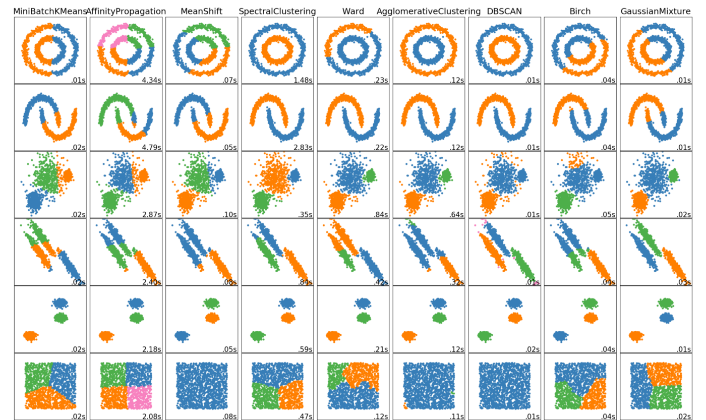

## Week Summary

- Data Story 6 is available, due Sunday November 22
- Last Data Story will be on Shiny Apps
- Talking about clustering today

<!-- TODO Fall 2026: Spring 2025 event announcement - swap in a current
     event card before the meetup.

## NY Open Statistical Computing Meetup {.stretch}


  
-->


## Clustering and Dim. Reduction {.smaller}

- We can gain insight when we notice data points cluster together

```{r}
library(tidyverse)
library(ggplot2)
library(broom)
library(marginaleffects)
library(ggplot2)
library(GGally)
library(cowplot)

okabeito <- c('#E69F00', '#56B4E9', '#009E73', '#F0E442', '#0072B2', '#D55E00', '#CC79A7', '#999999', '#000000')
options(ggplot2.discrete.fill = okabeito)
options(ggplot2.discrete.colour = okabeito)


```


```{r}
library(rattle)
data(wine)
wine_df = tibble(wine)
wine_df |> select(-Type) |> head(n=10) |> kableExtra::kable()

```


## Clustering and Dim. Reduction

```{r}
pca_fit = wine |> 
  select(where(is.numeric))  |>  
  prcomp(scale = TRUE)

pca_fit |> 
 augment(wine_df)  |> 
  ggplot(aes(.fittedPC1, .fittedPC2)) + 
  geom_point(size = 1.5) +
  theme_minimal(base_size=16) +
  labs(title="Principal Components Reveal Low Dimensional Structure of Italian Wines",
       x = "PC 1", y= "PC 2",subtitle = "Chemical properties of wines grown in the same region of Italy. UCI ML Wine Dataset")

```


## Clustering and Dim. Reduction

- Color by the grape type

```{r}

pca_fit |> 
 augment(wine_df)  |> 
  ggplot(aes(.fittedPC1, .fittedPC2,color=Type)) + 
  geom_point(size = 1.5) +
  theme_minimal(base_size=16) +
  labs(title="Grape Cultivars Reveal Natural Clusters",
       x = "PC 1", y= "PC 2",subtitle = "Chemical properties of wines grown in the same region of Italy. UCI ML Wine Dataset")
```


## Automatic Clustering


```{r}

wine_clusters = pca_fit|> 
    augment(wine_df) |> 
  select(.fittedPC1:.fittedPC13) |> 
  kmeans(centers=3) |> augment(wine_df)

pca_fit |> augment(wine_clusters) |> 
  ggplot(aes(.fittedPC1, .fittedPC2,color=.cluster)) + 
  geom_point(size = 1.5) +
  theme_minimal(base_size=16) +
  labs(title="K-Means Algorithm Computes Similar Groups",
       x = "PC 1", y= "PC 2",subtitle = "Chemical properties of wines grown in the same region of Italy. UCI ML Wine Dataset")
```


## k-means method

- Most common clustering method
- Needs two things:
  - Measure of distance between points
  - Number of Clusters to find
- Each cluster characterized by a center
- Points clustered to closest center
  

## k-means method

```{r}
wine_clusters = pca_fit|> 
    augment(wine_df) |> select(-Type) |> 
  select(.fittedPC1:.fittedPC13) |> 
  kmeans(centers=3,nstart = 10) 
  
wine_clusters_df = wine_clusters |> augment(wine_df)

center_tibble = tibble(center = seq(1:3), .fittedPC1 = wine_clusters$centers[1:3,1],.fittedPC2 = wine_clusters$centers[1:3,2])

pca_fit |> augment(wine_clusters_df) |> 
  ggplot(aes(.fittedPC1, .fittedPC2,color=.cluster)) + 
  geom_point(size = 1.5) +
  geom_point(data = center_tibble,aes(x=.fittedPC1,y=.fittedPC2),color="black",size=4) +
  theme_minimal(base_size=16) +
  labs(title="K-Means Algorithm Computes Similar Groups",
       x = "PC 1", y= "PC 2",subtitle = "Chemical properties of wines grown in the same region of Italy. UCI ML Wine Dataset")
```


## Implementing k-means in R

- kmeans in stats package

```{r}
#| echo: true
wine_clusters = pca_fit|> 
    augment(wine_df) |> select(-Type) |> 
  select(.fittedPC1:.fittedPC13) |> 
  kmeans(centers=3,nstart = 10) 

wine_clusters

```


## Key arguments

- `centers` species the number of clusters to find
- `nstart` is number of times to initialize algorithm
- `algorithm` several choices the default choice is usually very robust
- `iter.max` is the number of iterations to try


## Key Outputs

- Clustering Vector: Identifies each point by cluster. Is attached to original data frame by augmnet

```{r}
#| echo: true
wine_clusters$cluster 

```

## Key Outputs

- Cluster Means: These are the cluster centers

```{r}
#| echo: true

wine_clusters$centers


```


## Key Outputs

- Cluster Means: These are the cluster centers

```{r}
#| echo: true

wine_clusters$centers


```


## Key Outputs

- Error Measurements
  - `withinss` sum of squares within clusters
  - `betweenss` between cluster sum of squares
  - `tot.withinss/totss` measure of how much clusters explain variance

```{r}
#| echo: true

wine_clusters$withinss
wine_clusters$totss
wine_clusters$tot.withinss/wine_clusters$totss

```


## How many clusters?

- What happens when we increase the number of centers?

```{r}
data(ruspini, package = "cluster")

ruspini_tibble = tibble(ruspini)

ruspini_tibble |> ggplot(aes(x=x,y=y)) + geom_point() +
  theme_minimal(base_size=16) +
  coord_fixed(ratio = 0.7) +
  labs(title = "There are 4 obvious clusters here")

```


## How many clusters?

- 3 Clusters

```{r}

ruspini_clusters = ruspini_tibble |> kmeans(centers = 3)


ruspini_clusters |> augment(ruspini_tibble) |> ggplot(aes(x=x,y=y,color=.cluster)) + geom_point() +
  theme_minimal(base_size=16) +
  coord_fixed(ratio = 0.7) +
  labs(title = "Three Clusters")

```


## How many clusters?

- 4 Clusters

```{r}

ruspini_clusters = ruspini_tibble |> kmeans(centers = 4,nstart = 100)


ruspini_clusters |> augment(ruspini_tibble) |> ggplot(aes(x=x,y=y,color=.cluster)) + geom_point() +
  theme_minimal(base_size=16) +
  coord_fixed(ratio = 0.7) +
  labs(title = "Four Clusters")

```


## How many clusters?

- 5 Clusters

```{r}

ruspini_clusters = ruspini_tibble |> kmeans(centers = 5,nstart = 100)


ruspini_clusters |> augment(ruspini_tibble) |> ggplot(aes(x=x,y=y,color=.cluster)) + geom_point() +
  theme_minimal(base_size=16) +
  coord_fixed(ratio = 0.7) +
  labs(title = "Five Clusters")

```


## How many clusters?

- 10 Clusters

```{r}

ruspini_clusters = ruspini_tibble |> kmeans(centers = 10,nstart = 100)


ruspini_clusters |> augment(ruspini_tibble) |> ggplot(aes(x=x,y=y,color=.cluster)) + geom_point() +
  theme_minimal(base_size=16) +
  coord_fixed(ratio = 0.7) +
  labs(title = "10 Clusters")

```


## Quantitative Tools for Cluster Number

- Many methods for choosing the number of clusters!
- Elbow method: Look for `elbow` in plot of within cluster variance

```{r}
kvec = seq(2:10)


wcss = map(kvec,.f = function(k) {
    kmeans(ruspini, centers = k, nstart = 5)$tot.withinss
})

elbow_plot = tibble(clusters = kvec, wcss = wcss) |> unnest()

elbow_plot |> ggplot(aes(kvec, wcss)) + 
  geom_line() +
  geom_vline(xintercept = 4, color = "red", linetype = 2) +
  theme_minimal(base_size = 16) +
  scale_x_continuous(breaks=c(2,4,6,8,10)) +
  labs(title = "Elbow Plot",
       subtitle = "Four Clusters is optimal",
       y = "Within Cluster Sum of Squares",
       x = "Number of Clusters")

```


## Quantitative Tools for Cluster Number

- Many methods for choosing the number of clusters!
- Elbow method: Look for `elbow` in plot of within cluster variance

```{r}
kvec = seq(2:15)

wine_var_df = pca_fit |> 
 augment(wine_df)  |> 
  select(.fittedPC1:.fittedPC13)

wcss = map(kvec,.f = function(k) {
    kmeans(wine_var_df, centers = k, nstart = 5)$tot.withinss
})

elbow_plot = tibble(clusters = kvec, wcss = wcss) |> unnest()

elbow_plot |> ggplot(aes(kvec, wcss)) + 
  geom_line() +
  geom_vline(xintercept = 3, color = "red", linetype = 2) +
  theme_minimal(base_size = 16) +
  scale_x_continuous(breaks=c(2,6,10,14)) +
  labs(title = "Elbow Plot for Wine Data",
       subtitle = "Not obvious how many clusters are optimal",
       y = "Within Cluster Sum of Squares",
       x = "Number of Clusters")

```


## Quantitative Tools for Cluster Number

- Use `map` to apply k-means to many times

```{r}
#| echo: true
#| eval: false
kvec = seq(2:10)

wcss = map(kvec,.f = function(k) {
    kmeans(ruspini, centers = k, nstart = 5)$tot.withinss
})
elbow_plot = tibble(clusters = kvec, wcss = wcss) |> unnest()
elbow_plot |> ggplot(aes(kvec, wcss)) + 
  geom_line() +
  geom_vline(xintercept = 4, color = "red", linetype = 2) +
  theme_minimal(base_size = 16) +
  scale_x_continuous(breaks=c(2,4,6,8,10)) +
  labs(title = "Elbow Plot",
       subtitle = "Four Clusters is optimal",
       y = "Within Cluster Sum of Squares",
       x = "Number of Clusters")

```


## Interpreting Clusters

- Goal of clustering is often to gain insight.

```{r}
library(ggthemes)
wine_df_2 = wine_df |> select(-Type)
centers_df = t(t(wine_clusters$centers %*% t(pca_fit$rotation)) * pca_fit$scale + pca_fit$center) |> as_tibble() |> bind_rows(wine_df_2) |> 
  scale() |> as_tibble() |> head(n=3) |> mutate(center = seq(1:3))

centers_df |> pivot_longer(cols = Alcohol:Proline,names_to = "type") |> mutate(sign= value>0) |> ggplot(aes(x=type,y=value)) + 
  geom_col(aes(fill=sign)) +
  scale_fill_discrete(guide = "none") +
  geom_hline(yintercept = 0) +
  facet_wrap(~center,nrow=3) +
  theme_clean(base_size = 12) +
  labs(title = "Wine clusters with scaled variables",
       subtitle = "Cluster 1 has moderate color and high flavanoids, phenols, and alcohol. Cluster 2 has low color, medium flavanoids,\nlow alcohol, and low proline. Cluster 3 has strong color but low flavanoids, hue, and phenols.",
       y= "Scaled Values",
       x="Characteristic")


```

## Interpreting Clusters

- Takes some tricky to understand code to transform the PCA coordinates: 

```{r}
#| echo: true
#| eval: false

wine_df_2 = wine_df |> select(-Type)
centers_df = t(t(wine_clusters$centers %*% t(pca_fit$rotation)) *
            pca_fit$scale + pca_fit$center) |> 
  as_tibble() |> 
  bind_rows(wine_df_2) |> 
  scale() |> 
  as_tibble() |> 
  head(n=3) |>
  mutate(center = seq(1:3))

```

- `t(t(wine_clusters$centers %*% t(pca_fit$rotation)) * pca_fit$scale + pca_fit$center)` coordinate transformation
- `scale` enables visualization of variables together


## Interpreting Clusters

```{r}
#| echo: true
#| eval: false

centers_df |> pivot_longer(
  cols = Alcohol:Proline,
  names_to = "type") |> 
  mutate(sign= value>0) |> 
  ggplot(aes(x=type,y=value)) + 
  geom_col(aes(fill=sign)) +
  scale_fill_discrete(guide = "none") +
  geom_hline(yintercept = 0) +
  facet_wrap(~center,nrow=3) +

```

- There could be many ways of visualizing this
- Here chose column plot, colored by sign with a horizontal line to denote where 0 is across the facets
- I found this a little better than a dot plot for some reason


## Annotating Clusters

- `geom_mark_ellipse` to draw circles around clusters

```{r}
library(ggforce)


plot_df = pca_fit|> 
    augment(wine_df) |> 
  select(.fittedPC1:.fittedPC13)

wine_clusters = plot_df |> kmeans(centers = 3,nstart=10)

wine_clusters |> augment(plot_df) |> ggplot(aes(.fittedPC1,.fittedPC2,color=.cluster)) +geom_point() +
  geom_mark_ellipse(aes(fill=as_factor(.cluster)),alpha = 0.3) +
  scale_color_discrete(guide = "none") +
  scale_fill_discrete(guide = "none") +
  theme_minimal(base_size=16) +
  labs(title = "Wine Clusters drawn with ellipses")


```

## k-means tips and pitfalls

- Algorithm not guaranteed to converge
  - Can get wrong answes if `nstart` too low
  - Can get stuck in local minima
- Very sensitive to outliers and largest scale of data
  - Always scale data first or used on scaled coordinates
- Assumes Spherical, Balanced Clusters
- Will find clusters when there are none


## Other Clustering Algorithms




## Thanks!
