```{r setup, include=FALSE, echo=FALSE}
options(htmltools.dir.version = FALSE)
knitr::opts_chunk$set(comment = "")

library(tidyverse)
library(here)
library(ggdendro)
library(cowplot)
library(colorspace)
library(kableExtra)
library(ggforce)
library(broom)
library(ggiraph)
library(sf)
library(maps)
library(usmapdata)
library(usmap)
library(ggokabeito)

```


## Week Summary 

- Entering home stretch
  - This week finish clustering
  - Talk about making plots interactive
- Finish with Shiny Apps

## Reading {.smaller}

1. [Wikipedia article on Hierarchical Clustering](https://en.wikipedia.org/wiki/Hierarchical_clustering)
2. [ggdendro introduction and reference](https://cran.r-project.org/web/packages/ggdendro/vignettes/ggdendro.html)
3. [tidy_heatmaps documentation](https://jbengler.github.io/tidyheatmaps/reference/tidyheatmap.html)
4. [Bioinformatics Training and Education Program Tutorial on Hierarchical Clustering](https://bioinformatics.ccr.cancer.gov/docs/data-visualization-with-r/Lesson5_intro_to_ggplot/)
5. [For Python: Seaborn Clustermap](https://seaborn.pydata.org/generated/seaborn.clustermap.html)
6. [For Python: Scipy Clusters](https://docs.scipy.org/doc/scipy/reference/cluster.html)

## May 9th Meetup!


## Tree of Life

- Lots of data has a hierarchical structure

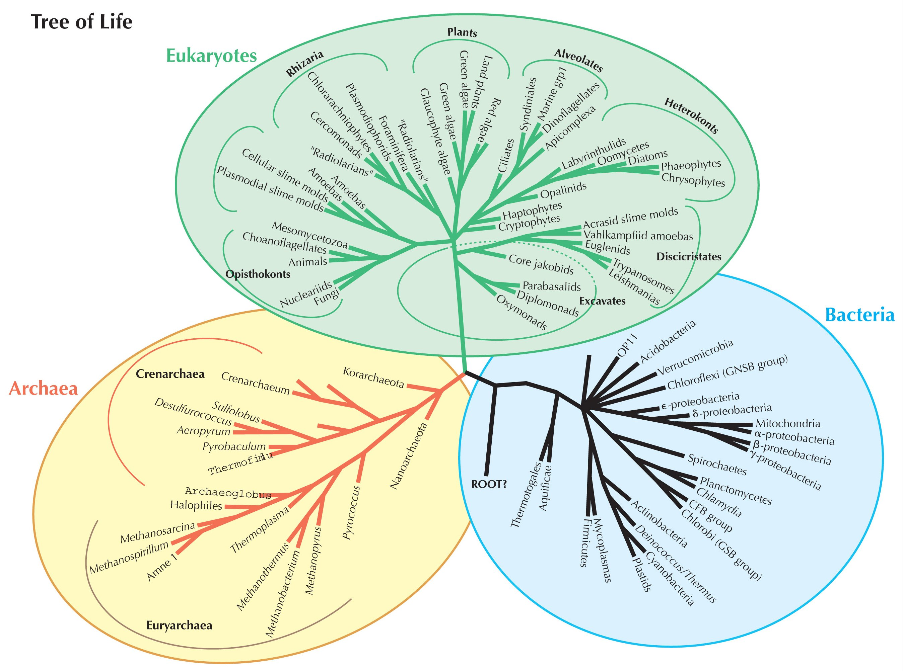


## Statistics of US States {.smaller}

```{r}

# We are loading a file which defines regions for US states
# And one which has statistics on US states

US_regions <- read_csv("US_regions.csv")
US_state_stats <- read_csv("US_state_stats.csv") %>%
  filter(state != "District of Columbia")

```

```{r}
#| echo: true
US_state_stats |> head(n=15)
```


## Could Cluster Them

```{r}

# There are few missing values in these data frames, so dropping
# to make the clustering work. You could alternatively try imputing
# or doing something fancier

US_state_stats = US_state_stats |>       
  select(-murder, -robbery,-agg_assault, -larceny, -motor_theft)

# We will use PCA for clustering. This isn't necessary. Whether it is smart or not depends on the dimensionality of the data. If it is
# very high dimensional you should consider only keeping a few principal components

pca_fit = US_state_stats |> 
  select(where(is.numeric))  |>  
  prcomp(scale = TRUE)

US_clusters = pca_fit|> 
    augment(US_state_stats) |> select(.fittedPC1:.fittedPC14) |> 
  kmeans(centers=4) |> augment(US_state_stats)

# Pulling in a map

us_state_map = us_map(regions="state")

US_clusters |> 
  left_join(us_state_map,by=c("state" = "full")) |> 
  ggplot(aes(fill = .cluster)) +
  geom_sf(aes(geometry=geom)) +
  scale_fill_okabe_ito() +
  theme_void(base_size=16) +
  theme(panel.grid = element_line(color = "transparent")) +
  labs(title = "State Clusters")


  


```


## Different Levels and Meaning

```{r}

# I should probably set a seed here, but most of the times I do this
# I get some inconsistency with the clusters (between 4 and 8)

US_clusters = pca_fit|> 
    augment(US_state_stats) |> select(.fittedPC1:.fittedPC14) |> 
  kmeans(centers=8) |> augment(US_state_stats)

US_clusters |> 
  left_join(us_state_map,by=c("state" = "full")) |> 
  ggplot(aes(fill = .cluster)) +
  geom_sf(aes(geometry=geom)) +
  scale_fill_okabe_ito() +
  theme_void(base_size=16) +
  theme(panel.grid = element_line(color = "transparent")) +
  labs(title = "State Clusters",subtitle="Different Patterns Appear when we use 8 Clusters")

```

## Hierarchical Clustering is Bottom-Up

```{r}

# column_to_rownames makes the state variable a name. This helps 
# deal with the fact that it isn't numerical and makes things work

  hc <- US_state_stats %>%
      column_to_rownames(var = "state") %>%
      scale() %>%
      dist(method = "euclidean") %>%
      hclust(method = "ward.D2")
    
# This shows a "by hand" way of making a dendrogram. 
# In most of this document we will use the official dendrogram
# functions

    ddata <- dendro_data(as.dendrogram(hc), type = "rectangle")
    segments <- segment(ddata)
    labels <- label(ddata) %>%
      left_join(US_regions, by = c("label" = "state"))
    
    ggplot() + 
      geom_segment(data = segments, aes(x, -y, xend = xend, yend = -yend)) + 
      geom_text(
        data = labels,
        aes(x, -y+.5, label = label, color = region),
        hjust = 0,
        angle = 90,
        key_glyph = "point",
        size = 4
      ) +
      scale_color_manual(
        values = darken(c("#56B4E9", "#E69F00", "#009E73", "#F0E442"), 0.3),
        name = NULL
      ) +
      scale_x_continuous(name = NULL) +
      scale_y_continuous(name = NULL, limits = c(-20, 6), expand = c(0, 0)) +
      guides(
        color = guide_legend(
          override.aes = list(color = c("#56B4E9", "#E69F00", "#009E73", "#F0E442"))
        )
      ) +
      theme_void(16)

```


## Dendrogram Clusters


```{r}

# Here we compute cluster coefficients at different cutoffs

cut_height <- 14.7
clusters <- cutree(hc, h = cut_height)
clustered_labels <- left_join(
  labels,
  tibble(label = names(clusters), cluster = factor(clusters)),
  by = "label"
) 

ggplot() + 
  geom_segment(data = segments, aes(x, -y, xend = xend, yend = -yend)) + 
  geom_text(
    data = clustered_labels,
    aes(x, -y+.5, label = label, color = cluster),
    hjust = 0,
    angle = 90,
    key_glyph = "point",
    size = 4
  ) +
  geom_hline(yintercept = -cut_height, linetype = 2) +
  scale_color_viridis_d(option = "B", begin = 0.2, end = 0.8) +
  scale_x_continuous(name = NULL) +
  scale_y_continuous(name = NULL, limits = c(-20, 6), expand = c(0, 0)) +
  theme_void(16)
```


## Dendrogram Cuts

```{r}
cut_height <- 10.9
clusters <- cutree(hc, h = cut_height)
clustered_labels <- left_join(
  labels,
  tibble(label = names(clusters), cluster = factor(clusters)),
  by = "label"
) 

ggplot() + 
  geom_segment(data = segments, aes(x, -y, xend = xend, yend = -yend)) + 
  geom_text(
    data = clustered_labels,
    aes(x, -y+.5, label = label, color = cluster),
    hjust = 0,
    angle = 90,
    key_glyph = "point",
    size = 4
  ) +
  geom_hline(yintercept = -cut_height, linetype = 2) +
  scale_color_viridis_d(option = "B", begin = 0.2, end = 0.8) +
  scale_x_continuous(name = NULL) +
  scale_y_continuous(name = NULL, limits = c(-20, 6), expand = c(0, 0)) +
  theme_void(16)

```

## Dendrogram Cuts

```{r}

cut_height <- 7.5
clusters <- cutree(hc, h = cut_height)
clustered_labels <- left_join(
  labels,
  tibble(label = names(clusters), cluster = factor(clusters)),
  by = "label"
) 

ggplot() + 
  geom_segment(data = segments, aes(x, -y, xend = xend, yend = -yend)) + 
  geom_text(
    data = clustered_labels,
    aes(x, -y+.5, label = label, color = cluster),
    hjust = 0,
    angle = 90,
    key_glyph = "point",
    size = 4
  ) +
  geom_hline(yintercept = -cut_height, linetype = 2) +
  scale_color_viridis_d(option = "B", begin = 0.05, end = 0.95) +
  scale_x_continuous(name = NULL) +
  scale_y_continuous(name = NULL, limits = c(-20, 6), expand = c(0, 0)) +
  theme_void(16)

```

## Dendrogram Cuts

```{r}
cut_height <- 5.0
clusters <- cutree(hc, h = cut_height)
clustered_labels <- left_join(
  labels,
  tibble(label = names(clusters), cluster = factor(clusters)),
  by = "label"
) 

ggplot() + 
  geom_segment(data = segments, aes(x, -y, xend = xend, yend = -yend)) + 
  geom_text(
    data = clustered_labels,
    aes(x, -y+.5, label = label, color = cluster),
    hjust = 0,
    angle = 90,
    key_glyph = "point",
    size = 4
  ) +
  geom_hline(yintercept = -cut_height, linetype = 2) +
  scale_color_viridis_d(option = "B", begin = 0.05, end = 0.95) +
  scale_x_continuous(name = NULL) +
  scale_y_continuous(name = NULL, limits = c(-20, 6), expand = c(0, 0)) +
  theme_void(16)

```


## Why Hierarchical Clustering?

- You care about fine details
  - Can find clusters of small numbers of points
  - Biological Species
- You want to explore multiple different clustering scales
- You want robustness to outliers

## How does it work?

- Needs two basic ingredients:
  1. Distance function between the points
  2. Rule for applying the distance to clusters
  
  
##  Agglomerative Clustering

:::: {.columns}

::: {.column width=50%}

- Begin with points

:::

::: {.column width=50%}

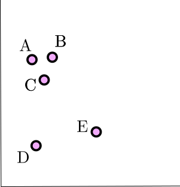

:::

::::

  

##  Agglomerative Clustering

:::: {.columns}

::: {.column width=50%}

- Begin with points
- Distance Matrix
:::

::: {.column width=50%}

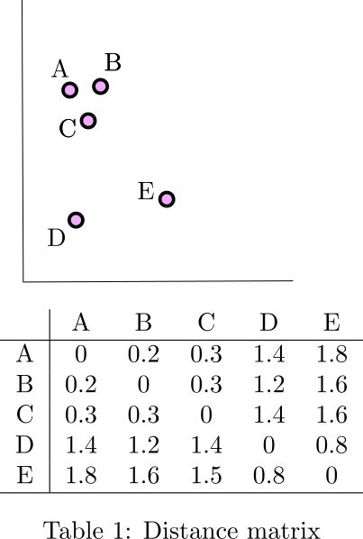

:::

::::


##  Agglomerative Clustering

:::: {.columns}

::: {.column width=50%}

- Begin with points
- Distance Matrix
- Group Closest

:::

::: {.column width=50%}

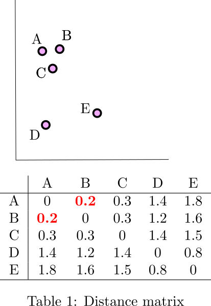

:::

::::


##  Agglomerative Clustering

:::: {.columns}

::: {.column width=50%}

- Begin with points
- Distance Matrix
- Group Closest
- Recalculate Distances

:::

::: {.column width=50%}

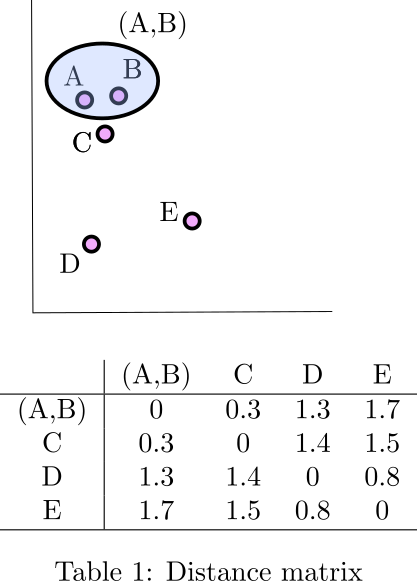

:::

::::


##  Agglomerative Clustering

:::: {.columns}

::: {.column width=50%}

- Begin with points
- Distance Matrix
- Group Closest
- Recalculate Distances
- Rinse and Repeat

:::

::: {.column width=50%}

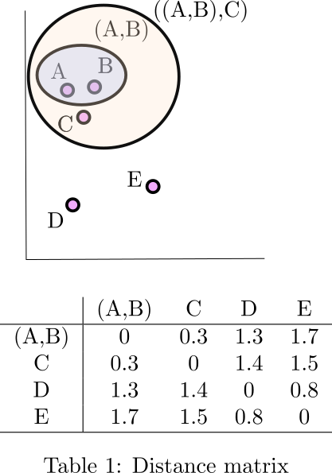

:::

::::


##  Agglomerative Clustering

:::: {.columns}

::: {.column width=50%}

- Begin with points
- Distance Matrix
- Group Closest
- Recalculate Distances
- Rinse and Repeat

:::

::: {.column width=50%}

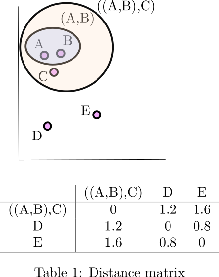

:::

::::


##  Agglomerative Clustering

:::: {.columns}

::: {.column width=50%}

- Begin with points
- Distance Matrix
- Group Closest
- Recalculate Distances
- Rinse and Repeat

:::

::: {.column width=50%}

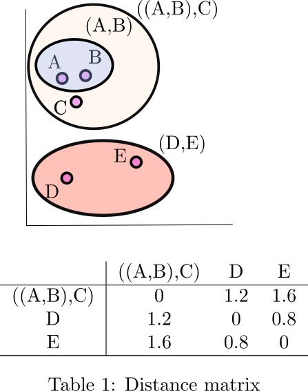

:::

::::


##  Agglomerative Clustering

:::: {.columns}

::: {.column width=50%}

- Begin with points
- Distance Matrix
- Group Closest
- Recalculate Distances
- Rinse and Repeat

:::

::: {.column width=50%}

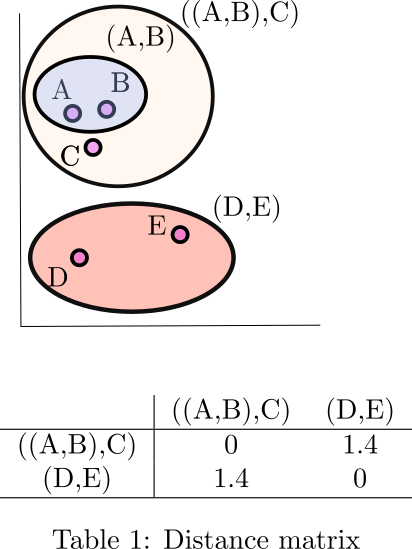

:::

::::


##  Agglomerative Clustering

:::: {.columns}

::: {.column width=50%}

- Begin with points
- Distance Matrix
- Group Closest
- Recalculate Distances
- Rinse and Repeat

:::

::: {.column width=50%}

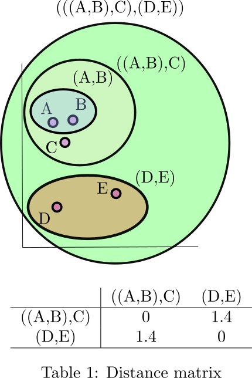

:::

::::


##  Agglomerative Clustering

:::: {.columns}

::: {.column width=50%}

- Begin with points
- Distance Matrix
- Group Closest
- Recalculate Distances
- Rinse and Repeat
- Form Dendrogram
:::

::: {.column width=50%}

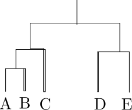

:::

::::


## Distance Metrics

- Euclidean Distance (Most Common)
- Correlation Distance (Common in Bio)
- Manhattan, Maximum (Other Metrics)
- Categorical Metrics:
  - Gower's (Mixed categorical and numerical)
  - Jaccard, Hamming, many more
  
## Linkage Methods

- How to determine the distance between clusters?
- [Many on wikipedia](https://en.wikipedia.org/wiki/Hierarchical_clustering)
  - Max or Min distance between points
  - UPGMA (unweighted average distance between pairs)
  - Ward's Linkage (minimize increase in within cluster variance)


## Implementing Hierarchical Clustering

- Demonstrate it on a Kaggle Customer Segmentation Dataset

```{r}
#| echo: true
mall_customers = read_csv("Mall_Customers.csv")
mall_customers


```

## Calculate Distance Matrix

- Ignore Categorical

```{r}
#| echo: true
mall_customers |> 
  select(-Gender) |> 
  column_to_rownames(var = "CustomerID")  |> 
  scale()  |> 
  dist(method = "euclidean")

```


## Calculate Distance Matrix

- Keep Categorical

```{r}
#| echo: true
# Notice use of `gower` cluster package/daisy function
library(cluster)
mall_dist = mall_customers |> mutate(Gender = as_factor(Gender)) |> 
  column_to_rownames(var = "CustomerID")  |> 
  daisy(metric = "gower")

```

## Create Clusters

```{r}
#| echo: true
library(ggdendro)
mall_clusters = mall_dist |> 
  hclust(
  method = "average"
) 

mall_clusters |> 
  ggdendrogram( rotate = TRUE,labels=FALSE,leaf_labels = FALSE)


```

## Tree objects

```{r}
str(mall_clusters)


```


## Cut to Assign Clusters

- `cutree` function assigns clusters at a given depth
- `cutree(tree,k= num_groups)`
- `cutree(tree,h=depth_groups)`

```{r}
#|echo: true
mall_clusters |> cutree(k=4) |> tidy() 

```


## Visualizing Clusters 

- Join clusters with original data frame

```{r}
#| echo: true
#| eval: false

mall_customers = mall_customers |> left_join(
  mall_clusters |> cutree(k=4) |> tidy() |> mutate(names = as.numeric(names)),
  by = c("CustomerID" = "names") )|> 
  rename(clusters = x)

mall_customers |> ggplot(aes(x = `Annual Income (k$)`,y=`Spending Score (1-100)`,color = as_factor(clusters),fill = as_factor(clusters) )) +
  geom_point()  +
  scale_color_okabe_ito() +
  scale_fill_okabe_ito()
  
```

## Visualizing Clusters 

- Join clusters with original data frame

```{r}


mall_customers = mall_customers |> left_join(
  mall_clusters |> cutree(k=4) |> tidy() |> mutate(names = as.numeric(names)),
  by = c("CustomerID" = "names") )|> 
  rename(clusters = x)

mall_customers |> ggplot(aes(x = `Annual Income (k$)`,y=`Spending Score (1-100)`,color = as_factor(clusters),fill = as_factor(clusters) )) +
  geom_point()  +
  scale_color_okabe_ito() +
  scale_fill_okabe_ito() +
  theme_minimal(base_size = 16) +
  labs(title = "Cluster Differences")
  
```


## Visualizing Clusters 

- Seems like Gender is main differentiator

```{r}


mall_customers |> ggplot(aes(x = `Annual Income (k$)`,y=`Spending Score (1-100)`,color = as_factor(clusters),fill = as_factor(clusters) )) +
  geom_text(aes(label = Gender))  +
  scale_color_okabe_ito() +
  scale_fill_okabe_ito() +
  theme_minimal(base_size = 16) +
  labs(title = "Cluster Differences")
  
```

## Try Something Else

- Dropped Gender and Age

```{r}
mall_customers = read_csv("Mall_Customers.csv")

mall_dist = mall_customers |> 
  select(-Gender,-Age) |> 
  column_to_rownames(var = "CustomerID")  |> 
  scale()  |> 
  dist(method = "euclidean")

mall_clusters = mall_dist |> 
  hclust(
  method = "average"
) 

mall_customers_with_clusters = mall_customers |> left_join(
  mall_clusters |> cutree(k=5) |> tidy() |> mutate(names = as.numeric(names)),
  by = c("CustomerID" = "names") )|> 
  rename(clusters = x)

mall_customers_with_clusters |> ggplot(aes(x = `Annual Income (k$)`,y=`Spending Score (1-100)`,color = as_factor(clusters),fill = as_factor(clusters) )) +
  geom_point()  +
  scale_color_okabe_ito() +
  scale_fill_okabe_ito()  +
  theme_minimal(base_size = 16) +
  labs(title = "Cluster Differences")
  


```


## Try a Different Linkage

- Use the Ward Linkage Instead

```{r}
#| echo: true
#| eval: false

mall_clusters = mall_dist |> 
  hclust(
  method = "ward"
) 

mall_customers = mall_customers |> left_join(
  mall_clusters |> cutree(k=5) |> tidy() |> mutate(names = as.numeric(names)),
  by = c("CustomerID" = "names") )|> 
  rename(clusters = x)

mall_customers |> ggplot(aes(x = `Annual Income (k$)`,y=`Spending Score (1-100)`,color = as_factor(clusters),fill = as_factor(clusters) )) +
  geom_point()  +
  scale_color_okabe_ito() +
  scale_fill_okabe_ito()  +
  theme_minimal(base_size = 16) +
  labs(title = "Cluster Differences")
  
```

## Try a Different Linkage

- Use the Ward Linkage Instead

```{r}
#| echo: true
#| eval: false

mall_clusters = mall_dist |> 
  hclust(
  method = "ward"
) 

mall_customers = mall_customers |> left_join(
  mall_clusters |> cutree(k=5) |> tidy() |> mutate(names = as.numeric(names)),
  by = c("CustomerID" = "names") )|> 
  rename(clusters = x)

mall_customers |> ggplot(aes(x = `Annual Income (k$)`,y=`Spending Score (1-100)`,color = as_factor(clusters),fill = as_factor(clusters) )) +
  geom_point()  +
  scale_color_okabe_ito() +
  scale_fill_okabe_ito()  +
  theme_minimal(base_size = 16) +
  labs(title = "Cluster Differences")
  
```


## Try a Different Linkage

- Use the Ward Linkage Instead

```{r}

mall_clusters = mall_dist |> 
  hclust(
  method = "ward"
) 

mall_customers = mall_customers |> left_join(
  mall_clusters |> cutree(k=5) |> tidy() |> mutate(names = as.numeric(names)),
  by = c("CustomerID" = "names") )|> 
  rename(clusters = x)

mall_customers |> ggplot(aes(x = `Annual Income (k$)`,y=`Spending Score (1-100)`,color = as_factor(clusters),fill = as_factor(clusters) )) +
  geom_point()  +
  scale_color_okabe_ito() +
  scale_fill_okabe_ito()  +
  theme_minimal(base_size = 16) +
  labs(title = "Cluster Differences")
  
```


## Interpreting Clusters

- Similar procedure as to k-means
  - Summarize/average over the clusters
  - Plot distributions over the clusters
- Take advantage of Hierarchical Structure using Heatmaps


## Clustered Heatmaps

```{r}
library(tidyheatmaps)

US_long = US_state_stats |> pivot_longer(names_to = "variable",cols=homeownership:popdens2010,values_to = "value")

US_long |> tidy_heatmap(rows = state,columns = variable, values = value,cluster_rows = TRUE, cluster_cols = TRUE,scale = "column",fontsize_row = 6,
                        ,fontsize_col=12,clustering_method = "ward",main = "Hierarchical Clustering of US States",fontsize = 12)

```

## Clustered Heatmaps

- `tidyheatmaps` package
  - `pheatmap` frontend
  - Others have similar names
- Not `ggplot2` compatible 

## Clustered Heatmaps {.smaller}

- Need long-format data

```{r}
#| echo: TRUE
US_state_stats


```

## Clustered Heatmaps {.smaller}

- Need long-format data

```{r}
#| echo: true
US_long = US_state_stats |> pivot_longer(
  names_to = "variable",
  cols=homeownership:popdens2010,
  values_to = "value")
US_long

```


## Clustered Heatmaps

- `tidy_heatmap` computes clusters for you, but takes a ton of arguments

```{r}
#| echo: true
#| eval: false
library(tidyheatmaps)

US_long |> 
  tidy_heatmap(
                rows = state,
                columns = variable, 
                values = value,
                cluster_rows = TRUE, 
                cluster_cols = TRUE,
                scale = "column",
                fontsize_row = 6,
                fontsize_col=12,
                clustering_method = "ward",
                main = "Hierarchical Clustering of US States",
                fontsize = 12)


```
  
## Clustered Heatmaps

- `scale = column/row is very important` 

```{r}
#| echo: true
#| eval: false
library(tidyheatmaps)

US_long |> 
  tidy_heatmap(
                rows = state,
                columns = variable, 
                values = value,
                cluster_rows = TRUE, 
                cluster_cols = TRUE,
                scale = "column",
                fontsize_row = 6,
                fontsize_col=12,
                clustering_method = "ward",
                main = "Hierarchical Clustering of US States",
                fontsize = 12)


```  

## Clustered Heatmaps

- `scale = column/row is very important` 

```{r}


US_long |> 
  tidy_heatmap(
                rows = state,
                columns = variable, 
                values = value,
                cluster_rows = TRUE, 
                cluster_cols = TRUE,
                fontsize_row = 6,
                fontsize_col=12,
                clustering_method = "ward",
                main = "I forgot to scale the columns and now my plot is worthless",
                fontsize = 12)


```  

## Clustered Heatmaps

- `scale = column/row is very important` 

```{r}


US_long |> 
  tidy_heatmap(
                rows = state,
                columns = variable, 
                values = value,
                cluster_rows = TRUE, 
                cluster_cols = TRUE,
                scale = "column",
                fontsize_row = 6,
                fontsize_col=12,
                clustering_method = "ward",
                main = "I forgot to scale the columns and now my plot is worthless",
                fontsize = 12)


```  
  

## Annotations

- Say we want to annotate the clusters with a categorical variable
- Add US-Regions to data frame

```{r}
#| echo: true

US_state_aug = US_state_stats |> 
  left_join(US_regions) |> 
  mutate(state = state_abr) |> 
  select(-state_abr) |> 
  pivot_longer(
    names_to = "variable",
    cols=homeownership:popdens2010,
    values_to = "value") 

```


## Annotations

- Say we want to annotate the clusters with a categorical variable
- Add US-Regions to data frame

```{r}

US_state_aug

```


## Annotations

```{r}
#| echo: true
#| eval: false
US_state_aug |>
  tidy_heatmap(
                rows = state,
                columns = variable, 
                values = value,
                cluster_rows = TRUE, 
                cluster_cols = TRUE,
                scale = "column",
                fontsize_row = 6,
                fontsize_col=12,
                clustering_method = "ward",
                main = "Hierarchical Clustering of US States",
                fontsize = 12,
                annotation_row = region,
                annotation_colors =  list(  # specify colors for annotations
      region = c("Northeast" = "#56B4E9", "South" = "#E69F00", "West" = "#009E73", "Midwest" ="#F0E442")
    ))

```


## Annotations

```{r}

US_state_aug |>
  tidy_heatmap(
                rows = state,
                columns = variable, 
                values = value,
                cluster_rows = TRUE, 
                cluster_cols = TRUE,
                scale = "column",
                fontsize_row = 6,
                fontsize_col=12,
                clustering_method = "ward",
                main = "Hierarchical Clustering of US States",
                fontsize = 12,
                annotation_row = region,
                annotation_colors =  list(  # specify colors for annotations
      region = c("Northeast" = "#56B4E9", "South" = "#E69F00", "West" = "#009E73", "Midwest" ="#F0E442")
    ))

```

## Multiple Annotations

```{r}

US_state_aug |>
  tidy_heatmap(
                rows = state,
                columns = variable, 
                values = value,
                cluster_rows = TRUE, 
                cluster_cols = TRUE,
                scale = "column",
                fontsize_row = 6,
                fontsize_col=12,
                clustering_method = "ward",
                main = "Hierarchical Clustering of US States",
                fontsize = 12,
                annotation_row = c("region","division"),
                annotation_colors =  list(  # specify colors for annotations
      region = c("Northeast" = "#56B4E9", "South" = "#E69F00", "West" = "#009E73", "Midwest" ="#F0E442")
    ))

```


## Downsides of Hierarchical Clustering

- Computationally very challenging
  - Naive methods scale like $O(n^3)$
  - $O(n^2)$ for memory
  - Need to become a pro....
- Bad with many features/high dimensions
- Bad if data is nonlinearly shaped

## Thanks!