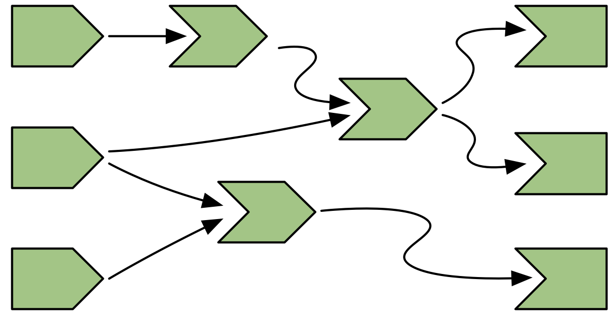
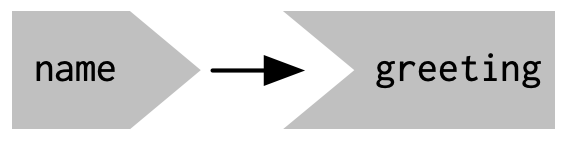
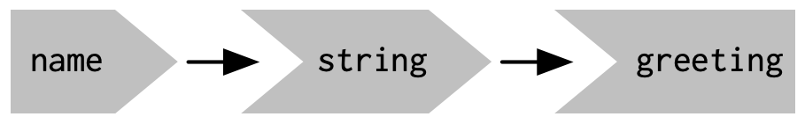
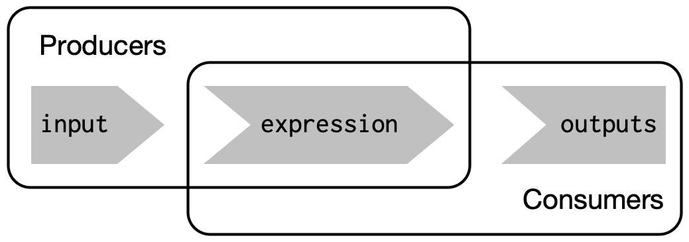
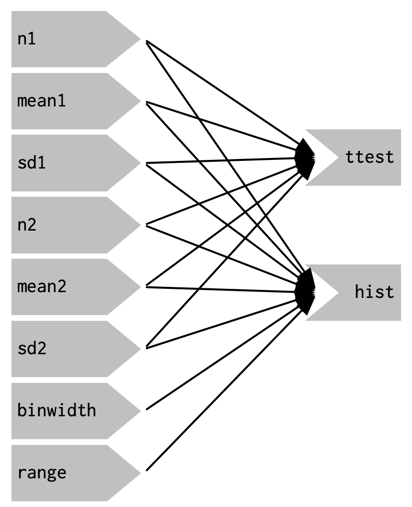
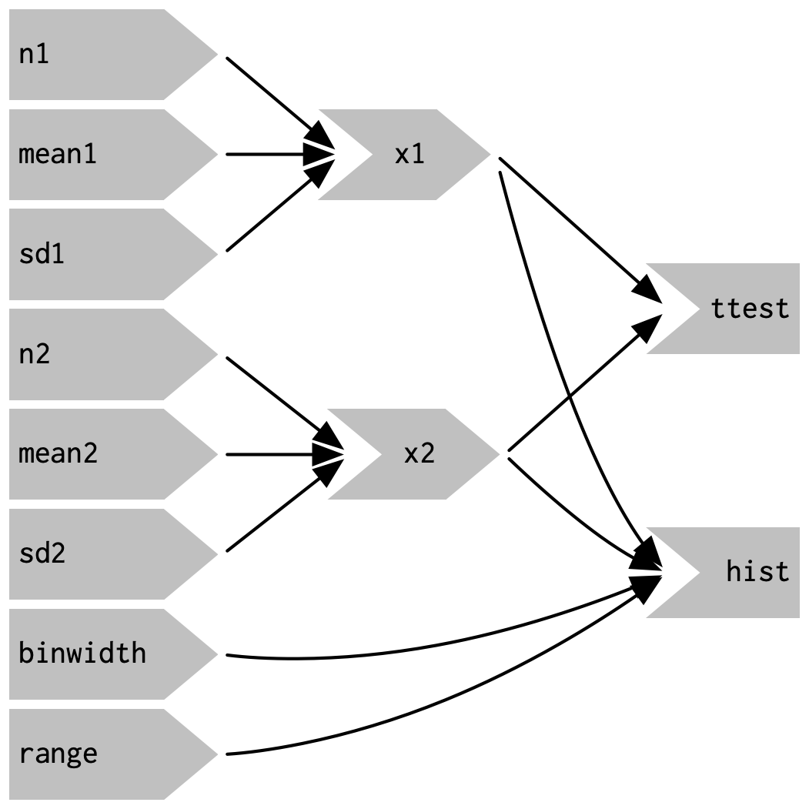

## Week Summary

- Next 2 weeks on Shiny
- Data Story 7- Create a Shiny App using one of the datasets we have worked with
- Talk more about design principles next week


<!-- TODO Fall 2026: Spring 2025 event announcement - swap in a current
     event card before the meetup.

## May 7th Meetup!


-->


## Shiny

- Shiny is an R package which creates interactive web applications based on models or code written in `R` or `python`
- Easy to get started with
  - You can write your first app in minutes
- Based on clean underlying design principles
  
```{r}
#| echo: true
#| eval: false
install.packages("shiny")
library(shiny)
```


## Examples: Old Faithful


```{r}
sliderInput("bins", "Number of bins:", 
            min = 1, max = 50, value = 30)
plotOutput("distPlot")
```

```{r}
#| context: server
output$distPlot <- renderPlot({
  x <- faithful[, 2]  # Old Faithful Geyser data
  bins <- seq(min(x), max(x), length.out = input$bins + 1)
  hist(x, breaks = bins, col = 'darkgray', border = 'white')
})
```


## Example: Iris Clusters 


```{r}
#| panel: sidebar
vars <- setdiff(names(iris), "Species")
selectInput('xcol', 'X Variable', vars)
selectInput('ycol', 'Y Variable', vars, selected = vars[[2]])
numericInput('clusters', 'Cluster count', 3, min = 1, max = 9)
```

```{r}
#| panel: fill
plotOutput('plot1')
```

```{r}
#| context: server
selectedData <- reactive({
    iris[, c(input$xcol, input$ycol)]
  })

clusters <- reactive({
  kmeans(selectedData(), input$clusters)
})

output$plot1 <- renderPlot({
  palette(c("#E41A1C", "#377EB8", "#4DAF4A", "#984EA3",
    "#FF7F00", "#FFFF33", "#A65628", "#F781BF", "#999999"))

  par(mar = c(5.1, 4.1, 0, 1))
  plot(selectedData(),
       col = clusters()$cluster,
       pch = 20, cex = 3)
  points(clusters()$centers, pch = 4, cex = 4, lwd = 4)
})

```


## Examples Can be More Sophisticated

- These are excellent tools for sharing models with the general public, stakeholders, members of the general public, etc

## Case Study

- Case study of my colleague (who promised to send me his shiny app as an example....)
  - Scientist Negotiating Marine Protected Area
  - Ecological/Economic projections for outcomes
  - Stakeholders include nations, indigenous groups, fishing companies
  - Having a shiny app was what made stakeholders comfortable
  
## Shiny App Structure

- Shiny Apps have two components

```{r}
#| echo: true
#| eval: false

library(shiny)

# ui is a variable that defines the user interface
ui <- fluidPage(
  "Hello, world!"
)
# server is where the computations happen
# server and ui exchange info
server <- function(input, output, session) {
}

# This call intializes the shiny app
shinyApp(ui, server)


```


## Old Faithful in Detail

- Let's look at the UI

```{r}
#| echo: true
#| eval: false

# Define UI for application that draws a histogram
ui <- fluidPage(
    # Application title
    titlePanel("Old Faithful Geyser Data"),
    # Sidebar with a slider input for number of bins 
    sidebarLayout(
        sidebarPanel(
            sliderInput("bins",
                        "Number of bins:",
                        min = 1,
                        max = 50,
                        value = 30)
        ),
        # Show a plot of the generated distribution
        mainPanel(
           plotOutput("distPlot")
        )
    )
)


```

## fluidPage

- `fluidPage` is a function whose arguments define the UI page
- Page elements are arguments to the function
- Sidebar creates a panel
  - It's argument `sliderInput` creates a slider to control the `obs` variable
- `mainPanel` creates the main feature of the page, a plot that is produced by the server

## server

```{r}
#| echo: true
#| eval: false

# The input is a variable containing all the functions defined on 
# the ui, in this case "bins". Everything in output gets returned to
# the UI (for potential display)

server <- function(input, output) {

    output$distPlot <- renderPlot({
        # generate bins based on input$bins from ui.R
        
        faithful |> tibble() |> ggplot(aes(x=waiting)) +
            geom_histogram(bins = input$bins) +
            theme_minimal(base_size = 16) +
            labs(x="Waiting time to next eruption (mins)",
                 title = "Histogram of Old Faithful Eruption Waiting Times")
    })
}

```

## server

- The server takes inputs from the UI and returns outputs
- The outputs are created by different functions:
  - `renderPlot` makes graphs
  - `renderTable` makes tables
  - `renderImage` draws an image
  - several others
  
  
## inputs

- `sliderInput("min", "Limit (minimum)", value = 50, min = 0, max = 100) `
  - `inputID`, then `label`, then other arguments
- There are several different input functions:
  - text
  - numbers
  - dates
  - categories

## text input

```{r}
#| echo: true
#| eval: false
ui <- fluidPage(
  textInput("name", "What's your name?"),
  passwordInput("password", "What's your password?"),
  textAreaInput("story", "Tell me about yourself", rows = 3)
)

```


```{r}
  textInput("name", "What's your name?",width='400px')
  passwordInput("password", "What's your password?",width='400px')
  textAreaInput("story", "Tell me about yourself", rows = 3,width='400px')
```

```{r}
#| context: server


```

## Numeric Input

```{r}
#| echo: true
#| eval: false

ui <- fluidPage(
  numericInput("num", "Number one", value = 0, min = 0, max = 100),
  sliderInput("num2", "Number two", value = 50, min = 0, max = 100),
  sliderInput("rng", "Range", value = c(10, 20), min = 0, max = 100)
)

```

```{r}
numericInput("num", "Number one", value = 0, min = 0, max = 100)
sliderInput("num2", "Number two", value = 50, min = 0, max = 100)
sliderInput("rng", "Range", value = c(10, 20), min = 0, max = 100)

```


```{r}
#| context: server

```

## outputs

- `output` variable contains data generated in server
- Can access `output` with different types of output
functions in the ui:
```{r}
#| echo: true
#| eval: false

# Here the output variable must contain "plot"
# "text" and "code" must contain text

fluidPage(

plotOutput("plot", width = "400px"),
textOutput("text"),
verbatimTextOutput("code"),

)


```

## Setting Outputs

- Outputs are created with `render` functions on the server side
- Render functions have code wrapped in `{}`:
```{r}
#| echo: true
#| eval: false
 output$distPlot <- renderPlot({
        # generate bins based on input$bins from ui.R
        faithful |> tibble() |> ggplot(aes(x=waiting)) +
            geom_histogram(bins = input$bins) +
            theme_minimal(base_size = 16) +
            labs(x="Waiting time to next eruption (mins)",
                 title = "Histogram of Old Faithful Eruption Waiting Times")
    })

```

## Accessing Inputs

- Suppose I tried to do the above code differently:

```{r}
#| echo: true
#| eval: false
 
plot1 = faithful |> tibble() |> ggplot(aes(x=waiting)) +
            geom_histogram(bins = input$bins) +
            theme_minimal(base_size = 16) +
            labs(x="Waiting time to next eruption (mins)",
                 title = "Histogram of Old Faithful Eruption Waiting Times")
    
output$distPlot <- renderPlot(plot1)
   

```

- Results in error:
  - `Error in input$bins :\n
  Can't access reactive value 'bins' outside of reactive consumer.\n
ℹ Do you need to wrap inside reactive() or observe()?`


## Reactive Programming 

- The secret sauce of `Shiny` is reactive programming
- Problem to solve- how to update the display when a user changes a value?
  - Inefficient: Recalculate all from Scratch
  - Leads to buggy code: Use event driven functions
  
## Reactive Programming

- Shiny solves this by creating a special type of variable called a 
__reactive expression__
  - Reactive expressions build a graph of dependencies between objects, responding to changes efficiently but not complicating things
  
## Reactive Programming

{width=6}

- 3 Inputs and 3 outputs
- Graph specifies when things should be recalculated

## Server Function

- Whenver someone visits your app, a new server instance is created
- Server function takes three args: `input`, `output`, and `session` (advanced):

```{r}
#| echo: true
#| eval: false

ui <- fluidPage(
  # front end interface
)

server <- function(input, output, session) {
  # back end logic
}

shinyApp(ui, server)

```


## Input

- `input` is a list
- Can only be modified by the app user in the user interface!
```{r}
#| echo: true
#| eval: false
ui <- fluidPage(
  numericInput("count", label = "Number of values", value = 100)
)

```
- Can only be modified by the aupp user in the user interface:

```{r}
#| echo: true
#| eval: false
server <- function(input, output, session) {
  input$count <- 10
}

shinyApp(ui, server)
#> Error: Can't modify read-only reactive value 'count'


```

## Accessing Input

- You can only read the input values in something called a __reactive context__
- Reactive context is created by functions like `reactive` or `render`
- Allows Shiny app to create a parsimonius graph

## Output

- Output is a list like object
- Created with `render` functions
- These create a reactive context that tracks the objects the output depends on
- Not allowed to read outputs or write them outside a `render`

## Output

- Forbidden Code

```{r}
#| echo: true
#| eval: false

# Forbidden
server <- function(input, output, session) {
  output$greeting <- "Hello human"
}

# Also forbidden
server <- function(input, output, session) {
  message("The greeting is ", output$greeting)
}


```

## Reactive Graph

```{r}
#| echo: true 
#| eval: false
ui <- fluidPage(
  textInput("name", "What's your name?"),
  textOutput("greeting")
)

server <- function(input, output, session) {
  output$greeting <- renderText({
    paste0("Hello ", input$name, "!")
  })
}

```

- `name` connected to `greeting`
- output updates only when input changes


## Reactive Graph

```{r}
#| echo: true 
#| eval: false
ui <- fluidPage(
  textInput("name", "What's your name?"),
  textOutput("greeting")
)

server <- function(input, output, session) {
  output$greeting <- renderText({
    paste0("Hello ", input$name, "!")
  })
}

```




## Reactive Expressions

- Reactive Expressions create additional nodes in reactive graph

```{r}
#| echo: true
#| eval: false

server <- function(input, output, session) {
  string <- reactive(paste0("Hello ", input$name, "!"))
  output$greeting <- renderText(string())
}

```



## Execution Order

- Shiny Apps are not imperative programs
- Code is executed in the order specified by the graph and
how inputs change
- This is equivalent to previous code

```{r}

#| echo: true
#| eval: false

server <- function(input, output, session) {
    output$greeting <- renderText(string())
    string <- reactive(paste0("Hello ", input$name, "!"))
}
```


## Producers and Consumers

- Inputs produce data that is fed into reactive expressions
- Outputs consume data from reactive expressions
- reactives do both



## Example

- Consider the following code
- It uses `freqpoly` to visualize two distributions
- Performs a t-test to compare their means

```{r}
#| echo: true
#| eval: false

library(ggplot2)

freqpoly <- function(x1, x2, binwidth = 0.1, xlim = c(-3, 3)) {
  df <- data.frame(
    x = c(x1, x2),
    g = c(rep("x1", length(x1)), rep("x2", length(x2)))
  )

  ggplot(df, aes(x, colour = g)) +
    geom_freqpoly(binwidth = binwidth, size = 1) +
    coord_cartesian(xlim = xlim)
}

t_test <- function(x1, x2) {
  test <- t.test(x1, x2)

  # use sprintf() to format t.test() results compactly
  sprintf(
    "p value: %0.3f\n[%0.2f, %0.2f]",
    test$p.value, test$conf.int[1], test$conf.int[2]
  )
}

x1 <- rnorm(100, mean = 0, sd = 0.5)
x2 <- rnorm(200, mean = 0.15, sd = 0.9)

freqpoly(x1, x2)

cat(t_test(x1, x2))


```


## Example: `freqpoly` + t-test


```{r}

library(ggplot2)

freqpoly <- function(x1, x2, binwidth = 0.1, xlim = c(-3, 3)) {
  df <- data.frame(
    x = c(x1, x2),
    g = c(rep("x1", length(x1)), rep("x2", length(x2)))
  )

  ggplot(df, aes(x, colour = g)) +
    geom_freqpoly(binwidth = binwidth, size = 1) +
    coord_cartesian(xlim = xlim)
}

t_test <- function(x1, x2) {
  test <- t.test(x1, x2)

  # use sprintf() to format t.test() results compactly
  sprintf(
    "p value: %0.3f\n[%0.2f, %0.2f]",
    test$p.value, test$conf.int[1], test$conf.int[2]
  )
}

x1 <- rnorm(100, mean = 0, sd = 0.5)
x2 <- rnorm(200, mean = 0.15, sd = 0.9)

freqpoly(x1, x2)

cat(t_test(x1, x2))


```

## Simple Shiny Version

```{r}
#| echo: true
#| eval: false


ui <- fluidPage(
    fluidRow(
        column(4,
               "Distribution 1",
               numericInput("n1", label = "n", value = 1000, min = 1),
               numericInput("mean1", label = "µ", value = 0, step = 0.1),
               numericInput("sd1", label = "σ", value = 0.5, min = 0.1, step = 0.1)
        ),
        column(4,
               "Distribution 2",
               numericInput("n2", label = "n", value = 1000, min = 1),
               numericInput("mean2", label = "µ", value = 0, step = 0.1),
               numericInput("sd2", label = "σ", value = 0.5, min = 0.1, step = 0.1)
        ),
        column(4,
               "Frequency polygon",
               numericInput("binwidth", label = "Bin width", value = 0.1, step = 0.1),
               sliderInput("range", label = "range", value = c(-3, 3), min = -5, max = 5)
        )
    ),
    fluidRow(
        column(9, plotOutput("hist")),
        column(3, verbatimTextOutput("ttest"))
    )
)


server <- function(input, output, session) {
    output$hist <- renderPlot({
        x1 <- rnorm(input$n1, input$mean1, input$sd1)
        x2 <- rnorm(input$n2, input$mean2, input$sd2)
        
        
        
        freqpoly(x1, x2, binwidth = input$binwidth, xlim = input$range)
    }, res = 96)
    
    output$ttest <- renderText({
        x1 <- rnorm(input$n1, input$mean1, input$sd1)
        x2 <- rnorm(input$n2, input$mean2, input$sd2)
        
        t_test(x1, x2)
    })
}

```

## Reactive Graph

:::: {.columnns}
:::{.column width=50%}

:::

::: {.column width=50%}

- Everything is connected to everything else
- Hard to understand
- Everything is re-run when an input changed

:::

::::

## Code Problems

- We generate the data twice (for the plot, and the t-test)
- This code is updated whenever anything changes:

```{r}
#| echo: true
#| eval: false

x1 <- rnorm(input$n1, input$mean1, input$sd1)
x2 <- rnorm(input$n2, input$mean2, input$sd2)
t_test(x1, x2)

```

- We want to update `x1` only when `n1`, `mean1`, or `sd1` change
- We want to use same data for t-test and freqpoly


## Code Reduction

- Solution is to create `x1` and `x2` in separate reactive expressions:

```{r}
#| echo: true
#| eval: false

server <- function(input, output, session) {
  x1 <- reactive(rnorm(input$n1, input$mean1, input$sd1))
  x2 <- reactive(rnorm(input$n2, input$mean2, input$sd2))

  output$hist <- renderPlot({
    freqpoly(x1(), x2(), binwidth = input$binwidth, xlim = input$range)
  }, res = 96)

  output$ttest <- renderText({
    t_test(x1(), x2())
  })
}

```


## Simplified Reactive Graph

- New reactive graph is much simpler




## Thanks!
