## Week Summary

-   Last Real Week of Class
    -   I will be around next week but there will be no new work
-   This week: More on Shiny and Interactive Visualizations
  - Interactive Considerations
  - Layouts
- Reading:
  - Mastering Shiny Chapter 6
  - Exploration and Explanation in Data Driven Storytelling
  
## NY Open Stats Meetup

- Next Meetup is this Wednesday!

## Exploration versus Explanation

-   Storytelling with data has focused on a controlled narrative
-   To accomplish this, we used explanatory elements 

## Exploratory versus Explanatory

-   Interactive Visualizations enable Exploratory elements
-   You relinquish some control of the narrative

## Exploration Pros

- Reader gains agency
- Can ask and answer their own questions
- Greater Transparency
- Better Communicates Complexity

## Exploration Cons

- Requires greater data literacy/domain knowledge
- Requires greater time investment
  - Time investment could go wrong if the reader gets lost
- Takes much more design effort to stick to a strict narrative


## Design Principles


## Design Principles

- Overview first

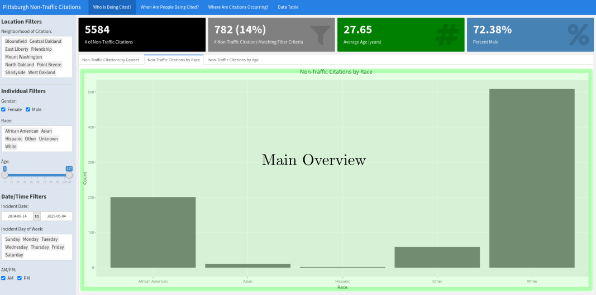


## Design Principles

- Overview first

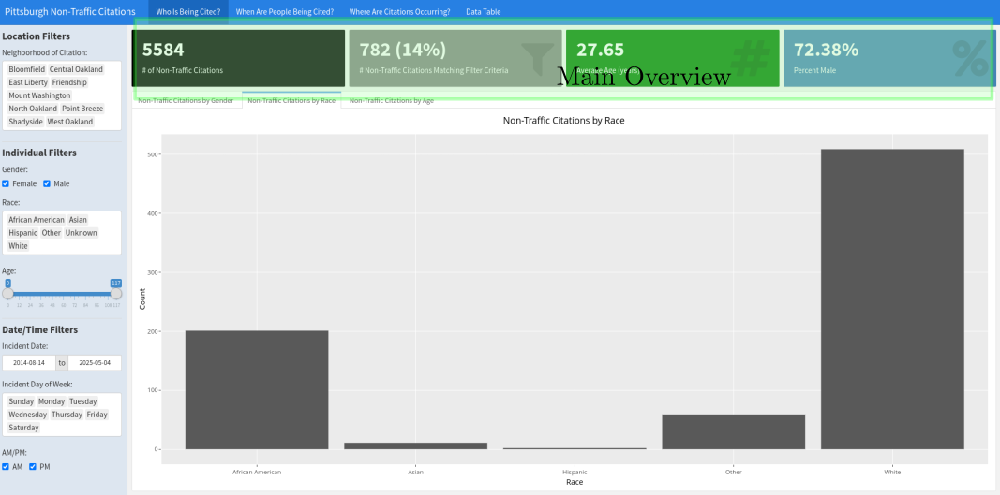


## Design Principles

- Then Filters
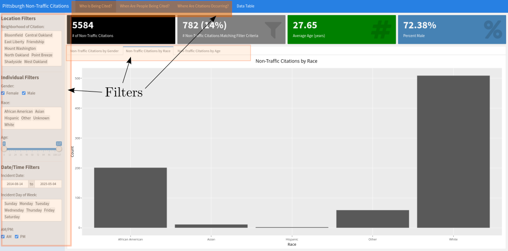


## Design Principles

- Fine Details
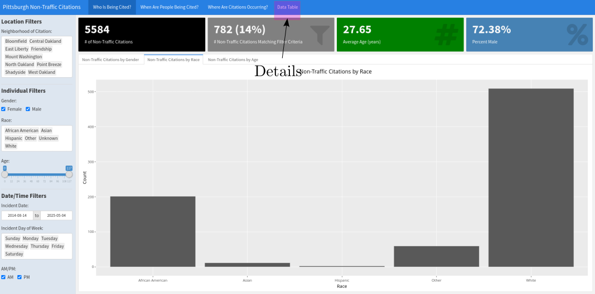


## Importance of Context

- Interactive Visualizations can range from highly narrative driven to purely exploratory
- Adding Contextual Clues Allows Reader to Create a Story
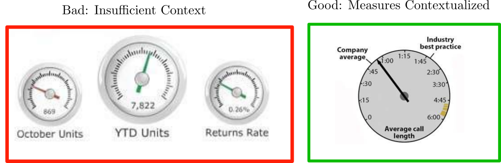


## Shiny App Layout

- Hierarchical functions calls 
- Different `Page`, `Panel`, and `Layout` Functions

:::: {.columns}

::: {.column width=50%}
```{r}
#| echo: true
#| eval: false

fluidPage(
  titlePanel(
    # app title/description
  ),
  sidebarLayout(
    sidebarPanel(
      # inputs
    ),
    mainPanel(
      # outputs
    )
  )
)


```
:::

::: {.column width=50%}
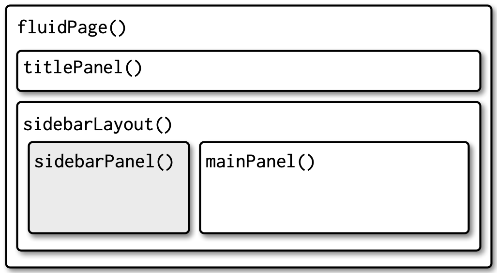
:::
::::


## Multi-Row

- `fluidRow` creates a row with space for 12 columns
- `column(n,)` takes `n` of those columns

:::: {.columns}
::: {.column width=50%}
```{r}
#| echo: true 
#| eval: false
fluidPage(
  fluidRow(
    column(4, 
      ...
    ),
    column(8, 
      ...
    )
  ),
  fluidRow(
    column(6, 
      ...
    ),
    column(6, 
      ...
    )
  )
)


```
:::

::: {.column width=50%}
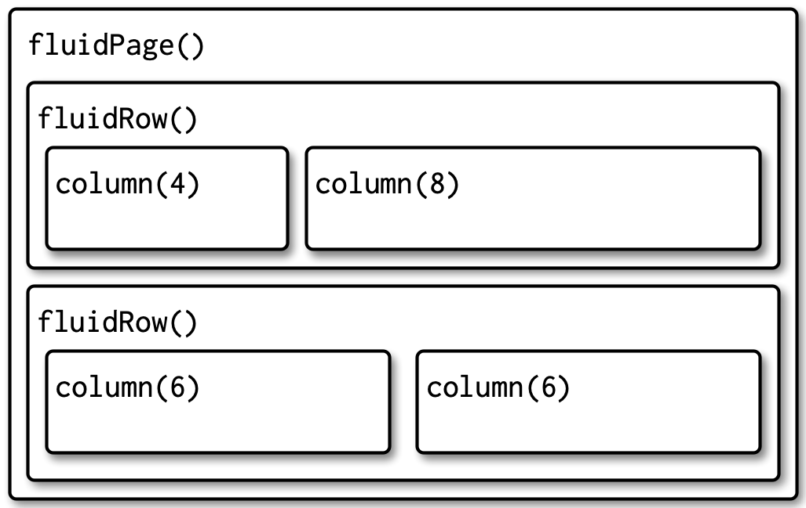
:::
::::


## Multi-Page

- Steven Few: "You should never have to scroll..."
- `tabsetPanel` and `tabPanel` create page elements

::: {.panel-tabset}

## Code

```{r}
#| echo: true
#| eval: false
ui <- fluidPage(
  tabsetPanel(
    tabPanel("Import data", 
      fileInput("file", "Data", buttonLabel = "Upload..."),
      textInput("delim", "Delimiter (leave blank to guess)", ""),
      numericInput("skip", "Rows to skip", 0, min = 0),
      numericInput("rows", "Rows to preview", 10, min = 1)
    ),
    tabPanel("Set parameters"),
    tabPanel("Visualise results")
  )
)

```

## Layout

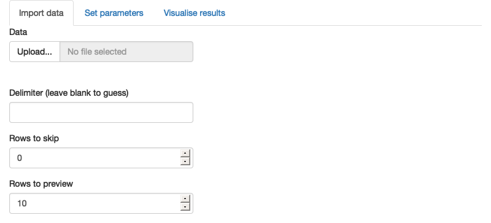

:::

## Tabset ID {.smaller}

- You can alter the behavior of elements based on ID of tab

::: {.panel-tabset}

## Code 

```{r}
#| echo: true
#| eval: false

ui <- fluidPage(
  sidebarLayout(
    sidebarPanel(
      textOutput("panel")
    ),
    mainPanel(
      tabsetPanel(
        id = "tabset",
        tabPanel("panel 1", "one"),
        tabPanel("panel 2", "two"),
        tabPanel("panel 3", "three")
      )
    )
  )
)
server <- function(input, output, session) {
  output$panel <- renderText({
    paste("Current panel: ", input$tabset)
  })
}

```

## Layout


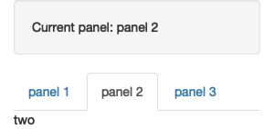

:::

## Themes

- There are many theme packages for `shiny`
  - `bootstrap`, i.e. `library(bslib)`
  - `shiny.semantic`, `shinyMobile`, `shinydashboard`, `shinymaterial`
- Also extensions:
  - `shinyTableau`
  
## Themes

- `layout` functions have a theme argument

::: {.panel-tabset}

## Code

```{r}
#| echo: true
#| eval: false

ui <- fluidPage(
  theme = bslib::bs_theme(bootswatch = "darkly"),
  sidebarLayout(
    sidebarPanel(
      textInput("txt", "Text input:", "text here"),
      sliderInput("slider", "Slider input:", 1, 100, 30)
    ),
    mainPanel(
      h1(paste0("Theme: darkly")),
      h2("Header 2"),
      p("Some text")
    )
  )
)

```

## Darkly

```{r}
#| echo: true
#| eval: false
ui <- fluidPage(
  theme = bslib::bs_theme(bootswatch = "darkly"),
```

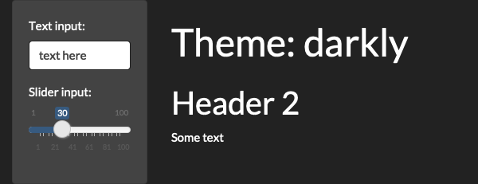

## Sandstone

```{r}
#| echo: true
#| eval: false
ui <- fluidPage(
  theme = bslib::bs_theme(bootswatch = "sandstone"),
```

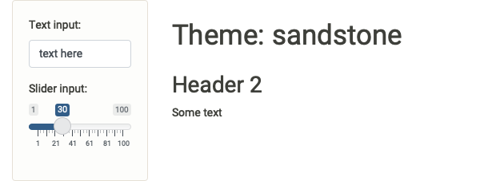

:::


## Themes

:::: {.columns}

::: {.column width=40%}
- [bootswatch.com](https://bootswatch.com/) for more themes

:::

::: {.column width=60%}
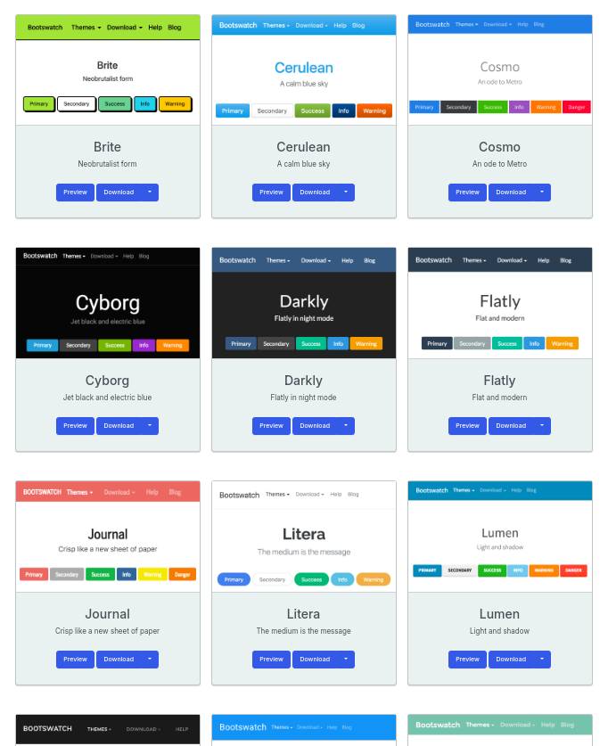{width=80%}
:::
::::

## Theme Customization

- You can also create your own themes:

```{r}
#| echo: true
library(bslib)

theme <- bslib::bs_theme(
  bg = "#0b3d91", 
  fg = "white", 
  base_font = "Source Sans Pro"
)

```


## Plot Themes

- `thematic` package automatically matches theme of plots to app theme

::: {.panel-tabset}

## Code

```{r}
#| echo: true
#| eval: false

server <- function(input, output, session) {
  thematic::thematic_shiny()
  
  output$plot <- renderPlot({
    ggplot(mtcars, aes(wt, mpg)) +
      geom_point() +
      geom_smooth()
  }, res = 96)
}
```

## Plot
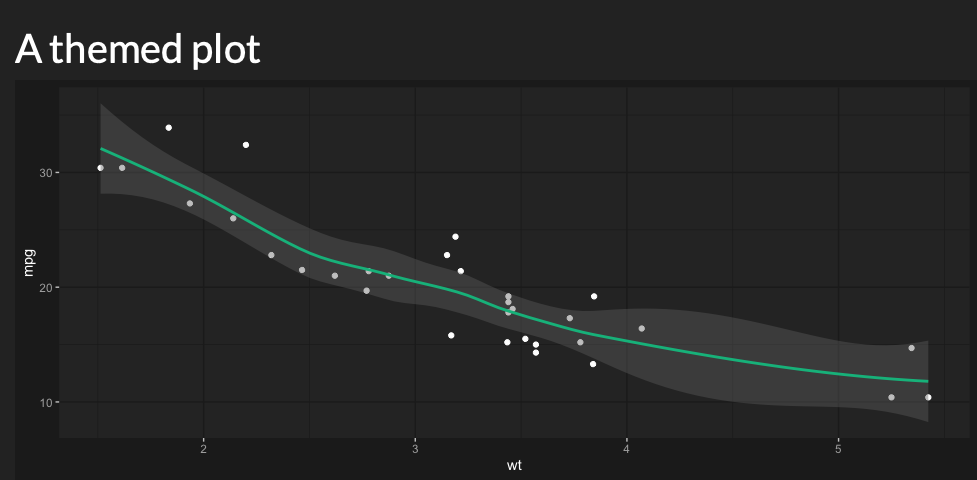{width=70%}

:::

## Thanks!