```{r}
#| echo: False
#| output: False
library(tidyverse)
library(kableExtra)
library(ggrepel)
library(lubridate)
library(scales)
library(patchwork)
library(ggthemes)
library(DT)

```

## Why Are Pie-Charts Terrible? 

- "Pie Charts are Evil"
  - Chapter 2 Storytelling with Data
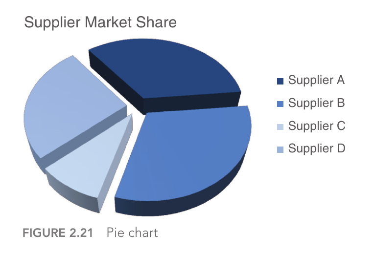

## Why Are Pie-Charts Terrible? 


- Lots of graphics advice is presented as rules
- Are there principles behind these rules?

## What to do this week

1. Readings: Chapter 2 of "Storytelling" and Chapter 5 of "Fundamentals"
2. Bonus Reading: Cleveland et al 1984 Perceptual Visualization Paper
3. Discussion: Favorite Graph
4. First HW due Sunday at midnight

## What Makes a Graph Good

- We use graphs to communicate quantitative data
- A graph is good if it successfully conveys quantitative data to the reader
- [Can we break down visualizations into a series of elementary perceptual tasks and then test how good humans are at completing each one?]{style="color:blue"}
- Research program led by many, William Cleveland most prominent


## Elementary Perceptual Tasks {.smaller}

:::: {.columns}

::: {.column width="50%"}


1. Position along a common scale
2. Position along non-aligned scales
3. Length
4. Direction
5. Angle
6. Area
7. Volume
8. Curvature
9. Shading
10. Hue/Saturation

:::

::: {.column width="50%"}

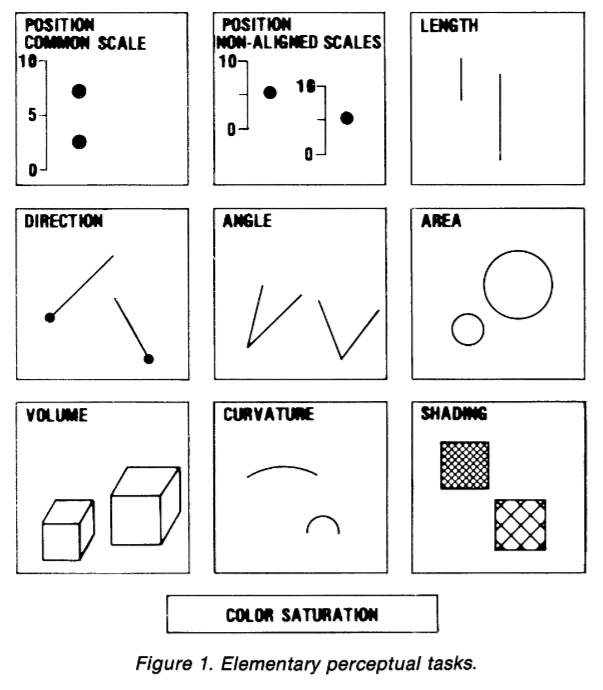
:::

::::

## Elementary Perceptual Tasks {.smaller}

:::: {.columns}

::: {.column width="50%"}


1.  [__Position along a common scale__]{style="color:red;"}
2. Position along non-aligned scales
3. Length
4. Direction
5. Angle
6. Area
7. Volume
8. Curvature
9. Shading
10. Hue/Saturation

:::

::: {.column width="50%"}

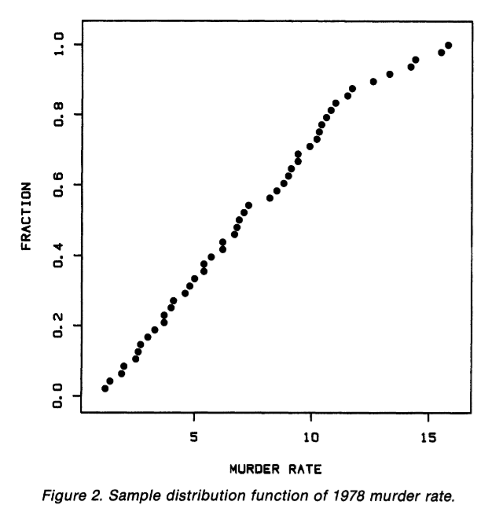

:::

::::


## Elementary Perceptual Tasks {.smaller}

:::: {.columns}

::: {.column width="50%"}


1. Position along a common scale
2. [__Position along non-aligned scales__]{style="color:red"}
3. Length
4. Direction
5. Angle
6. Area
7. Volume
8. Curvature
9. Shading
10. Hue/Saturation

:::

::: {.column width="50%"}

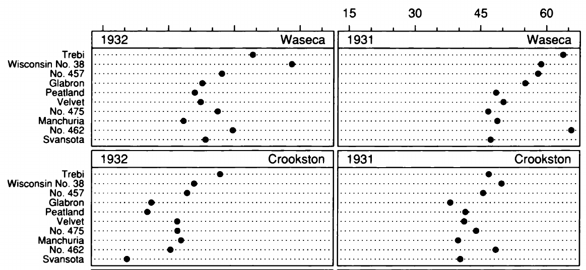

:::

::::

## Elementary Perceptual Tasks {.smaller}

:::: {.columns}

::: {.column width="50%"}


1. [Position along a common scale]{style="color:red"}
2. Position along non-aligned scales
3. Length 
4. Direction
5. Angle
6. [__Area__]{style="color:red"}
7. Volume
8. Curvature
9. Shading
10. Hue/Saturation

:::

::: {.column width="50%"}

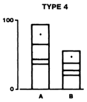

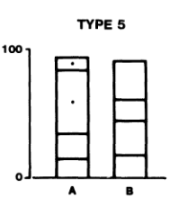

:::

::::

## Elementary Perceptual Tasks {.smaller}

:::: {.columns}

::: {.column width="50%"}


1. Position along a common scale
2. Position along non-aligned scales
3. [__Length__]{style="color:red"}
4. Direction
5. Angle
6. Area
7. Volume
8. Curvature
9. Shading
10. Hue/Saturation

:::

::: {.column width="50%"}

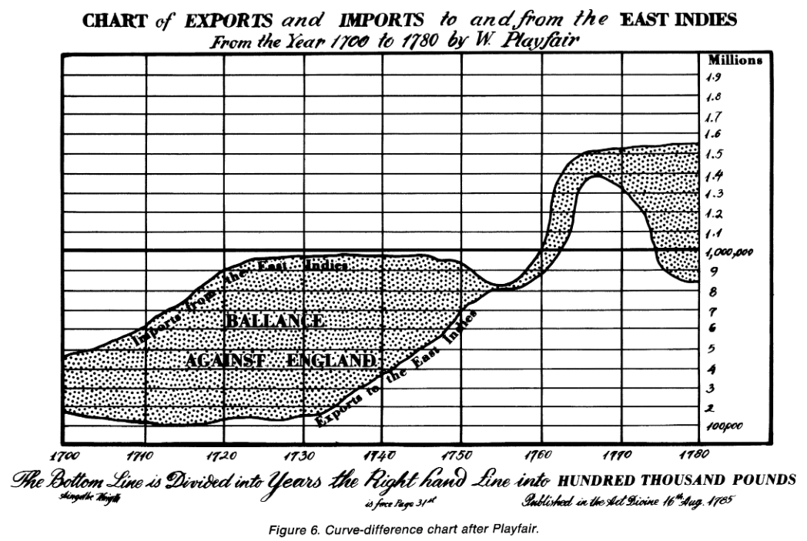

:::

::::

## Elementary Perceptual Tasks {.smaller}

:::: {.columns}

::: {.column width="50%"}


1. Position along a common scale
2. Position along non-aligned scales
3. Length
4. Direction
5. [__Angle__]{style="color:red"}
6. [__Area__]{style="color:red"}
7. Volume
8. Curvature
9. Shading
10. Hue/Saturation

:::

::: {.column width="50%"}

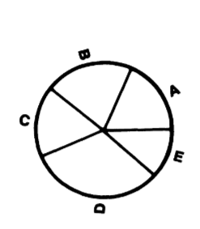

:::

::::


## Elementary Perceptual Tasks {.smaller}

:::: {.columns}

::: {.column width="50%"}


1. Position along a common scale
2. Position along non-aligned scales
3. Length
4. Direction
5. Angle
6. Area
7. [__Volume__]{style="color:red"}
8. Curvature
9. Shading
10. Hue/Saturation

:::

::: {.column width="50%"}

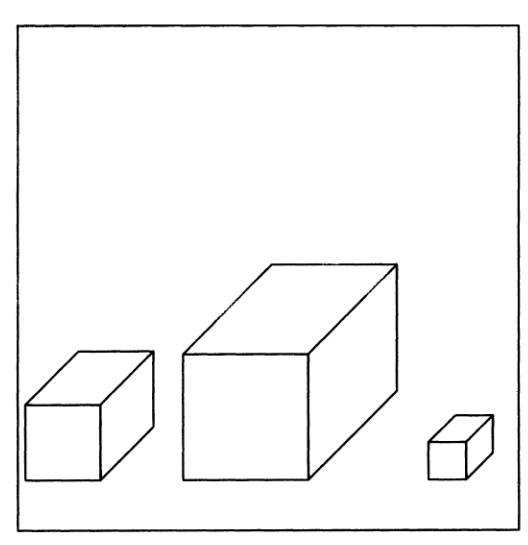

:::

::::


## Elementary Perceptual Tasks {.smaller}

:::: {.columns}

::: {.column width="50%"}


1. Position along a common scale
2. Position along non-aligned scales
3. [__Length__]{style="color:red"}
4. Direction
5. Angle
6. [__Area__]{style="color:red"}
7. Volume
8. Curvature
9. Shading
10. Hue/Saturation

:::

::: {.column width="50%"}

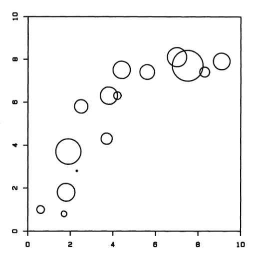

:::

::::

## Elementary Perceptual Tasks {.smaller}

:::: {.columns}

::: {.column width="50%"}


1. Position along a common scale
2. Position along non-aligned scales
3. Length
4. Direction
5. Angle
6. Area
7. Volume
8. Curvature
9. [__Shading__]{style="color:red"}
10. Hue/Saturation

:::

::: {.column width="50%"}

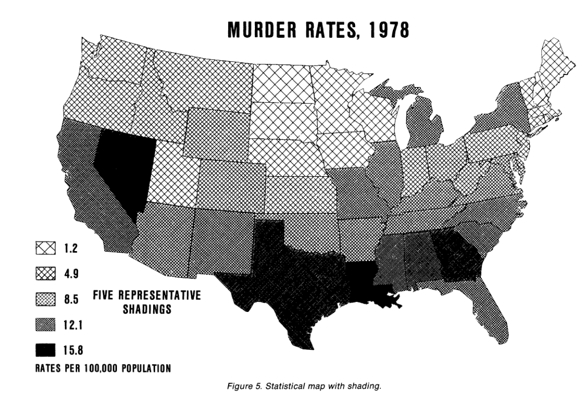
:::
::::

## Elementary Perceptual Tasks {.smaller}

:::: {.columns}

::: {.column width="50%"}


1. Position along a common scale
2. Position along non-aligned scales
3. [__Length__]{style="color:red"}
4. Direction
5. Angle
6. [__Area__]{style="color:red"}
7. Volume
8. Curvature
9. Shading
10. Hue/Saturation

:::

::: {.column width="50%"}

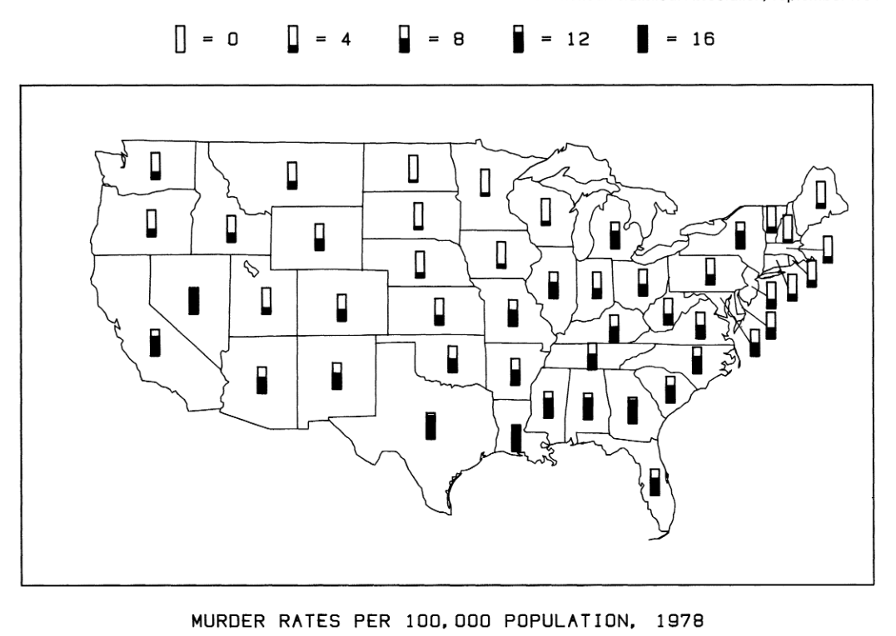

:::

::::


## Elementary Perceptual Tasks {.smaller}

:::: {.columns}

::: {.column width="50%"}


1. Position along a common scale
2. Position along non-aligned scales
3. Length
4. Direction
5. Angle
6. Area
7. Volume
8. Curvature
9. Shading
10. [__Hue/Saturation__]{style="color:red"}

:::

::: {.column width="50%"}

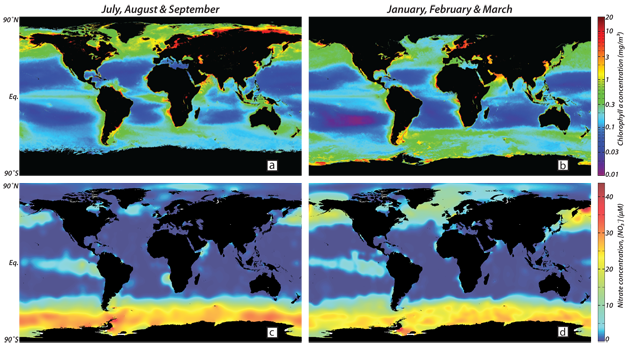
:::
::::

## Some Perceptual Tasks are Easier

- Position along a common axis is the best
- Percentage of major errors:
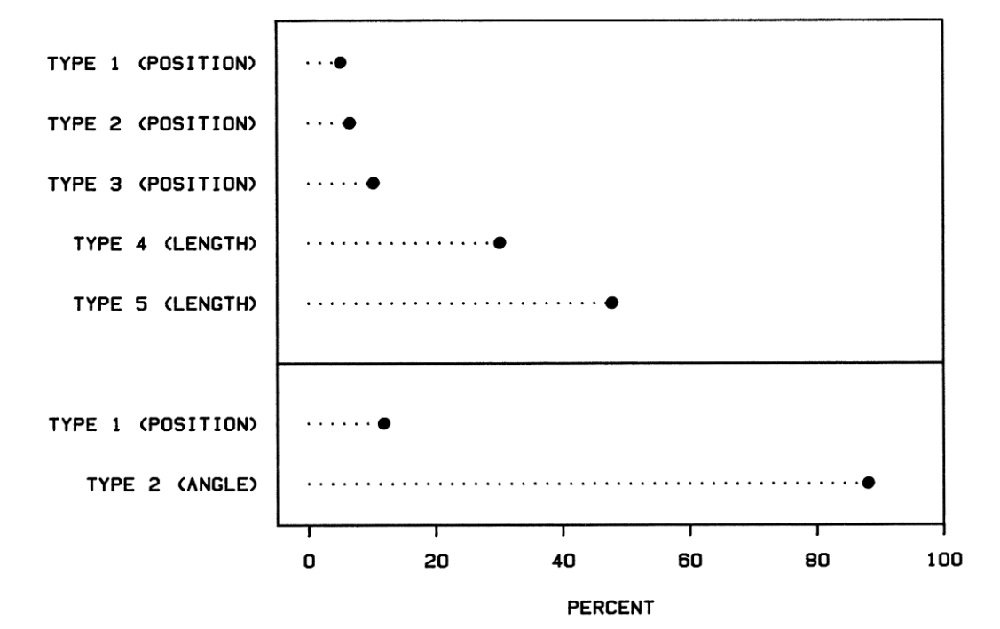{width=70%}

## Some Perceptual Tasks are Easier

- Position along a common axis is the best
- Error
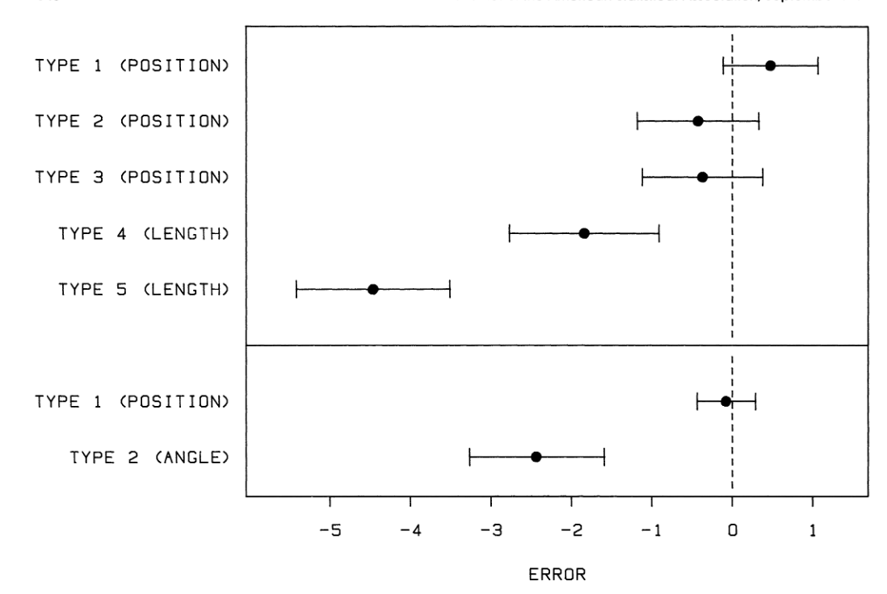{width=70%}

## Overall Ranking
:::: {.columns}

::: {.column width="50%"}
1. Position along a common axis 
2. Position along an uncommon axis 
3. Length, Direction, Angle
4. Area
5. Shading, Color Saturation
6. Volume, Curvature
:::

::: {.column width="50%"}
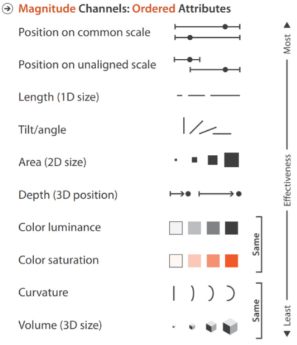
:::

::::


## Implications

- Plot the comparisons you want to make on the same axis
- Position can usually substitute length, direction, and angle
- Avoid 3D
- Be cautious with area
- Shading and color saturation are very imprecise

## Dot-Plots for 1D Comparisons

- Flights from each carrier leaving NYC in 2013

```{r}
library(tidyverse)
library(ggplot2)
library(nycflights13)

pie(flights |> count(carrier) |> pull(n), labels = flights |> count(carrier) |> pull(carrier), title = "Fraction of flights from NYC By Carrier")

```

## Dot-Plots for Comparisons

- Flights from each carrier leaving NYC in 2013

```{r}
flights |> count(carrier) |> arrange(desc(n)) |> 
  ggplot(aes(as_factor(carrier),n)) + 
  geom_bar(stat="identity") +
  theme_bw(base_size = 20) +
  xlab("Carrier") +
  ylab("Flights") 

```

## Dot-Plots for Comparisons

- Flights from each carrier leaving NYC in 2013


```{r}
flights |> count(carrier) |> arrange((n)) |> 
  ggplot(aes(x=n,y=as_factor(carrier),label = carrier)) + 
  geom_point(size=3) +
  theme_bw(base_size = 20) +
  xlab("Flights") +
  ylab("Carrier") 


```

## Show Differences Directly

- Position is much easier to judge than length
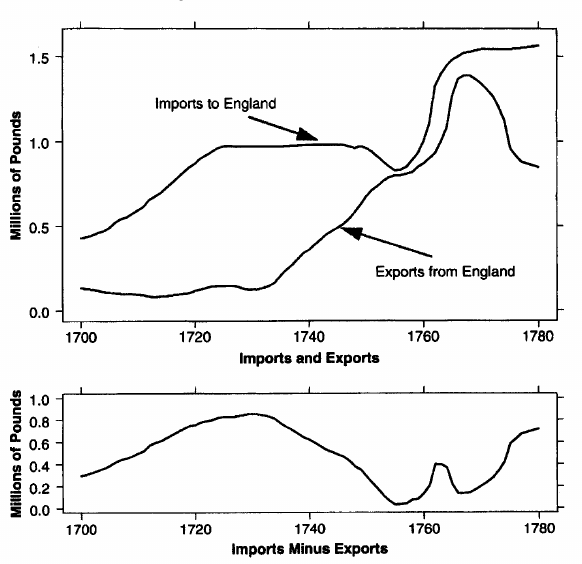

## Show Differences Directly

- Position is much easier to judge than length
- These curves have a constant height difference
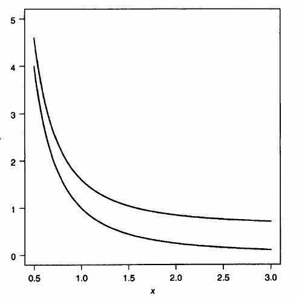

## Show Differences Directly

- Adjacent Bars Versus Dots on the same Axis

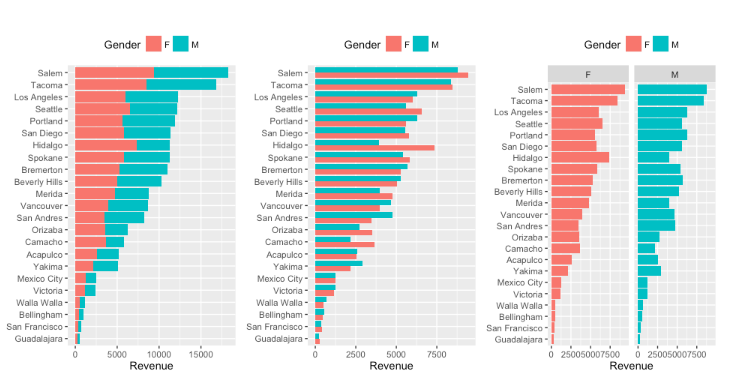

## Show Differences Directly

- Adjacent Bars Versus Dots on the same Axis

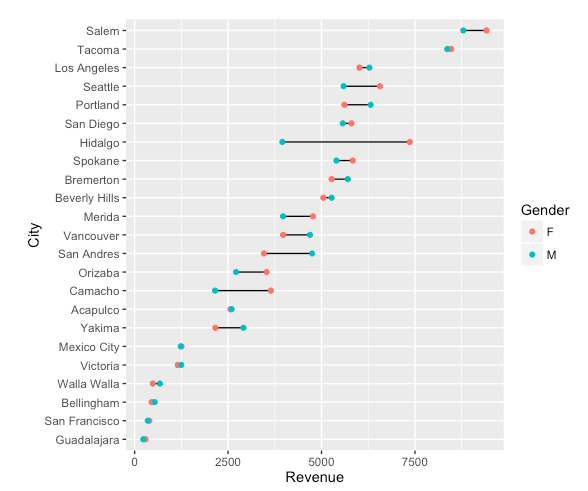


## What to do About Color?

- Color is a poor choice for precise numerical comparisons
- Consider whether you need to use it at all
- It is very helpful for illustrating geographic patterns

## Perceptually Uniform Colormaps

- Colormaps attach color to number
- Visual complexity makes it easy for the colormap to create
features that aren't there or to hide features
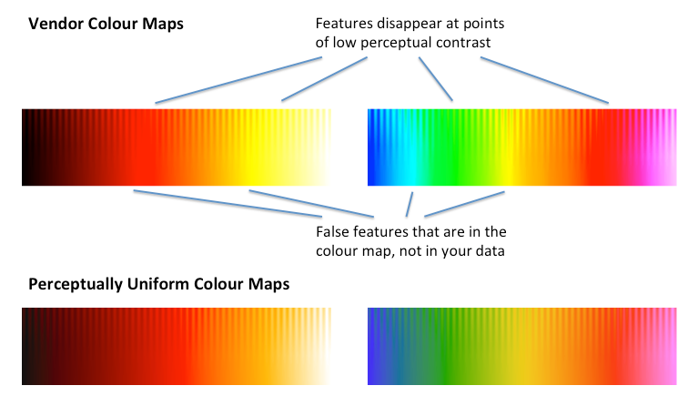

## Colormap Example

- Which colormap renders the surface height better?

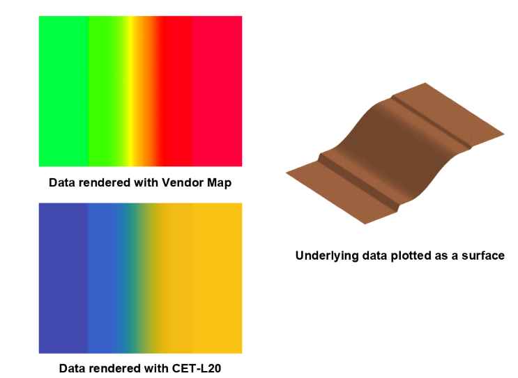

## Colormap Types: Sequential/Perceptually Uniform

- [Matplotlib Website](https://matplotlib.org/stable/users/explain/colors/colormaps.html#colormaps)


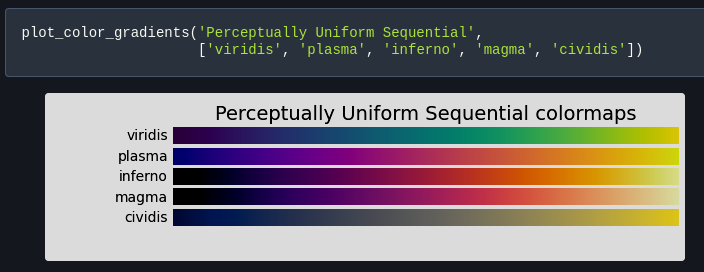


## Colormap Types: Sequential


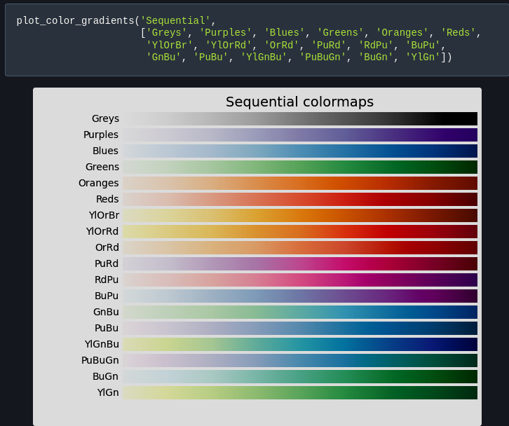


## Colormap Types: Diverging


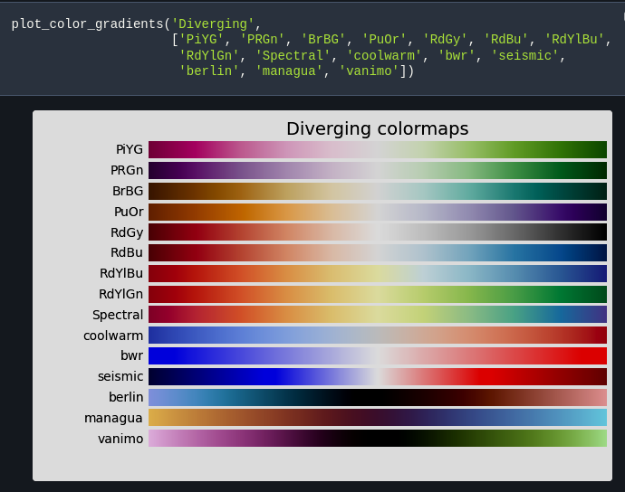


## Colormap Types: Qualitative


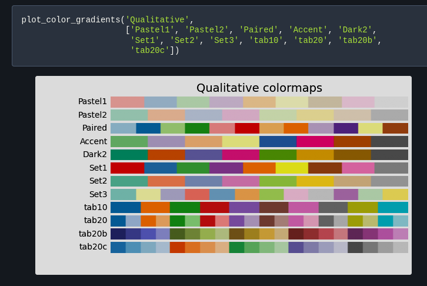


## Do you need a map?

- [Gelman 2004: All Maps of Parameter Estimates are Misleading](https://sites.stat.columbia.edu/gelman/research/published/allmaps.pdf)

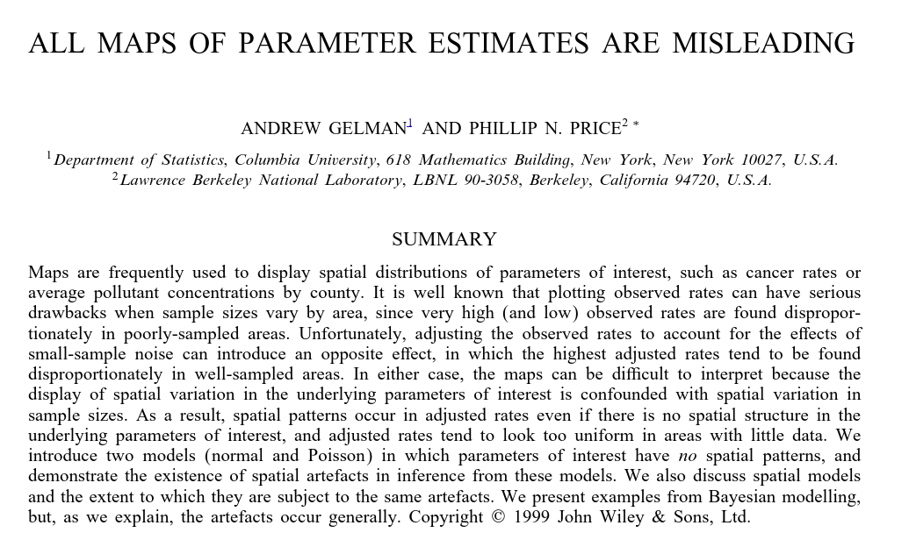{width=80%}


## Categories/Qualitative Features

- Hue/Color and Shape are good for differentiating categories
- Category limit 5 or 6
```{r}

mpg |> ggplot(aes(displ,hwy,shape = drv,color = drv)) +
  geom_point(size=5) +
  theme_clean(base_size = 18)


```

## Small Multiples for Categories

- Suppose we want to show a relationship between many variables
- Make repeated plots with same axis that correspond to different categorical or numerical dimensions
- Facets, Trellis plots, small multiples plots, etc

## Small Multiples for Categories

- Suppose we want to show a relationship between many variables
- Make repeated plots with same axis that correspond to different categorical or numerical dimensions
- Facets, Trellis plots, small multiples plots, etc

## Small Multiples Example

```{r}
#| out-width: 80%
#| fig-asp: 0.67
library(lattice)
barley |> 
  ggplot(aes(x=yield,y=variety,color=year)) +
  geom_point(size=2.5) +
  facet_wrap(~site,nrow = 3) +
  theme_bw(base_size = 14)

```


## Thanks!


