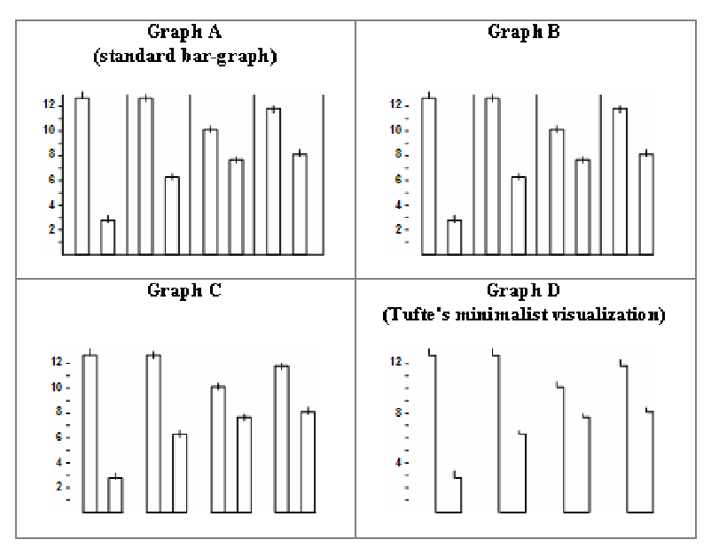

```{r}
#| echo: False
#| output: False
library(tidyverse)
library(kableExtra)
library(ggrepel)
library(lubridate)
library(scales)
library(patchwork)
library(ggthemes)
library(DT)

```


## Week Summary

- This week we will read about more quality principles used to structure graphs
- There is lots of "smart" sounding advice, but is it good and how to do it?
- Discussion on different quality principles and begin Data Story 2
- Planning to make a coding vignette on `plotnine`

## Data Story 2


- Data Story 2 is about the Federal Reserve
- Emphasis is on improving figure basics


## Principle of Uniformity of Graphics

- Represent data directly proportional to ink/graphics
  - Lie Factor = (size of effect shown in graphic) / (size of effect in data)
  - Proportional Ink
- Clear, detailed, and thorough labeling
  - Write explanations on the graphic.
  - Label important events
- Show data variation, not design variation


## Principal of Proportional Ink

> "The representation of numbers, as physically measured on the surface of the graphic itself, should be directly proportional to the numerical quantities represented." (1983, p.56) Edward Tufte, The Visual Display of Quantitative Information

-   This principle avoids many misleading visualizations

## Example

::: columns
::: {.column width="50%"}


:::

::: {.column width="50%"}
-   Scale doesn't start at 0
-   Width expands with height
-   Danger in bar plots, filled line plots, plots with elements that scale with data
:::
:::

## Bar Plots Should Start at 0

::: columns
::: {.column width="50%"}
Wrong

```{r}
library(openintro)
library(palmerpenguins)
nycflights |> mutate(month = as.factor(month)) |> ggplot(aes(x=month)) +
  geom_bar() +
  coord_cartesian(ylim = c(2000, 3000)) +
  theme_bw(base_size = 36) +
  labs(title = "NYC Flights by Month")

```

Or make them line charts:
:::

::: {.column width="50%"}
Right

```{r}
library(openintro)
nycflights |> mutate(month = as.factor(month)) |> ggplot(aes(x=month)) +
  geom_bar() +
  theme_bw(base_size = 36) +
  labs(title = "NYC Flights by Month") 

```

```{r}
library(openintro)
nycflights |> group_by(month) |> 
  summarise(count = n()) |> ggplot(aes(x=month,y=count)) +
  geom_line() +
  theme_bw(base_size = 36) +
  labs(title = "NYC Flights by Month") +
  scale_x_continuous(breaks = seq(1,12,by=1))

```
:::
:::

## Bar Plots at 0: How?

```{r}
#| echo: true
#| eval: false
#| source-line-numbers: 
#| code-line-numbers: "5,9"

nycflights |> mutate(month = as.factor(month)) |> ggplot(aes(x=month)) +
  geom_bar() +
  theme_bw(base_size = 36) +
  labs(title = "NYC Flights by Month") +
  coord_cartesian(ylim = c(0, 3000))

nycflights |> group_by(month) |> 
  summarise(count = n()) |> ggplot(aes(x=month,y=count)) +
  geom_line() +
  theme_bw(base_size = 36) +
  labs(title = "NYC Flights by Month") +
  scale_x_continuous(breaks = seq(1,12,by=1))

```


## Filled Plots Should Start at 0

::: columns
::: {.column width="50%"}
Wrong

```{r}
library(openintro)
sp500_1950_2018 |> mutate(Date = as.Date(Date)) |> 
  filter(Date > as.Date("2015-01-01") ) |> ggplot(aes(x=Date,y=Close)) +
  geom_area(fill = "blue",alpha = 0.5) +
  geom_line() +
  theme_bw(base_size = 24) +
  labs(title = "S&P 500 Closing Price") +
  coord_cartesian(ylim = c(1750, 3000))
  

```

Or transform data to represent a net change:
:::

::: {.column width="50%"}
Right

```{r}
library(openintro)
sp500_1950_2018 |> mutate(Date = as.Date(Date)) |> 
  filter(Date > as.Date("2015-01-01") ) |> ggplot(aes(x=Date,y=Close)) +
  geom_area(fill = "blue",alpha = 0.5) +
  geom_line() +
  theme_bw(base_size = 24) +
  labs(title = "S&P 500 Closing Price") 
  

```

```{r}


library(openintro)

Initial_Date = sp500_1950_2018 |> filter(Date == "2015-01-02") 
Initial_Open = Initial_Date$Open[1]

sp500_1950_2018 |> mutate(Date = as.Date(Date)) |> 
  filter(Date > as.Date("2015-01-03") ) |> 
  mutate(Price_Change = Close - Initial_Open) |> ggplot(aes(x=Date,y=Price_Change)) +
  geom_area(fill = "blue",alpha = 0.5) +
  geom_line() +
  theme_bw(base_size = 24) +
  labs(title = "S&P 500 Closing Price",
       y = "Price Change\n from 1-Jan-2015")

```
:::
:::

## Filled Plots: How?

```{r}
#| echo: true
#| eval: false
#| source-line-numbers: 
#| code-line-numbers: "7,9-10,14"

sp500_1950_2018 |> mutate(Date = as.Date(Date)) |> 
  filter(Date > as.Date("2015-01-01") ) |> ggplot(aes(x=Date,y=Close)) +
  geom_area(fill = "blue",alpha = 0.5) +
  geom_line() +
  theme_bw(base_size = 24) +
  labs(title = "S&P 500 Closing Price") +
  coord_cartesian(ylim = c(0, 3000))

Initial_Date = sp500_1950_2018 |> filter(Date == "2015-01-02") 
Initial_Open = Initial_Date$Open[1]

sp500_1950_2018 |> mutate(Date = as.Date(Date)) |> 
  filter(Date > as.Date("2015-01-03") ) |> 
  mutate(Price_Change = Close - Initial_Open) |> ggplot(aes(x=Date,y=Price_Change)) +


```


## Scale Area not Radius

```{r fig.height=8}

plotWrong = penguins |> ggplot(aes(x=bill_depth_mm,y=bill_length_mm,size = body_mass_g,color=species)) +
  geom_point(alpha = 0.5) +
  labs(title = "Wrong") +
  theme_bw(base_size = 18) +
  scale_radius()

plotRight = penguins |> ggplot(aes(x=bill_depth_mm,y=bill_length_mm,size = body_mass_g,color=species)) +
  geom_point(alpha = 0.5) +
  labs(title = "Right") +
  scale_size_area() +
  theme_bw(base_size = 18)


plotWrong / plotRight

```

## Scale Area: How?

```{r}
#| echo: true
#| eval: false
#| source-line-numbers: 
#| code-line-numbers: "3,7"

plotRight = penguins |> ggplot(aes(x=bill_depth_mm,
                                y=bill_length_mm,
                                size = body_mass_g,
                                color=species)) +
  geom_point(alpha = 0.5) +
  labs(title = "Right") +
  scale_size_area() +
  theme_bw(base_size = 18)
```

## Principles of Graphical Excellence

> Graphical Excellence is that which gives to the viewer the greatest number of ideas in the shortest
time with the least ink in the smallest space (Tufte)

- Two types of visual elements in figures
  - Data
  - Other Stuff
- Maximize Data-Ink Ratio

## Example

```{r}
library(readr)
library(lubridate)
library(ggrepel)
library(DAAG)
data(ais)
library(tidyverse)
library(ggplot2)
library(ggthemes)

male_Aus = tibble(ais) |> filter(sex=="m") %>%
    filter(sport %in% c("B_Ball", "Field", "Swim", "T_400m", "T_Sprnt", "W_Polo")) %>%
    mutate(sport = case_when(sport == "T_400m" ~ "Track",
                             sport == "T_Sprnt" ~ "Track",
                             sport == "B_Ball" ~ "Basketball",
                             sport == "W_Polo" ~ "Water Polo",
                             TRUE ~ sport))

male_Aus |> ggplot(aes(x=ht,y=pcBfat,color=sport,fill=sport,shape=sport)) +
     geom_point(size=2.5) +
     theme_excel(base_size = 40) +
  theme(
    panel.grid.major = element_line(color = "black", size = 1),
    panel.grid.minor = element_line(color = "black", size = 0.5),
    panel.border = element_rect(color = "black", size = 3)) +
  labs(title = "Height and Bodyfat of Australian Athletes") +
  xlab("Height") +
  ylab("Bodyfat")


```

- This figure has lots of chart-junk

## How so ugly?

```{r}
#| echo: true
#| eval: false

male_Aus |> ggplot(aes(x=ht,y=pcBfat,color=sport,fill=sport,shape=sport)) +
     geom_point(size=2.5) +
     theme_excel(base_size = 24) +
  theme(
    panel.grid.major = element_line(color = "black", size = 1),
    panel.grid.minor = element_line(color = "black", size = 0.5),
    panel.border = element_rect(color = "black", size = 3)) +
  labs(title = "Height and Bodyfat of Australian Athletes") +
  xlab("Height") +
  ylab("Bodyfat")

```

- `theme_excel` lots of poor decisions there
- `panel.grid.major`
- `panel.grid.minor`
- `panel.border`

## Improve It

```{r}
#| echo: true
#| eval: false
#| code-line-numbers: "3"


male_Aus |> ggplot(aes(x=ht,y=pcBfat,color=sport,fill=sport,shape=sport)) +
     geom_point(size=2.5) +
     theme_bw(base_size = 24) +
  labs(title = "Height and Bodyfat of Australian Athletes") +
  xlab("height (cm)") +
  ylab("%bodyfat")

```

## Improve It

```{r}

male_Aus |> ggplot(aes(x=ht,y=pcBfat,color=sport,fill=sport,shape=sport)) +
     geom_point(size=2.5) +
     theme_bw(base_size = 24) +
  labs(title = "Height and Bodyfat of Australian Athletes") +
  xlab("height (cm)") +
  ylab("%bodyfat")

```

- Removed the intentionally bad items

## Improve It

```{r}
#| echo: true
#| eval: false
#| code-line-numbers: "4"
male_Aus |> ggplot(aes(x=ht,y=pcBfat,color=sport,fill=sport,shape=sport)) +
     geom_point(size=2.5) +
     theme_bw(base_size = 24) +
  scale_shape_manual(values = 21:25) +
  labs(title = "Height and Bodyfat of Australian Athletes") +
  xlab("height (cm)") +
  ylab("%bodyfat")

```

- Make the symbols solid

## Improve It

```{r}


male_Aus |> ggplot(aes(x=ht,y=pcBfat,color=sport,fill=sport,shape=sport)) +
     geom_point(size=2.5) +
     theme_bw(base_size = 24) +
  scale_shape_manual(values = 21:25) +
  labs(title = "Height and Bodyfat of Australian Athletes") +
  xlab("height (cm)") +
  ylab("%bodyfat")

```

- Make the symbols solid


## Improve It

```{r}
#| echo: true
#| eval: false
#| code-line-numbers: "5-6"

male_Aus |> ggplot(aes(x=ht,y=pcBfat,color=sport,fill=sport,shape=sport)) +
     geom_point(size=2.5,alpha=0.7,stroke=1) +
     theme_bw(base_size = 24) +
  scale_shape_manual(values = 21:25) +
   scale_color_colorblind() +
  scale_fill_colorblind() +
  labs(title = "Height and Bodyfat of Australian Athletes") +
  xlab("height (cm)") +
  ylab("%bodyfat")

```

- Switch to colorblind friendly palette

## Improve It

```{r}

library(scales)

male_Aus |> ggplot(aes(x=ht,y=pcBfat,color=sport,fill=sport,shape=sport)) +
     geom_point(size=2.5,alpha=0.7,stroke=1.) +
     theme_bw(base_size = 24) +
  scale_shape_manual(values = 21:25) +
   scale_color_colorblind() +
  scale_fill_colorblind() +
  labs(title = "Height and Bodyfat of Australian Athletes") +
  xlab("height (cm)") +
  ylab("%bodyfat")

```

- Switch to colorblind friendly palette


## Improve It

```{r}
library(scales)
#| eval: false
#| echo: true

male_Aus |> ggplot(aes(x=ht,y=pcBfat,color=sport,fill=sport,shape=sport)) +
     geom_point(size=2.5,alpha=0.7,stroke=1.) +
     theme_minimal(base_size = 24) +
  scale_shape_manual(values = 21:25) +
   scale_color_colorblind() +
  scale_fill_colorblind() +
  labs(title = "Height and Bodyfat of Australian Athletes") +
  xlab("height (cm)") +
  ylab("%bodyfat")

```

- Try a theme without background frame

## Improve It

```{r}
#| echo: true
#| eval: false
#| code-line-numbers: "3"


male_Aus |> ggplot(aes(x=ht,y=pcBfat,color=sport,fill=sport,shape=sport)) +
     geom_point(size=2.5,alpha=0.7,stroke=1.) +
     theme_minimal(base_size = 24) +
  scale_shape_manual(values = 21:25) +
   scale_color_colorblind() +
  scale_fill_colorblind() +
  labs(title = "Height and Bodyfat of Australian Athletes") +
  xlab("height (cm)") +
  ylab("%bodyfat")

```

- Try a theme without background frame


## Improve It?

```{r}
#| echo: true
#| eval: false
#| code-line-numbers: "3"

male_Aus |> ggplot(aes(x=ht,y=pcBfat,color=sport,fill=sport,shape=sport)) +
     geom_point(size=2.5,alpha=0.7,stroke=1.) +
     theme_tufte(base_size = 24) +
  scale_shape_manual(values = 21:25) +
  scale_color_colorblind() +
  scale_fill_colorblind() +
  labs(title = "Height and Bodyfat of Australian Athletes") +
  xlab("height (cm)") +
  ylab("%bodyfat")

```

- Tufte theme gets rid of everything


## Improve It?

```{r}


male_Aus |> ggplot(aes(x=ht,y=pcBfat,color=sport,fill=sport,shape=sport)) +
     geom_point(size=2.5,alpha=0.7,stroke=1.) +
     theme_tufte(base_size = 24) +
  scale_shape_manual(values = 21:25) +
   scale_color_colorblind() +
  scale_fill_colorblind() +
  labs(title = "Height and Bodyfat of Australian Athletes") +
  xlab("height (cm)") +
  ylab("%bodyfat")

```

- Tufte theme gets rid of everything


## How far is too far?

- I think it is possible to be too minimal
- Research supports this idea:

{width="50%"}


## Maximize Data:Ink Within Reason

- When figures are too minimalistic elements appear to "float"

```{r fig.width = 8, fig.asp = 3/4,}
data("Titanic")
titanic = as_tibble(Titanic)
titanic |> filter(Class != "Crew") |> mutate(Survived = if_else(Survived == "No", "died","survived")) |> 
     ggplot(aes(Sex,n,fill = Sex)) + geom_col() +
     facet_grid(Class ~ Survived,scales = "free_x") +
    scale_x_discrete(name = NULL) + 
    scale_y_continuous(limits = c(0, 195), expand = c(0, 0)) +
    scale_fill_manual(values = c("#D55E00D0", "#0072B2D0"), guide = "none") +
  theme_tufte(base_size = 24)

```

## Maximize Data:Ink Within Reason

- When figures are too minimalistic elements appear to "float"

```{r}
#| echo: true
#| eval: false

data("Titanic")
titanic = as_tibble(Titanic)
titanic |> 
  filter(Class != "Crew") |> 
  mutate(Survived =
           if_else(Survived == "No", "died","survived")) |> 
     ggplot(aes(Sex,n,fill = Sex)) + 
  geom_col() +
     facet_grid(Class ~ Survived,scales = "free_x") +
    scale_x_discrete(name = NULL) + 
    scale_y_continuous(limits = c(0, 195), expand = c(0, 0)) +
    scale_fill_manual(values = c("#D55E00D0", "#0072B2D0"), guide = "none") +
  theme_tufte(base_size = 24)

```

## Maximize Data:Ink Within Reason

- Adding a Gray Background grounds figures

```{r fig.width = 8, fig.asp = 3/4,}


colors <- c("#56B4E9", "#56B4E9")

p = data("Titanic")
titanic = as_tibble(Titanic)
titanic |> 
  filter(Class != "Crew") |> 
  mutate(Survived =
           if_else(Survived == "No", "died","survived")) |> 
     ggplot(aes(Sex,n,fill = Sex)) + 
  geom_col() +
     facet_grid(Class ~ Survived,scales = "free_x") +
scale_x_discrete(name = NULL) + 
    scale_y_continuous(limits = c(0, 195), expand = c(0, 0)) +
    scale_fill_manual(values = c("#D55E00D0", "#0072B2D0"), guide = "none") +
  theme_gray(base_size = 24) +
theme(axis.line = element_blank(),
          #axis.line.y = element_line(color = colors[2]),
          axis.ticks = element_blank(),
          axis.ticks.length = grid::unit(0, "pt"),
          #axis.ticks.y = element_line(color = colors[2]),
          axis.text.x = element_text(margin = margin(7, 0, 3.5, 0)),          strip.text = element_text(margin = margin(3.5, 3.5, 3.5, 3.5)),
          strip.background  = element_blank(),
          panel.background = element_rect(fill = "#E6E6E3",
                                          linewidth =0),
          panel.grid.major.x = element_blank(),
          panel.grid.minor.y = element_line(color="white",linewidth = 0.3),
          panel.grid.major.y = element_blank(),
          panel.grid.minor.x = element_blank())


```

## Maximize Data:Ink Within Reason

- Adding a Gray Background grounds figures

```{r fig.width = 8, fig.asp = 3/4,}
#| echo: true
#| eval: false
#| code-line-numbers: "2,10-16,"

p +
  theme_gray(base_size = 24) +
theme(axis.line = element_blank(),
          #axis.line.y = element_line(color = colors[2]),
          axis.ticks = element_blank(),
          axis.ticks.length = grid::unit(0, "pt"),
          #axis.ticks.y = element_line(color = colors[2]),
          axis.text.x = element_text(margin = margin(7, 0, 3.5, 0)),
      strip.text = element_text(margin = margin(3.5, 3.5, 3.5, 3.5)),
          strip.background  = element_blank(),
          panel.background = element_rect(fill = "#E6E6E3",
                                          linewidth =0),
          panel.grid.major.x = element_blank(),
          panel.grid.minor.y = element_line(color="white",linewidth = 0.3),
          panel.grid.major.y = element_blank(),
          panel.grid.minor.x = element_blank())


```


## More Gridline Tips

- Consider gridlines perpendicular to axis of variation:

```{r}

tech_stocks = read_csv("tech_stocks.csv")

tech_stocks |>
  ggplot(aes(x=date,y=return,group=Company,color=Company)) + geom_line(size=0.66,na.rm=TRUE) +
  geom_hline(yintercept = 1, size = 1.5, color="grey70") +
  theme_gray(base_size = 24) +
  scale_color_manual(
    values = c("#000000", "#E69F00", "#56B4E9", "#009E73"),
    name = NULL,
    breaks = c("AAPL", "META", "MSFT", "NVDA"),
    labels = c("Apple", "Meta", "Microsoft", "Nvidia")) +
  theme(
    strip.background  = element_blank(),
          panel.background = element_rect(fill = "#E6E6E3",
                                          linewidth =0),
          panel.grid.minor.y = element_line(color="white",linewidth = 1),
          panel.grid.major.y = element_line(color="white",linewidth = 1),
          panel.grid.minor.x = element_line(color="white",linewidth = 1),
          panel.grid.major.x = element_line(color="white",linewidth = 1),
  )

```

## More Gridline Tips

- Consider gridlines perpendicular to axis of variation:

```{r}

tech_stocks = read_csv("tech_stocks.csv")

tech_stocks |>
  ggplot(aes(x=date,y=return,group=Company,color=Company)) + geom_line(size=0.66,na.rm=TRUE) +
  geom_hline(yintercept = 1, size = 1.0, color="grey70") +
  theme_gray(base_size = 24) +
  scale_color_manual(
    values = c( "#009E73","#E69F00","#000000", "#56B4E9"),
    name = NULL,
    breaks = c("NVDA", "META", "AAPL", "MSFT"),
    labels = c("NVidia", "Meta", "Apple", "Microsoft"))  +
  theme(
    strip.background  = element_blank(),
          panel.background = element_rect(fill = "#E6E6E3",
                                          linewidth =0),
          panel.grid.minor.y = element_line(color="white",linewidth = 0.5),
          panel.grid.major.y = element_line(color="white",linewidth = 0.5),
          panel.grid.minor.x = element_blank(),
          panel.grid.major.x = element_blank(),
  )

```

## Gridlines: How?

- Consider gridlines perpendicular to axis of variation:

```{r}
#| echo: true
#| eval: false
#| code-line-numbers: "8-9,14-18"

tech_stocks |>
  ggplot(aes(x=date,y=return,group=Company,color=Company)) + geom_line(size=0.66,na.rm=TRUE) +
  geom_hline(yintercept = 1, size = 1.0, color="grey70") +
  theme_gray(base_size = 24) +
  scale_color_manual(
    values = c( "#009E73","#E69F00","#000000", "#56B4E"),
    name = NULL,
    breaks = c("NVDA", "META", "AAPL", "MSFT"),
    labels = c("NVidia", "Meta", "Apple", "Microsoft")) +
  theme(
    strip.background  = element_blank(),
          panel.background = element_rect(fill = "#E6E6E3",
                                          linewidth =0),
          panel.grid.minor.y = element_line(color="white",linewidth = 0.5),
          panel.grid.major.y = element_line(color="white",linewidth = 0.5),
          panel.grid.minor.x = element_blank(),
          panel.grid.major.x = element_blank(),
  )

```


## More Gridline Tips Paired Data

- For paired data, draw a regression line

```{r fig.width=8, fig.asp = 1}
tech_stocks = tech_stocks |> group_by(Company) |> mutate(daily_return = return/lag(return)) 
tech_stocks |> select(Company,date,daily_return) |> pivot_wider(names_from=Company,values_from = daily_return) |> 
  ggplot(aes(x=MSFT,y=AAPL)) +
  geom_point(alpha = 0.5,fill = "#0072B2D0",color="#0072B2D0",size=2) +
  stat_smooth(method="lm",color="gray",se = FALSE,linewidth=2) +
  theme_bw(base_size = 24) +
  xlab("MSFT Return") +
  ylab("AAPL Return")


```

## More Gridline Tips Paired Data

- For paired data, but drop gridlines

```{r fig.width=8, fig.asp = 1}
tech_stocks = tech_stocks |> group_by(Company) |> mutate(daily_return = return/lag(return)) 
tech_stocks |> select(Company,date,daily_return) |> pivot_wider(names_from=Company,values_from = daily_return) |> 
  ggplot(aes(x=MSFT,y=AAPL)) +
  geom_point(alpha = 0.5,fill = "#0072B2D0",color="#0072B2D0",size=2) +
  stat_smooth(method="lm",color="gray",se = FALSE,linewidth=2) +
  theme_bw(base_size = 24) +
  xlab("MSFT Return") +
  ylab("AAPL Return") +
  theme(
    panel.grid.minor.y = element_blank(),
          panel.grid.major.y = element_blank(),
          panel.grid.minor.x = element_blank(),
          panel.grid.major.x = element_blank(),
  )


```

## More Gridline Tips Paired Data

- For paired data, but drop gridlines
```{r}
#| echo: true
#| eval: false
#| code-line-numbers: "5,9-14"

tech_stocks = tech_stocks |> group_by(Company) |> mutate(daily_return = return/lag(return)) 
tech_stocks |> select(Company,date,daily_return) |> pivot_wider(names_from=Company,values_from = daily_return) |> 
  ggplot(aes(x=MSFT,y=AAPL)) +
  geom_point(alpha = 0.5,fill = "#0072B2D0",color="#0072B2D0",size=2) +
  stat_smooth(method="lm",color="gray",se = FALSE,linewidth=2) +
  theme_bw(base_size = 24) +
  xlab("MSFT Return") +
  ylab("AAPL Return") +
  theme(
    panel.grid.minor.y = element_blank(),
          panel.grid.major.y = element_blank(),
          panel.grid.minor.x = element_blank(),
          panel.grid.major.x = element_blank(),
  )

```


## Consider Larger Font Size

- Most common mistake in in person presentations
  - If you can, look at your slides from the back of the room
- Also an issue for figures in other formats
  - You see figure in full size on your screen
  - Publisher/Publishing software scales it down to fit it with your text

## Good Font Size

```{r}

male_Aus |> ggplot(aes(x=ht,y=pcBfat,color=sport,fill=sport,shape=sport)) +
     geom_point(size=2.5,alpha=0.7,stroke=1.) +
     theme_minimal(base_size = 24) +
  scale_shape_manual(values = 21:25) +
   scale_color_colorblind() +
  scale_fill_colorblind() +
  labs(title = "Height and Bodyfat of Australian Athletes") +
  xlab("height (cm)") +
  ylab("%bodyfat")

```

## Small Font Size

```{r}

male_Aus |> ggplot(aes(x=ht,y=pcBfat,color=sport,fill=sport,shape=sport)) +
     geom_point(size=1.5,alpha=0.7,stroke=1.) +
     theme_minimal(base_size = 14) +
  scale_shape_manual(values = 21:25) +
   scale_color_colorblind() +
  scale_fill_colorblind() +
  labs(title = "Height and Bodyfat of Australian Athletes") +
  xlab("height (cm)") +
  ylab("%bodyfat")

```

## Large Font Size

```{r}

male_Aus |> ggplot(aes(x=ht,y=pcBfat,color=sport,fill=sport,shape=sport)) +
     geom_point(size=3.5,alpha=0.7,stroke=1.) +
     theme_minimal(base_size = 32) +
  scale_shape_manual(values = 21:25) +
   scale_color_colorblind() +
  scale_fill_colorblind() +
  labs(title = "Height and Bodyfat of\n Australian Athletes") +
  xlab("height (cm)") +
  ylab("%bodyfat")
```

## How to change size

`ggplot2` based advice:

- `theme_x(base_size = ?)`
- `geom_point(size = ?)`
- `geom_line(linewidth=?)`
- `panel.grid.major.y = element_rect(linewidth = ?)`
- `axis.text.x = element_text(size=?)`


## Thanks!

