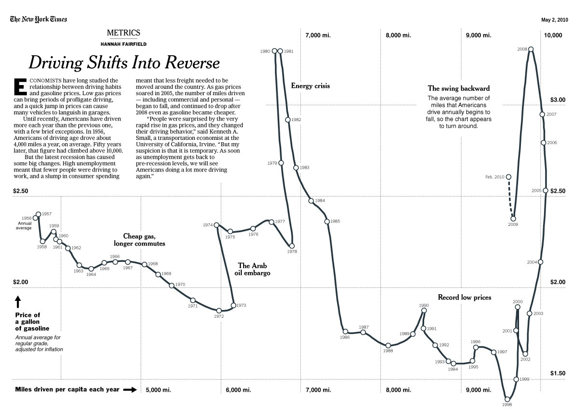

## Week 4 Summary

- Data Story 2 due this Sunday
- Discussion post on 
- This week is all about associations
  - Two variables
  - Time Series
  - Several to Many Variables


## Events Happening this Week!


## Events Happening this Week

1. Career Readiness Bootcamp
  - Wednesday Februar 19th, Room 407 319 West 31st Street

[In person link](https://forms.office.com/pages/responsepage.aspx?id=s_BgbwZfCU6XFZiduozH2HbtHT07h8RHsqfEh3iJc1xUOFFYRzZLSk5MOEtVMFhXREpYR0ZQQTkyUy4u&route=shorturl)

[Virtual link](https://us02web.zoom.us/meeting/register/YOIAuEsQREmTrWa8KeGV4Q#/)


## Events Happening This Week!


## Events Happening this Week

2. New York Open Statistical Computing Meetup 
  - 6:30-8:30+, Pless Hall NYU
  - $7 tickets must RSVP
  - We have a group that attends these monthly meetups
  - I won't be there this week not sure how the attendance will be

[Register by Clicking Here](https://nyhackr.org/)


## Scatterplots

- Shows how two variables are associated

```{r}
library(tidyverse)
library(palmerpenguins)
library(ggplot2)

penguins |> ggplot(aes(x=body_mass_g,y=flipper_length_mm)) +
  geom_point() +
  theme_bw(base_size = 18) +
  theme(aspect.ratio=0.67) +
  labs( title = "Flipper Length Increases With Body Mass") +
  xlab("Body Mass (g)") +
  ylab("Flipper Length (mm)")
  
```

## Scatterplots

- Shows how two variables are associated

```{r}
#| echo: true
#| eval: false
library(tidyverse)
library(palmerpenguins)
library(ggplot2)

penguins |> ggplot(aes(x=body_mass_g,y=flipper_length_mm)) +
  geom_point() +
  theme_bw(base_size = 18) +
  theme(aspect.ratio=0.67) +
  labs( title = "Flipper Length Increases With Body Mass") +
  xlab("Body Mass (g)") +
  ylab("Flipper Length (mm)")
  
```

## Multiple Types of Penguins


- Can add categorical information several ways:
  - Color/Shape (Same Graph)
  - Facets (Different Graphs)

```{r fig.width=12}
#| echo: false
library(patchwork)
library(ggthemes)
library(ggokabeito)
p1 = penguins |> ggplot(aes(x=body_mass_g,y=flipper_length_mm,color=species,shape = species,fill = species)) +
  geom_point() +
  theme_bw(base_size = 18) +
  scale_shape_manual(values=21:24)+
  scale_color_okabe_ito() +
  scale_fill_okabe_ito() +
  theme(aspect.ratio=0.67) +
  xlab("Body Mass (g)") +
  ylab("Flipper Length (mm)")

p2 = penguins |> ggplot(aes(x=body_mass_g,y=flipper_length_mm)) +
  geom_point() +
  theme_bw(base_size = 18) +
  facet_wrap(~species) + 
  theme(aspect.ratio=1) +
  xlab("Body Mass (g)") +
  ylab("Flipper Length (mm)")

p1 + labs(title="Species and Flipper vs Bodymass")
```


## Multiple Types of Penguins


- Can add categorical information several ways:
  - Color/Shape (Same Graph)
  - Facets (Different Graphs)

```{r}
p2 + labs(title="Species and Flipper vs Bodymass")

```


## Redundant Coding

```{r fig.width=12}
#| echo: false
library(patchwork)
library(ggthemes)
library(ggokabeito)
p1 = penguins |> ggplot(aes(x=body_mass_g,y=flipper_length_mm,color=species,shape = species,fill=species)) +
  geom_point() +
  theme_bw(base_size = 18) +
  scale_shape_manual(values=21:24)+
  scale_color_okabe_ito() +
  scale_fill_okabe_ito(alpha=0.7) +
  theme(aspect.ratio=0.67,legend.direction = "horizontal",
        legend.position = "bottom") +
  xlab("Body Mass (g)") +
  ylab("Flipper Length (mm)")


p2 = penguins |> ggplot(aes(x=body_mass_g,y=flipper_length_mm,color=species)) +
  geom_point() +
  theme_bw(base_size = 18) +
  scale_color_okabe_ito() +
  scale_fill_okabe_ito(alpha=0.7) +
  theme(aspect.ratio=0.67,
        legend.direction = "horizontal",
        legend.position = "bottom") +
  xlab("Body Mass (g)") +
  ylab("Flipper Length (mm)")

p1 + p2

```
- Some people can differentiate better when the additional variable is coded multiple times


## Limits on Channels

- Using multiple "channels" for different variables overloads the brain
- Practical limit is 1 categorical variable redundantly coded

```{r fig.width=12}
#| echo: false
library(patchwork)
library(ggthemes)
library(ggokabeito)
penguins |> ggplot(aes(x=body_mass_g,y=flipper_length_mm,color=species,shape = sex, fill = species, size = island)) +
  geom_point() +
  theme_bw(base_size = 18) +
  scale_shape_manual(values=21:24)+
  scale_color_okabe_ito() +
  scale_fill_okabe_ito(alpha=0.7) +
  theme(aspect.ratio=0.67) +
  xlab("Body Mass (g)") +
  ylab("Flipper Length (mm)") +
  labs(title = "Encoding too much")


```


## Facets

- Facet Grid and Facet wrap allow more annotations 

```{r}

penguins |> filter(sex %in% c("male","female")) |> 
        ggplot(aes(x=body_mass_g,
                   y=flipper_length_mm,
                   color=species,shape = species, 
                   fill = species)) +
  geom_point() +
  facet_grid(sex ~ island) +
  theme_bw(base_size = 16) +
  scale_shape_manual(values=21:24)+
  scale_color_okabe_ito() +
  scale_fill_okabe_ito(alpha=0.7) +
  theme(aspect.ratio=0.67,
        legend.direction = "horizontal",
        legend.position = "bottom") +
  xlab("Body Mass (g)") +
  ylab("Flipper Length (mm)") +
  labs(title = "Impact of Gender, Species, and Island")

```


## When to use Facets?

- Showing on the same plot is better because of direct comparisons unless:
  - You want to show several categories
  - Too many elements in category (6?) 


## Facilitating Comparisons with Facets

- Show all points on each facet

```{r}

penguins |> filter(sex %in% c("male","female")) |> 
        ggplot(aes(x=body_mass_g,
                   y=flipper_length_mm,
                   color=species,shape = species, 
                   fill = species)) +
  geom_point(data = transform(penguins, sex = NULL, island = NULL), color = "grey90",fill="grey90") +
  geom_point() +
  facet_grid(sex ~ island) +
  theme_bw(base_size = 16) +
  scale_shape_manual(values=21:24)+
  scale_color_okabe_ito() +
  scale_fill_okabe_ito(alpha=0.7) +
  theme(aspect.ratio=0.67,
        legend.direction = "horizontal",
        legend.position = "bottom") +
  xlab("Body Mass (g)") +
  ylab("Flipper Length (mm)") +
  labs(title = "Impact of Gender, Species, and Island") 

```

## Facilitating Comparisons with Facets

```{r}
#| echo: true
#| eval: false
#| code-line-numbers: "6-11"

penguins |> filter(sex %in% c("male","female")) |> 
        ggplot(aes(x=body_mass_g,
                   y=flipper_length_mm,
                   color=species,shape = species, 
                   fill = species)) +
  geom_point(data = transform(penguins, 
                              sex = NULL, 
                              island = NULL), 
             color = "grey90",
             fill="grey90") +  
    facet_grid(sex ~ island) + ... other
```
- Add to old plot another `geom_point`
- `NULL` the facet categories
- Force a light color

## Scatterplot Annotations

- Reduce cognitive load by labeling directly
- `stat_ellipse` draws ellipses around groups

```{r fig.width=12}
#| echo: false

p1 = penguins |> ggplot(aes(x=body_mass_g,y=flipper_length_mm,color=species,shape = species, fill = species)) +
  geom_point() +
  stat_ellipse(size=0.5) +
  theme_bw(base_size = 18) +
  scale_shape_manual(values=21:24)+
  scale_color_okabe_ito() +
  scale_fill_okabe_ito(alpha=0.7) +
  theme(aspect.ratio=0.67) +
  xlab("Body Mass (g)") +
  ylab("Flipper Length (mm)") +
  labs(title = "Ellipses Clarify")

p1

```

## Scatterplot Annotations


```{r fig.width=12}
#| echo: true
#| eval: false


penguins |> ggplot(aes(x=body_mass_g,y=flipper_length_mm,color=species,shape = species, fill = species)) +
  geom_point() +
  stat_ellipse(size=0.5) +
  other_commands(...)

```

```{r}
p1

```

## Labeling Ellipses

- Can use `geom_text` to label ellipses
- Create a new data-frame for the labels

```{r}
#| echo: true
penguin_labels =  tibble(
  species = c("Adelie", "Chinstrap", "Gentoo"),
  body_mass_g = c(3600, 3400, 4500),
  flipper_length_mm = c(170, 210, 230),
  hjust = c(0, 0.5, 0),
  vjust = c(0, 0.5, 1)
)

```


## Labelling Ellipses

```{r}
#| echo: true
p1 +
  geom_text(data = penguin_labels,
            label = penguin_labels$species,
            size = 18/.pt) +
  theme(legend.position = "none")


```

## Unique Elements

- When the category elements are unique makes sense to label them
with points
```{r}
library(gapminder) 

gapminder |> filter(year == 2007) |> ggplot(aes(x=gdpPercap,y=lifeExp))+
  geom_point() +
  theme_bw(base_size = 18) +
  theme(aspect.ratio=0.67) +
  xlab("GDP Per Capita") +
  ylab("Life Expectancy") +
  labs(title = "Economics and Health in 2007")

```

## `log` scale

```{r}

gapminder |> filter(year == 2007) |> ggplot(aes(x=gdpPercap,y=lifeExp))+
  geom_point() +
  theme_bw(base_size = 18) +
  theme(aspect.ratio=0.67) +
  xlab("GDP Per Capita") +
  ylab("Life Expectancy") +
  labs(title = "Economics and Health in 2007") +
  scale_x_log10(breaks = c(500, 5000, 50000))
```

## `log` scale

```{r}
#| echo: true
#| eval: false

gapminder |> filter(year == 2007) |> ggplot(aes(x=gdpPercap,y=lifeExp))+
  geom_point() +
  theme_bw(base_size = 18) +
  theme(aspect.ratio=0.67) +
  xlab("GDP Per Capita") +
  ylab("Life Expectancy") +
  labs(title = "Economics and Health in 2007") +
  scale_x_log10(breaks = c(500, 5000, 50000))

```

- `log` is useful when data is positive and spans a large range
- `scale_x_log10` and `scale_y_log10` can be useed


## Adding labels

- Can use `geom_text` instead of `geom_point` 

```{r}
gapminder |> left_join(country_codes) |> 
  filter(year == 2007) |> ggplot(aes(x=gdpPercap,y=lifeExp))+
  geom_text(aes(label = iso_alpha),size=8/.pt) +
  theme_bw(base_size = 18) +
  theme(aspect.ratio=0.67) +
  xlab("GDP Per Capita") +
  ylab("Life Expectancy") +
  labs(title = "Economics and Health in 2007") +
  scale_x_log10(breaks = c(500, 5000, 50000))
```

## Adding Labels

```{r}
#| echo: true
#| eval: false

gapminder |> left_join(country_codes) |> 
  filter(year == 2007) |> ggplot(aes(x=gdpPercap,y=lifeExp))+
  geom_text(aes(label = iso_alpha),size=8/.pt) +
  theme_bw(base_size = 18) +
  theme(aspect.ratio=0.67) +
  xlab("GDP Per Capita") +
  ylab("Life Expectancy") +
  labs(title = "Economics and Health in 2007") +
  scale_x_log10(breaks = c(500, 5000, 50000))
```


## `geom_text` removing overlaps

```{r}


gapminder |> left_join(country_codes) |> 
  filter(year == 2007) |> ggplot(aes(x=gdpPercap,y=lifeExp))+
  geom_text(aes(label = iso_alpha),size=8/.pt,check_overlap = TRUE) +
  theme_bw(base_size = 18) +
  theme(aspect.ratio=0.67) +
  xlab("GDP Per Capita") +
  ylab("Life Expectancy") +
  labs(title = "Economics and Health in 2007") +
  scale_x_log10(breaks = c(500, 5000, 50000))
```


## `geom_text` removing overlaps

```{r}
#| echo: true
#| eval: false
#| code-line-numbers: "5-8"

gapminder |> 
  left_join(country_codes) |> 
  filter(year == 2007) |> 
  ggplot(aes(x=gdpPercap,y=lifeExp))+
  geom_text(aes(label = iso_alpha),
            size=8/.pt,
            check_overlap = TRUE) +
  theme_bw(base_size = 18) +
  theme(aspect.ratio=0.67) +
  xlab("GDP Per Capita") +
  ylab("Life Expectancy") +
  labs(title = "Economics and Health in 2007") +
  scale_x_log10(breaks = c(500, 5000, 50000))
```
- But throws away data randomly


## Label a subset 

```{r}

library(ggrepel)

set.seed(1000)
label_list = country_codes |> slice_sample(n=20) |> pull(iso_alpha)
gapminder2 = gapminder |> left_join(country_codes) |> 
  mutate(iso_alpha = if_else(iso_alpha %in% label_list,iso_alpha, NA))

gapminder2 |> 
  filter(year == 2007) |> 
  ggplot(aes(x=gdpPercap,y=lifeExp))+
  geom_point(alpha=0.5) +
  geom_text_repel(aes(x=gdpPercap,y=lifeExp,label = iso_alpha),max.overlaps=Inf,
min.segment.length = 0.0,
box.padding = 1,
show.legend = FALSE) +
  theme_bw(base_size = 18) +
  theme(aspect.ratio=0.67) +
  xlab("GDP Per Capita") +
  ylab("Life Expectancy") +
  labs(title = "Economics and Health in 2007") +
  scale_x_log10(breaks = c(500, 5000, 50000))

```

## Label a subset

```{r}
#| echo: true
#| eval: false

library(ggrepel)

set.seed(1000)
label_list = country_codes |> slice_sample(n=20) |> pull(iso_alpha)
gapminder_2 = gapminder |> left_join(country_codes) |> 
  mutate(iso_alpha = if_else(iso_alpha %in% label_list,iso_alpha, NA))

gapminder2 |> 
  filter(year == 2007) |> 
  ggplot(aes(x=gdpPercap,y=lifeExp))+
  geom_point(alpha=0.5) +
  geom_text_repel(aes(x=gdpPercap,
                      y=lifeExp,
                      label = iso_alpha),
                  max.overlaps=Inf,
                min.segment.length = 0.0,
              box.padding = 1) + ...
```

## Add a category

```{r}

library(ggrepel)

set.seed(1000)
label_list = country_codes |> slice_sample(n=20) |> pull(iso_alpha)
gapminder = gapminder |> left_join(country_codes)
  
  gapminder_2 = gapminder |>  
  mutate(iso_alpha = if_else(iso_alpha %in% label_list,iso_alpha, NA))

gapminder_2 |> 
  filter(year == 2007) |> 
  ggplot(aes(x=gdpPercap,y=lifeExp,color=continent,fill=continent,shape = continent ))+
  geom_point(alpha=0.5 ) +
  geom_text_repel(aes(x=gdpPercap,y=lifeExp,label = iso_alpha),max.overlaps=Inf,
min.segment.length = 0.0,
box.padding = 1,
show.legend = FALSE) +
  scale_shape_manual(values=21:25) +
  theme_bw(base_size = 18) +
  theme(aspect.ratio=0.67) +
  xlab("GDP Per Capita") +
  ylab("Life Expectancy") +
  labs(title = "Economics and Health in 2007") +
  scale_x_log10(breaks = c(500, 5000, 50000))


```

## Color/Bubble Plots

- With 3 quantitative variables you can use size or color

```{r}
library(ggridges)
Aus_athletes |> ggplot(aes(x=weight,y=ferr,color=hc)) +
  geom_point(size=3,alpha=0.8) +
  scale_color_viridis_c(limits=c(35,50)) +  
  theme_bw(base_size = 18) +
  theme(aspect.ratio = 0.67) +
  ylab("Ferritin") +
  xlab("Weight (kg)") +
  labs(title = "Controls on Hematocrit in Athletes")
  
```


## Color/Bubble Plots

- With 3 quantitative variables you can use size or color

```{r}
#| echo: true
#| eval: false
library(ggridges)
Aus_athletes |> ggplot(aes(x=weight,y=ferr,color=hc)) +
  geom_point(size=3,alpha=0.8) +
  scale_color_viridis_c(limits=c(35,50)) +  
  theme_bw(base_size = 18) +
  theme(aspect.ratio = 0.67) +
  ylab("Ferritin") +
  xlab("Weight (kg)") +
  labs(title = "Controls on Hematocrit in Athletes")
  
```

## Bubble Plot

- The Bubble plot uses size instead

```{r}
library(ggridges)
Aus_athletes |> ggplot(aes(x=weight,y=ferr,size=hc,color=sex,fill=sex)) +
  geom_point(alpha=0.8) +
  scale_size_area() + 
  theme_bw(base_size = 18) +
  theme(aspect.ratio = 0.67) +
  ylab("Ferritin") +
  xlab("Weight (kg)") +
  labs(title = "Controls on Hematocrit in Athletes")
```  


## Bubble Plot

- The Bubble plot uses size instead

```{r}
#| echo: true
#| eval: false

library(ggridges)
Aus_athletes |> ggplot(aes(x=weight,y=ferr,size=hc,color=sex,fill=sex)) +
  geom_point(alpha=0.8) +
  scale_size_area() + 
  theme_bw(base_size = 18) +
  theme(aspect.ratio = 0.67) +
  ylab("Ferritin") +
  xlab("Weight (kg)") +
  labs(title = "Controls on Hematocrit in Athletes")
```  


## Many Variables: Pair-Plots

```{r}
library(GGally)

mtcars |> select(mpg,disp,hp,drat,wt,qsec) |> ggpairs()

```

## Many Variables: Pair-Plots

```{r}
#| echo: true
#| eval: false
library(GGally)

mtcars |> select(mpg,disp,hp,drat,wt,qsec) |> ggpairs()

```

## Disadvantages of Pair-Plots

- When the number of variables is high, false discovery rate
- Can be challenging to look at
- Later in semester we will discuss dimensional reduction


## Time Series

- Time series are like a scatterplot
- Time variable gives additional structure
- Commonly use line plots instead of points

```{r}
library(TTR)
gdp = read_csv("GDPC1.csv")
gdp = gdp |> mutate(growth = 100*(GDPC1/lag(GDPC1,4)-1)) 

gdp |> ggplot(aes(x=observation_date,y=growth)) +
  geom_point(color="blue") +
  theme_bw(base_size=16) +
  theme(panel.grid.minor.x = element_blank(),
          panel.grid.major.x = element_blank() )+
  labs(title="Real GDP Growth Rate") +
  xlab("Date") +
  ylab("TTM Real GDP Growth Rate (%)")
```

## Time Series

- Time series are like a scatterplot
- Time variable gives additional structure
- Commonly use line plots instead of points

```{r}
library(TTR)
gdp = read_csv("GDPC1.csv")
gdp = gdp |> mutate(growth = 100*(GDPC1/lag(GDPC1,4)-1)) 

gdp |> ggplot(aes(x=observation_date,y=growth)) +
  geom_line(color="blue") +
  theme_bw(base_size=16) +
  theme(panel.grid.minor.x = element_blank(),
          panel.grid.major.x = element_blank() )+
  labs(title="GDP Growth and Unemployment") +
  xlab("Date") +
  ylab("TTM Real GDP Growth Rate (%)")
```


## Time Series

- Time series are like a scatterplot
- Time variable gives additional structure
- Commonly use line plots instead of points

```{r}
#| echo: true
#| eval: false
library(TTR)
gdp = read_csv("GDPC1.csv")
gdp = gdp |> mutate(growth = 100*(GDPC1/lag(GDPC1,4)-1)) 

gdp |> ggplot(aes(x=observation_date,y=growth)) +
  geom_line(color="blue") +
  theme_bw(base_size=16) +
  theme(panel.grid.minor.x = element_blank(),
          panel.grid.major.x = element_blank() )+
  labs(title="Real GDP Growth Rate") +
  xlab("Date") +
  ylab("TTM Real GDP Growth Rate (%)")
```


## Multiple Time Series

- Unless units are the same, use multiple plots
- I like to use the `patchwork` package

```{r}
library(patchwork)
unemp = read_csv("UNRATE.csv")
gdp = gdp |> filter(!is.na(growth))
gdp = gdp |> left_join(unemp)

p1 = gdp |> ggplot(aes(x=observation_date,y=growth)) +
  geom_line(color="blue") +
  theme_clean(base_size=16) +
  theme(panel.grid.minor.x = element_blank(),
          panel.grid.major.x = element_blank(),
        plot.background = element_rect(color = NA)
        ) +
  labs(title = "Unemployment and GDP Growth")+
  xlab("") +
  ylab("TTM Real GDP Growth (%)")

p2 = gdp |> ggplot(aes(x=observation_date,y=UNRATE)) +
  geom_line(color="blue") +
  theme_clean(base_size=16) +
  theme(panel.grid.minor.x = element_blank(),
          panel.grid.major.x = element_blank(),
            plot.background = element_rect(color = NA)
        )+
  ylab("Unemployment Rate (%)")+
  xlab("")

p1/p2

```

## Multiple Time Series

- Unless units are the same, use multiple plots
- I like to use the `patchwork` package

```{r}
#| echo: true
#| eval: false
library(patchwork)
unemp = read_csv("UNRATE.csv")
p1 = gdp |> ggplot(aes(x=observation_date,y=growth)) +
  geom_line(color="blue") +
  theme_clean(base_size=16) +
  theme(panel.grid.minor.x = element_blank(),
          panel.grid.major.x = element_blank(),
        plot.background = element_rect(color = NA)
        ) +
  labs(title = "Unemployment and GDP Growth")+
  xlab("") +
  ylab("TTM Real GDP Growth (%)")

p2 = unemp |> ggplot(aes(x=observation_date,y=UNRATE)) +
  geom_line(color="blue") +
  theme_clean(base_size=16) +
  theme(panel.grid.minor.x = element_blank(),
          panel.grid.major.x = element_blank(),
            plot.background = element_rect(color = NA)
        )+
  ylab("Unemployment Rate (%)")+
  xlab("")

p1/p2

```


## How to Annotate

- Identify recessions with shaded rectangles
- `annotate` function takes `geom` as argument
- Here we identified recessions using FRED data

```{r}

recessions = read_csv("recessions.csv")
recessions = recessions |> filter(Peak>"1948-01-01")

p1_shade = p1 +
  annotate("rect",xmin=recessions$Peak,xmax=recessions$Trough,ymin=-Inf,ymax=+Inf,alpha=0.5,fill='grey')

p2_shade = p2 + annotate("rect",xmin=recessions$Peak,xmax=recessions$Trough,ymin=-Inf,ymax=+Inf,alpha=0.5,fill='grey')
p1_shade/p2_shade


```


## How to Annotate

- Identify recessions with shaded rectangles
- `annotate` function takes `geom` as argument
- Here we identified recessions using FRED data

```{r}
#| echo: true
#| eval: false
recessions = read_csv("recessions.csv")
recessions = recessions |> filter(Peak>"1948-01-01")

p1_shade = p1 +
  annotate("rect",xmin=recessions$Peak,xmax=recessions$Trough,ymin=-Inf,ymax=+Inf,alpha=0.5,fill='grey')

p2_shade = p2 + annotate("rect",xmin=recessions$Peak,xmax=recessions$Trough,ymin=-Inf,ymax=+Inf,alpha=0.5,fill='grey')
p1_shade/p2_shade


```

## Avoiding the Legend

- Create second data-frame with the last values
- Add additional "axis" on right hand side

```{r}
#| echo: true
tech_stocks = read_csv("../Meetup3/tech_stocks.csv")

p = tech_stocks |>
  ggplot(aes(x=date,y=return,group=Company,color=Company)) + geom_line(size=0.66,na.rm=TRUE,show.legend = FALSE) +
  geom_hline(yintercept = 1, size = 1.0, color="grey70") +
  theme_gray(base_size = 24) +
  scale_color_manual(
    values = c( "#009E73","#E69F00","#000000", "#56B4E9"),
    name = NULL,
    breaks = c("NVDA", "META", "AAPL", "MSFT"),
    labels = c("NVidia", "Meta", "Apple", "Microsoft"))  +
  theme(
    strip.background  = element_blank(),
          panel.background = element_rect(fill = "#E6E6E3",
                                          linewidth =0),
          panel.grid.minor.y = element_line(color="white",linewidth = 0.5),
          panel.grid.major.y = element_line(color="white",linewidth = 0.5),
          panel.grid.minor.x = element_blank(),
          panel.grid.major.x = element_blank(),
  )
```

## Avoiding the Legend

- Create second data-frame with the last values

```{r}


tech_stocks_final = tech_stocks |> filter(date == max(date))
p + geom_text_repel(data=tech_stocks_final,aes(x=date,y=return,label=Company),nudge_x = 20,size=14/.pt) +  
  guides(color = "none",size="none") 

```

## Avoiding the Legend

- Create second data-frame with the last values

```{r}
#| echo: true
#| eval: false

tech_stocks_final = tech_stocks |> filter(date == max(date))
p + geom_text_repel(data=tech_stocks_final,aes(x=date,y=return,label=Company),nudge_x = 20,size=14/.pt) +  
  guides(color = "none",size="none") 
```

- Another technique involves creating a secondary axis with breaks
at the final returns


## Seasonal and Polar Plots

- Lots of time series data show annual or daily patterns
- Plot against just month/day or in polar coordinates

```{r}
sea_ice = read_csv("sea_ice.csv")
sea_ice |> ggplot(aes(x=date,y=Extent)) + geom_line(color="blue") +
  theme_clean(base_size=16) + 
  theme( plot.background = element_rect(color = NA)) +
  labs(title="Arctic Sea Ice Extent") +
  ylab("Area with 15% Ice Cover\n millions km sq2") +
  guides(color=FALSE)
  

```

## Seasonal and Polar Plots

- use `feasts` package
```{r}
library(feasts)
sea_ice |> 
  as_tsibble() |> 
  tsibble::fill_gaps() |> 
  gg_season(Extent) +
  theme_clean(base_size=16) +
  theme(plot.background = element_rect(color = NA)) +
  labs(title = "Annual Changes in Sea Ice Extent") +
  xlab("")+
  ylab("15% Sea Ice Coverage\n million sq km")


```

## Seasonal and Polar Plots

- use `feasts` package
```{r}
#| echo: true
#| eval: false
library(feasts)
sea_ice |> 
  as_tsibble() |> 
  tsibble::fill_gaps() |> 
  gg_season(Extent) +
  theme_clean(base_size=16) +
    theme( plot.background = element_rect(color = NA)) +
  labs(title = "Annual Changes in Sea Ice Extent") +
  xlab("")+
  ylab("15% Sea Ice Coverage\n million sq km")

```

## Seasonal and Polar Plots

- use `feasts` package
```{r}
#| echo: true
#| eval: false
library(feasts)
sea_ice |> 
  as_tsibble() |> 
  tsibble::fill_gaps() |> 
  gg_season(Extent) +
  theme_clean(base_size=16) +
    theme( plot.background = element_rect(color = NA)) +
  labs(title = "Annual Changes in Sea Ice Extent") +
  xlab("")+
  ylab("15% Sea Ice Coverage\n million sq km")


```

## Seasonal and Polar Plots

- use `feasts` package
```{r}

library(feasts)
sea_ice |> 
  as_tsibble() |> 
  tsibble::fill_gaps() |> 
  gg_season(Extent, polar=TRUE) +
  theme_clean(base_size=16) +
    theme( plot.background = element_rect(color = NA)) +
  labs(title = "Annual Changes in Sea Ice Extent") +
  scale_y_continuous(limits = c(0,16)) +
  xlab("")+
  ylab("15% Sea Ice Coverage\n million sq km")

```

## Seasonal and Polar Plots

- use `feasts` package
```{r}
#| echo: true
#| eval: false
library(feasts)
sea_ice |> 
  as_tsibble() |> 
  tsibble::fill_gaps() |> 
  gg_season(Extent, polar=TRUE) +
  theme_clean(base_size=16) +
    theme( plot.background = element_rect(color = NA)) +
  labs(title = "Annual Changes in Sea Ice Extent") +
  scale_y_continuous(limits = c(0,16)) +
  xlab("")+
  ylab("15% Sea Ice Coverage\n million sq km")

```

## Connected Scatterplot 

- Alternative way to show two time series together
- Inspired by "phase-portrait" in physics
- `geom_path`

```{r}
hare_lynx = read_delim("LynxHare.txt"," ") |> mutate(Lynx = parse_number(Lynx))

p1 = hare_lynx |> ggplot(aes(x=Year,y=Hare)) +
  geom_line(color="blue") +
  theme_minimal(base_size = 16) +
    theme( plot.background = element_rect(color = NA)) +
  labs(title = "Oscillations of Lynx and Hare Populations") +
  xlab("Hare Trappings") +
  guides(color=FALSE)

p2 = hare_lynx |> ggplot(aes(x=Year,y=Lynx)) +
  geom_line(color="blue") +
  theme_minimal(base_size = 16) +
    theme( plot.background = element_rect(color = NA)) +
  xlab("Lynx Trappings") +
  guides(color=FALSE)

p1/p2


```


## Connected Scatterplot
- Alternative way to show two time series together
```{r}
hare_lynx |> ggplot(aes(x=Hare,y=Lynx)) +
  geom_path(aes(color=Year)) +
  geom_point() +
  geom_text_repel(aes(label = Year, x = Hare, y = Lynx)) +
  scale_color_viridis_c() +
  theme_minimal(base_size = 16) +
  theme( plot.background = element_rect(color = NA)) +
  labs(title="Predator Prey Oscillations") +
  xlab("Hare") +
  ylab("Lynx")

```

## Connected Scatterplot
- Alternative way to show two time series together
```{r}
#| echo: true
#| eval: false
hare_lynx |> ggplot(aes(x=Hare,y=Lynx)) +
  geom_path(aes(color=Year)) +
  geom_point() +
  geom_text_repel(aes(label = Year, x = Hare, y = Lynx)) +
  scale_color_viridis_c() +
  theme_minimal(base_size = 16) +
  theme( plot.background = element_rect(color = NA)) +
  labs(title="Predator Prey Oscillations") +
  xlab("Hare") +
  ylab("Lynx")

```

## Connected Scatterplot




## Thanks

