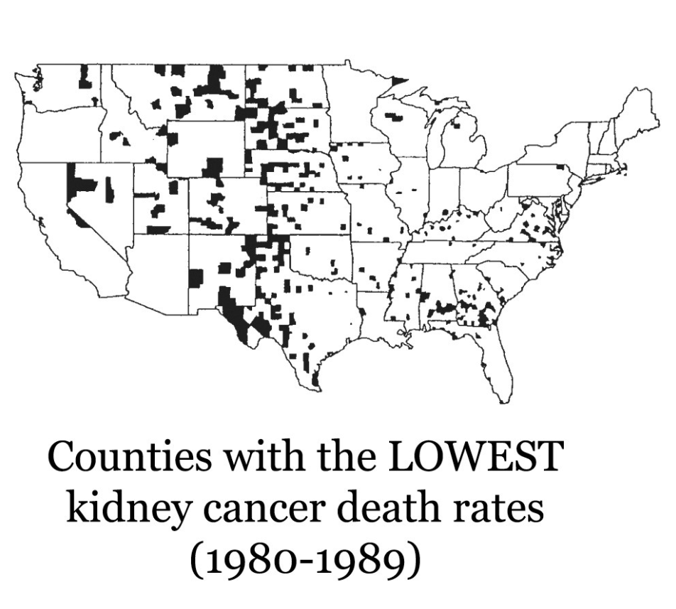
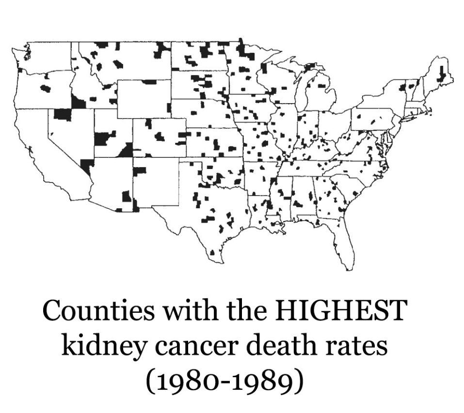
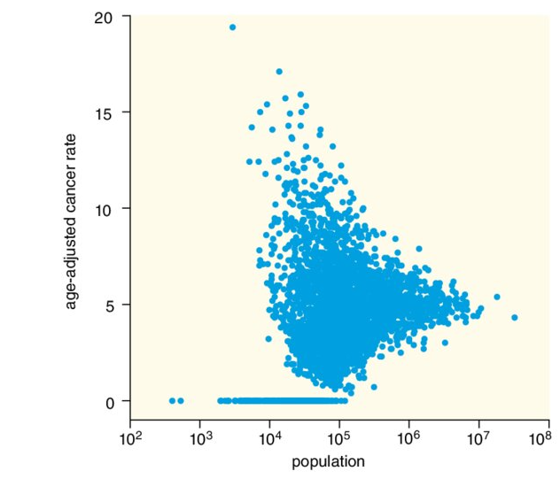

## Week Summary

-   Goal of this week: think more concretely about stories
-   Read: Chapter 29 of Fundamentals, Chapter 7 of Storytelling
-   HW: Data Story 3 Due on Sunday
-   Discussion: Put week 1 story in story arc format

## What is a story?

-   From Fundamentals:

> A story is a set of observations, facts, or events, true or invented, that are presented in a specific order such that they create an emotional reaction in the audience.


## Why emotion? 

- Quantitative culture: dismissive of stories, emotion
  - Deemed "squishy"
- This is a bad mistake
  - Emotional response is key to how we communicate
- You can tell stories while objectively presenting the truth

## How do stories create an emotional response?

- Initial build up of conflict and tension
- Release of tension at the conclusion of story


## Example: Where are the Cancers?

{width=50%}

- Lowest counties all rural

## Why Lowest Cancer in Rural Areas?

- Maybe rural counties have lower pollution?


## Why Lowest Cancer in Rural Areas?

- Maybe rural counties have lower pollution?
- Healthier, fresher food?

## Why Lowest Cancer in Rural Areas?

- Maybe rural counties have lower pollution?
- Healthier, fresher food?
- Low stress, active lifestyle?


## Why Lowest Cancer in Rural Areas?

- Maybe rural counties have lower pollution?
- Healthier, fresher food?
- Low stress, active lifestyle?

Shall we fund a big study to investigate???


## Plot Twist



- Rural counties also have the highest death rates! 


## Thought Experiment: Consider a small county

- The county has 100 people
- If it has 1 kidney cancer death in the decade, it's rate will be by far the highest in the country
- If it has 0 deaths, it's rate will be the lowest in the country

## Variance of a binomial distribution

- probability $p$ of dying from kidney cancer
- rate $\hat{r}=\frac{m}{n}$ observed deaths divided by population
$$
\mathrm{var}(\hat{r}) = \frac{p(1-p)}{n}
$$
- Big $n$ close to mean
- Expect small counties to dominate the extremes


## Be skeptical of maps

- This phenomenon isn't unique to this variable
- See this funnel shape all the time!



## Aside

- Funnel plot also good for showing bias in research studies
- Effect size gets small when study is bigger


## Story Arc

- Opening: Why are Cancer rates lowest in rural counties?
- Challenge: They are also highest in rural counties!
- Action: Use stats, binomial variance formula
- Resolution: Be wary when comparing unequally sized groups

## Story Arcs

- A story arc is a pattern which a story takes
- It is designed to build and then resolve conflict
- There are several different structures for arcs

## Arc 1

- Opening
- Challenge
- Action 
- Resolution

## Arc 2

- Lead: Give away main point
- Development: Introduction and details
- Resolution: Return to main point and moral

## Arc 2 applied

- Lead: _Maps are biased because of population heterogeneities_
- Development: _You can draw contradictory conclusions from maps. They can show that rural living both prevents and causes Kidney Cancer. This is because rural counties have high variance_
- Resolution: _This issue plays a role whenever you compare groups of different sizes. Always consider standard errors!_

## Arc 2 applied (alt)

- Lead: _All maps lie to you_
- Development: _You can draw contradictory conclusions from maps. They can show that rural living both prevents and causes Kidney Cancer. This is because rural counties have high variance_
- Resolution: _This issue plays a role whenever you compare groups of different sizes. Always consider standard errors!_


## Arc 3

- Action
- Background
- Development
- Climax
- Ending


## Arc 3

- Action: Show both figures together to get into conflict immediately
- Background: Present other examples of this and the challenges they caused
- Development: Connect with population size 
- Climax: Variance Formula, least squares techniques
- Ending: Highlight importance across areas

## Translating to Figures

- Map your figures to story arc
- (usually) need multiple figures


## Example: Opening

```{r}
library(tidyverse)

elec_data = read_csv("owid-energy-data.csv") |> filter(iso_code == "USA") 

elec_data |> ggplot(aes(x=year,y=coal_share_elec)) +
  geom_line(color="red") +
  scale_x_continuous(limits=c(1985,2023)) +
  scale_y_continuous(limits=c(0,55)) +
  labs(title = "The US Power Grid Depends Less on Coal",
       subtitle = "Coal Power Share",
       caption = "Opening") +
  xlab("") +
  ylab("Electricity Share") +
  theme_minimal(base_size = 16) 

```


## Example: Challenge

```{r}
library(tidyverse)


elec_data |> ggplot(aes(x=year,y=coal_share_elec)) +
  geom_line(color="red") +
  geom_vline(xintercept = 2008,color="blue") +
    annotate(
    "text", label = "What happened in 2008?",
    x = 1995, y = 40, size = 8, colour = "blue"
  ) +
  scale_x_continuous(limits=c(1985,2023)) +
  scale_y_continuous(limits=c(0,55)) +
  labs(title = "The US Power Grid Depends Less on Coal",
       subtitle = "Coal Power Share",
       caption = "Challenge") +
  xlab("") +
  ylab("Electricity Share") +
  theme_minimal(base_size = 16) 

```

## Example: Action

```{r}
library(tidyverse)


elec_data |> ggplot(aes(x=year,y=coal_share_elec)) +
  geom_line(color="red") +
  #geom_vline(xintercept = 2008,color="blue",linetype="dotted") +
    annotate(
    "rect", 
    xmin = 2005, xmax = 2010, ymin = 0,ymax=55,  alpha=0.3,fill = "grey70"
  ) +
  annotate("text",label="Fracking drove 50% annual\n growth in shale gas production\n  displacing coal",x=1995,y=35,size=8) +
  geom_line(aes(y=gas_share_elec),color="blue") +
  annotate("text",label="Gas Electricity Share",color="blue",size=8,x=2017,y=50) +
  scale_x_continuous(limits=c(1985,2023)) +
  scale_y_continuous(limits=c(0,55)) +
  labs(title = "The US Power Grid Depends Less on Coal",
       subtitle = "Coal Power Share",
       caption = "Action") +
  xlab("") +
  ylab("Electricity Share") +
  theme_minimal(base_size = 16) 

```


## Example: Action

```{r}

co2_data = read_csv("owid-co2-data.csv") |> filter(iso_code == "USA") 

co2_data |> ggplot(aes(x=year,y=co2_per_unit_energy)) +
  geom_line(color="red") +
  annotate(
    "rect", 
    xmin = 2005, xmax = 2010, ymin = 0.19,ymax=0.23,  alpha=0.3,fill = "grey70"
  ) +
  scale_x_continuous(limits=c(1985,2023)) +
  scale_y_continuous(limits=c(0.19,0.23)) +
  labs(title = "The Coal-Gas Transition Made the Grid More Efficient",
       subtitle = "Carbon Intensity of Electricity Production",
       caption = "Action") +
  xlab("") +
  ylab("CO2 per kw/hr") +
  theme_minimal(base_size = 16) 
  

  

```

## Example: Resolution

```{r}

co2_data = read_csv("owid-co2-data.csv") |> filter(iso_code == "USA") 

co2_data |> ggplot(aes(x=year,y=co2_per_unit_energy)) +
  geom_line(color="red") +
  annotate(
    "rect", 
    xmin = 2005, xmax = 2010, ymin = 0.0,ymax=0.23,  alpha=0.3,fill = "grey70"
  ) +
  annotate("text",x=1993,y=0.10,label="But we have a long way to go",size=8) +
  scale_x_continuous(limits=c(1985,2023)) +
  scale_y_continuous(limits=c(0.0,0.23)) +
  labs(title = "The Coal-Gas Transition Made the Grid More Efficient",
       subtitle = "Carbon Intensity of Electricity Production",
       caption = "Resolution") +
  xlab("") +
  ylab("CO2 per kw/hr") +
  theme_minimal(base_size = 16) 
  

```

## Example: Resolution

```{r}

co2_data = read_csv("owid-co2-data.csv") |> filter(iso_code == "USA") 

co2_data |> ggplot(aes(x=year,y=co2_per_unit_energy)) +
  geom_line(color="red") +
  annotate(
    "rect", 
    xmin = 2005, xmax = 2010, ymin = 0.0,ymax=0.23,  alpha=0.3,fill = "grey70"
  ) +
  annotate("text",x=1993,y=0.10,label="But we have a long way to go\n and gas can only take us so far",size=8) +
  annotate("text",label="Emissions if gas replaces coal",x=2015,y=0.18,size=8) +
  geom_hline(xmin=1985,xmax=2023,yintercept = 0.16,color="orange") +
  scale_x_continuous(limits=c(1985,2023)) +
  scale_y_continuous(limits=c(0.0,0.23)) +
  labs(title = "The Coal-Gas Transition Made the Grid More Efficient",
       subtitle = "Carbon Intensity of Electricity Production",
       caption = "Resolution") +
  xlab("") +
  ylab("CO2 per kw/hr") +
  theme_minimal(base_size = 16) 
  
```


## Example: Ending

```{r}
library(tidyverse)

elec_data |> ggplot(aes(x=year,y=fossil_share_elec)) +
  geom_line(color="red") +
    annotate(
    "rect", 
    xmin = 2015, xmax = 2023, ymin = 0,ymax=55,  alpha=0.3,fill = "grey70"
  ) +
  geom_line(aes(y=wind_share_elec+solar_share_elec),color="blue") +
  annotate("text",label="Gas served its purpose\n another transition is needed",x=1995,y=40,size=8) +
  annotate("text",label="Fossil Electricity Share",color="red",size=8,x=2017,y=73) +
    annotate("text",label="Wind and Solar Share",color="blue",size=8,x=2010,y=10) +
  scale_x_continuous(limits=c(1985,2023)) +
  scale_y_continuous(limits=c(0,75)) +
  labs(title = "Is a new transition beginning?",
       subtitle = "Fossil and Renewable Electricity Share",
       caption = "Ending") +
  xlab("") +
  ylab("Electricity Share") +
  theme_minimal(base_size = 16) 

```


## Making Figures for Busy People

- Make your figure as simple as possible, but no simpler!
- They shouldn't need 30 minutes to decipher all the details

```{r}
library(nycflights13)
library(ggthemes)
library(viridis)
library(ggokabeito)
library(cowplot)

carrier_names <- data.frame(carrier = c("9E", "AA", "B6", "DL", "EV", "MQ", "UA", "US", "WN", "--"),
                            name= c("Endeavor", "American", "JetBlue", "Delta", "ExpressJet", "Envoy", "United",
                                    "US Airways", "Southwest", "other"))

flights_clean <- filter(flights,
                !dest %in% c("HNL", "ANC") # remove Honolulu and Anchorage because they're so far
                ) %>%
  mutate(carrier = ifelse(carrier %in% c("DL", "AA"), carrier, "--")) %>%
  left_join(carrier_names) %>%
  select(name, distance, arr_delay, dest) %>%
  na.omit()

flights_clean$name <- factor(flights_clean$name, levels = c("American", "Delta", "other"))

delay <- flights_clean %>%
  group_by(name, dest) %>%
  summarise(count = n(),
            distance = mean(distance, na.rm = TRUE),
            arr_delay = mean(arr_delay, na.rm = TRUE))

p_delay_distance <- ggplot(delay, aes(x = distance, y = arr_delay, color = name, fill = name)) +
  geom_point(aes(size = count), alpha = .5) +
  geom_smooth(data = flights_clean, aes(x = distance, y = arr_delay, color = name),
              se = FALSE, inherit.aes = FALSE, size = 0.75,
              method = 'gam', formula = y ~ s(x, bs = "cs", k = 3), show.legend = FALSE) +
  scale_x_continuous(limits = c(0, 3050),
                     name = "distance (miles)") +
  scale_y_continuous(name = "mean arrival delay (min.)") +
  scale_size_area(breaks = c(4000, 8000, 12000), name = "# of flights") +
  scale_color_okabe_ito(name = "airline", order = c(2, 7, 1)) +
  scale_fill_okabe_ito(name = "airline", order = c(2, 7, 1)) +
  guides(color = guide_legend(order = 1),
         fill = guide_legend(override.aes = list(size = 4, alpha = .7), order = 1),
         size = guide_legend(override.aes = list(fill = "gray70"), order = 2)) +
  theme_minimal(base_size=16) +
  labs(title="NYC Flight Mean Flight Delays by Carrier and Distance",
       subtitle="This figure is too complex") 


p_delay_distance

```


## Complexity Hid the Story?


```{r}
flights %>% mutate(carrier = ifelse(carrier %in% c("OO", "HA", "YV", "F9", "AS", "FL", "VX"), "--", carrier)) %>%
    left_join(carrier_names) %>%
    group_by(name) -> flights_grouped

flights_grouped %>%
  summarize(mean_delay = mean(arr_delay, na.rm = TRUE)) %>%
  na.omit() %>%
  mutate(highlight = ifelse(name %in% c("Delta", "American"), "yes", "no")) %>%
  ggplot(aes(x=reorder(name, desc(mean_delay)), y=mean_delay, fill = highlight)) + 
    scale_fill_manual(values = c("#B0B0B0D0", "#BD3828D0"), guide = "none") +
    scale_y_continuous(expand = c(0, 0), name = "mean arrival delay (min.)") +
    scale_x_discrete(name = NULL) +
    geom_col() + 
    coord_flip(clip = "off") +
    theme_minimal(base_size=16) +
    theme(
      axis.line.y = element_blank(),
      axis.ticks.y = element_blank()
    )

```


## Build up to complexity

- Sometimes a complex plot is required
- Don't lead with complexity
  - Instead show something simpler first
  - Primes your audience to understand the complex figure
  
## Start Simple

- Here show a single panel first (or aggregate over all carriers)

```{r}

flights_grouped$name <- factor(
  flights_grouped$name,
  levels = c(
    "United", "ExpressJet", "JetBlue", "Delta", "American",
    "Endeavor", "Envoy", "US Airways", "Southwest", "other"
  )
)

filter(flights_grouped, name == "United" & origin == "EWR") %>%
  ggplot(aes(x = wday(time_hour, label = TRUE, week_start = 1))) + 
    geom_bar(fill = "#0072B2D0", color = "white", size = 1, width = .97) + 
    #facet_grid(origin ~ name) +
    labs(title = "Weekends have fewer flights",
      subtitle="Daily United departures, EWR") +
    scale_y_continuous(expand = c(0, 0), limits = c(0, 7500)) +
    scale_x_discrete(
      labels = c("M", "T", "W", "T", "F", "S", "S"),
      expand = c(0, 0.05),
      name = "weekday"
    ) +
    coord_cartesian(clip = "off") +
    theme_minimal(base_size = 16) +
    theme(
      strip.text = element_text(
        margin = margin(4, 4, 4, 4)
      ),
      axis.line.x = element_blank(),
      panel.spacing.x = grid::unit(6.5, "pt"),
      panel.spacing.y = grid::unit(6.5, "pt"),
      panel.grid.major = element_line(color = "gray90"),
      panel.background = element_rect(fill = "gray95"),
      plot.title = element_text(
        hjust = 0.5, vjust = 0.5,
        margin = margin(4, 4, 4, 4)
      )
    ) 
  

```


## Then go Complex

```{r}
ggplot(flights_grouped, aes(x = wday(time_hour, label = TRUE, week_start = 1))) + 
  geom_bar(fill = "#0072B2D0", color = "white") + 
  facet_grid(origin ~ name,scales = "free_y") +
  scale_x_discrete(
    labels = c("M", "", "W", "", "F", "", "S"),
    expand = c(0, 0.05),
    name = "weekday"
  ) +
  coord_cartesian(clip = "off") +
  theme_minimal(base_size = 16) +
  theme(
    strip.text = element_text(
      margin = margin(3, 3, 3, 3)
    ),
    axis.title = element_text(size = 14),
    axis.ticks = element_line(color = "gray80"),
    axis.line.x = element_blank(),
    panel.spacing.x = grid::unit(5, "pt"),
    panel.spacing.y = grid::unit(5, "pt"),
    panel.grid.major = element_line(color = "white"),
    panel.background = element_rect(fill = "gray95"),
    plot.margin = margin(5.5, 1, 5.5, 1)
  )
```

## Thanks!