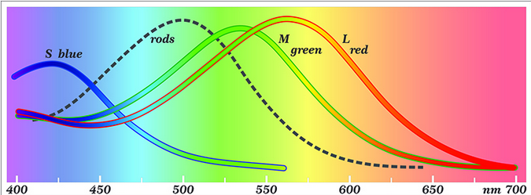
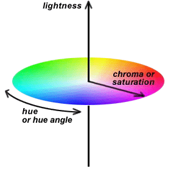
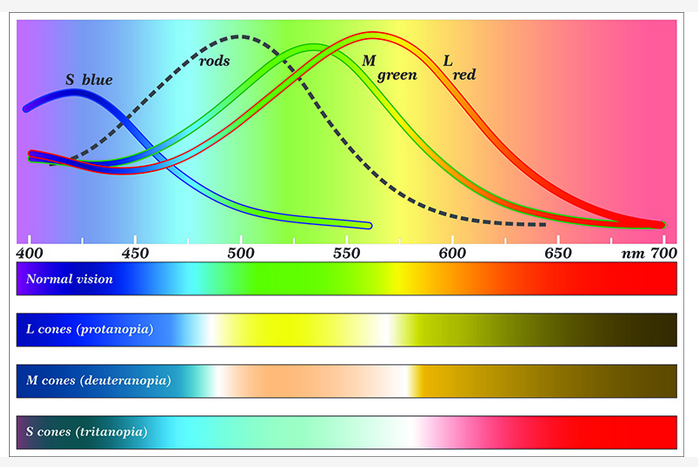
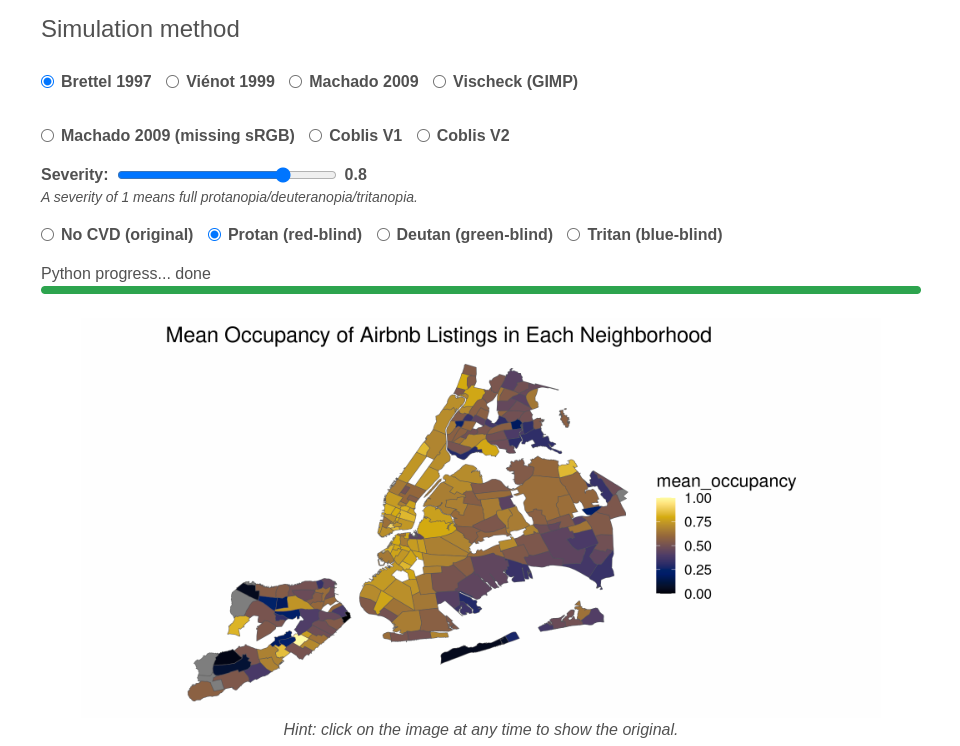

## Weekly Summary

-   This week is all about how to control colors in `R`
-   Chapter 4 (and 19) of Fundamentals
-   Chapter 4 of Storytelling
-   Okabe-Ito Page <https://jfly.uni-koeln.de/color/>
-   New Assignment: Airbnb Revenues in NYC
-   No Discussion Next Two Weeks

## Three Uses of Color

-   Color to Distinguish

```{r}
library(tidyverse)
library(paletteer)
library(RColorBrewer)
library(ggthemes)
library(cowplot)
library(ggokabeito)
set.seed(100)
nyc_bnb = read_csv("/home/georgehagstrom/work/Teaching/DATA608/DataStory4/nyc_airbnb_listings.csv")

borough_colors <- c("#E69F00", "#56B4E9", "#009E73", "#F0E442","#0072B2" )
#borough_colors_dark <- darken(region_colors, 0.4)


neighborhood_df = nyc_bnb |> group_by(neighborhood,borough) |> summarise(num_listings = n(), mean_revenue = mean(revenue,na.rm =TRUE), mean_rating = mean(review_scores_rating,na.rm=TRUE),mean_location = mean(review_scores_location,na.rm=TRUE),mean_value = mean(review_scores_value,na.rm=TRUE)) |> filter(num_listings > 200) |> 
  ungroup() |> slice_sample(n=20) # Need ungroup to make slice_sample pick 20 neighborhoods 

p_nabes = neighborhood_df |> 
  ggplot(aes(x=fct_reorder(neighborhood,mean_revenue),
             y=mean_revenue,
             fill = borough)) +
  geom_col() +
  scale_y_continuous(
    name = "Revenue Per Day"
  ) +
  scale_fill_manual(values = borough_colors) +
  coord_flip() + 
  theme_minimal(base_size=16) +
  theme(axis.title.y = element_blank(),
        axis.line.y = element_blank(),
        axis.ticks.length = unit(0, "pt"),
        #axis.text.y = element_text(size = 10, color = borough_colors),
        legend.background = element_rect(fill = "#ffffffb0")) +
  labs(title = "Mean Revenue Per Day of Airbnb Listings in\n Selected NYC Neighborhoods")

p_nabes
```

## Three Uses of Color

-   Qualitative Colormaps

```{r fig.width=5, fig.asp=.14,}
library(colorblindr)
p1 <- gg_color_swatches(7) + 
  scale_fill_OkabeIto() + ggtitle("Okabe Ito") +
  theme(plot.margin = margin(7, 1.5, 7, 1.5))
p2 <- gg_color_swatches(7) + 
  scale_fill_brewer(type = "qual", palette = "Dark2") + ggtitle("ColorBrewer Dark2") +
  theme(plot.margin = margin(7, 1.5, 7, 1.5))
p3 <- gg_color_swatches(7) + 
  scale_fill_hue() + ggtitle("ggplot2 hue") +
  theme(plot.margin = margin(7, 1.5, 7, 1.5))
p1
```

## Three Uses of Color

-   Qualitative Colormaps

```{r fig.width=5, fig.asp=.14,}


p2

```

## Three Uses of Color

-   Qualitative Colormaps

```{r fig.width=5, fig.asp=.14,}
p3
```

## Three Uses of Color

-   Represent Numerical Values

```{r}
library(geojsonsf)
library(sf)

neighborhood_df = nyc_bnb |> 
  group_by(neighborhood,borough) |> 
  summarise(num_listings = n(), 
            mean_revenue = mean(revenue,na.rm =TRUE), 
            mean_rating = mean(review_scores_rating,na.rm=TRUE),
            mean_location = mean(review_scores_location,na.rm=TRUE),
            mean_value = mean(review_scores_value,na.rm=TRUE),
            mean_occupancy = mean(occupancy,na.rm=TRUE)
          )

nyc_sf = geojson_sf("/home/georgehagstrom/work/Teaching/DATA608/DataStory4/neighbourhoods.geojson") |> as_tibble()

nyc_sf = nyc_sf |> rename(neighborhood = neighbourhood)
neighborhood_df = neighborhood_df |> right_join(nyc_sf)

neighborhood_df |> ggplot(aes(fill=mean_occupancy)) +
  geom_sf(aes(geometry=geometry)) +
  coord_sf() +
  scale_fill_viridis_c(option="inferno") +
  theme_void(base_size=16) +
  labs(title="Mean Occupancy of Airbnb Listings in Each Neighborhood")

```

## Three Uses of Color

-   Highlighting

```{r}

nb_vec = c("Williamsburg","Bedford-Stuyvesant","Bushwick","Crown Heights","Greenpoint")

colors <- c("#BD3828", rep("#808080", 4))
fills <- c(
  alpha(colors[1], .815),
  alpha(colors[2:5], .5)
)

neighborhood_df |> filter(!is.na(borough) & num_listings>20) |>  
  ggplot(aes(x=mean_occupancy,y=mean_revenue,color=borough,shape=borough,fill=borough)) +
  geom_point(size=4) +
  scale_y_continuous(limits = c(0,275)) +
    scale_shape_manual(values = 21:25) +
   scale_color_manual(values = colors) +
  scale_fill_manual(values = fills) +
  theme_minimal(base_size = 16) +
  labs(title = "Revenue and Occupancy Across NYC Neighborhoods")+
  xlab("Mean Occupancy") +
  ylab("Mean Revenue")

```

## Three Uses of Color

-   Highlighting

```{r}

nb_vec = c("Williamsburg","Bedford-Stuyvesant","Bushwick","Crown Heights","Greenpoint")

colors <- c("#808080","#BD3828", rep("#808080", 3))
fills <- c(
  alpha(colors[1], .5),
  alpha(colors[2],0.85),
  alpha(colors[3:5], .5)
)

neighborhood_df |> filter(!is.na(borough) & num_listings>20) |>  
  ggplot(aes(x=mean_occupancy,y=mean_revenue,color=borough,shape=borough,fill=borough)) +
  geom_point(size=4) +
  scale_y_continuous(limits = c(0,275)) +
    scale_shape_manual(values = 21:25) +
   scale_color_manual(values = colors) +
  scale_fill_manual(values = fills) +
  theme_minimal(base_size = 16) +
  labs(title = "Revenue and Occupancy Across NYC Neighborhoods")+
  xlab("Mean Occupancy") +
  ylab("Mean Revenue")
```

## What are colors?

-   Light is composed of a spectrum of `photons` each with different wavelength/energy


## What are colors?

-   Primary Colors each represent single wavelength
-   ROYGBIV


## Color Perception

-   We don't see spectrum
-   Our eyes have 3 types of cone cells that sense color
-   Each responds to a part of the spectrum 

## Color Perception

-   Our cones reduce the full spectrum to 3 numbers

::::: columns
::: {.column width="50%"}
-   Different 3D encodings:
    -   RGB mix + Luminance
    -   HCL (Hue + Chroma + Luminance)
:::

::: {.column width="50%"}

:::
:::::

## Color Vision Variability

-   Number and function of each cone type can vary from person to person
-   Different types of color perception referred to as colorblindness



## Checking your Color Palettes

-   [www.daltonlens.com](www.daltonlens.com)
    -   Simulates on Images or even entire slidedeck
    -   All types of colorblindness

## Checking your Color Palettes

-   [www.daltonlens.com](www.daltonlens.com)



## Checking your Color Palettes

-   `colorBlindnes` simulator

```{r}
#| echo: true
colorBlindness::displayAllColors(rainbow(6))

```

## Checking your Color Palettes

-   `colorBlindnes` simulator

```{r}
#| echo: true
colorBlindness::displayAllColors(ggokabeito::palette_okabe_ito(1:9))

```

## Checking your Color Palettes

-   `colorBlindnes` simulator

```{r}
#| echo: true
colorBlindness::displayAllColors(viridis::viridis(6))

```

## What I Do

-   Stick with known accessible palettes
-   `viridis` and `okabe-ito` families
-   Luminance based
-   Avoid red-green gradients

## `ggplot` color scale functions

-   Similar to how you control axis scales
-   `scale_*aes*_*name_of_color_function*`
-   `scale_color_xxxx` controls color (usually border)
-   `scale_fill_xxxx` controls fill
-   `xxxx` is usually the name of a package or color scheme

## Atlas of color qualtitative packages

| Command | Package | Color Safety? | 
|------|------|------|
| `scale_fill_hue`     |  `ggplot2`    |   No    |
| `scale_fill_brewer`     | `RColorBrewer`     |  Some    |
| `scale_fill_paleteer_d`     | `paleteer`     |  Many    |
| `scale_fill_okabe_ito`     |  `ggokabeito`    |   Yes   |
| `scale_fill_OkabeIto`     | `colorblindr`    |  Yes    |

: Color Packages


## `RColorBrewer`

- Designed for discrete values on maps
```{r}
#| echo: true
display.brewer.all(type = "qual")


```

## `RColorBrewer`

- 3 Colorblind friendly palettes
- Only friendly up to 3 categories (`Set2` and `Dark2`) or
4 categories (`Paired`)

```{r}
#| echo: true
display.brewer.all(type = "qual",colorblindFriendly = TRUE)


```

## `RColorBrewer`

- Code for Column Plot

```{r}
#| echo: true
#| eval: false

p1 = neighborhood_df |> 
  ggplot(aes(x=mean_revenue,
             y=mean_revenue,
             fill = borough)) +
  geom_col() +
  scale_y_continuous(
    name = "Revenue Per Day"
  ) +
  coord_flip() + 
  theme_minimal(base_size=16) +
  theme(axis.title.y = element_blank(),
        axis.line.y = element_blank(),
        axis.ticks.length = unit(0, "pt"),
        #axis.text.y = element_text(size = 10, color = borough_colors),
        legend.background = element_rect(fill = "#ffffffb0")) +
  labs(title = "Mean Revenue Per Day of Airbnb Listings in\n Selected NYC Neighborhoods")

```

## `RColorBrewer`

- `scale_fill_brewer()`
- `palette` can choose from list of palettes
- `name` gives legend label

```{r}
#| echo: true
#| eval: false

p1 + 
  scale_fill_brewer(name = "Boroughs", 
                    palette = "Set1")

```

## `RColorBrewer`

```{r}
p_nabes + 
  scale_fill_brewer(name = "Boroughs", 
                    type = "qual",
                    palette = "Set1")
```

## `RColorBrewer`

- Use `direction=-1` to reverse the colors

```{r}
#| echo: true
#| eval: false
p_nabes + 
  scale_fill_brewer(name = "Boroughs", 
                    direction = -1, 
                    palette = "Set1")
```


## `RColorBrewer`

- Use `direction=-1` to reverse the colors

```{r}
p_nabes + 
  scale_fill_brewer(name = "Boroughs", 
                    direction = -1, 
                    palette = "Set1")
```

## `RColorBrewer`

- If you forget names, you can use `type="qual"` and `palette= number`:

```{r}
#| echo: true
#| eval: false
p_nabes + 
  scale_fill_brewer(name = "Boroughs", 
                    type = "qual",
                    palette = 3)


```


## `RColorBrewer`

- If you forget names, you can use `type="qual"` and `palette= number`:

```{r}

p_nabes + 
  scale_fill_brewer(name = "Boroughs", 
                    type = "qual",
                    palette = 3)


```

## `RColorBrewer`

- `na.value="grey30"` tells us the color for missing values
- `guide = colorbar, legend, or colorsteps` says type of colorbar

```{r}
#| echo: true
#| eval: false
p_nabes + 
  scale_fill_brewer(name = "Boroughs", 
                    type = "qual",
                    palette = 2,
                    aesthetics = c("color,fill"),
                    na.value = "grey70")


```


## `RColorBrewer`

```{r}

p_nabes + 
  scale_fill_brewer(name = "Boroughs", 
                    type = "qual",
                    palette = 5,
  )


```

## `ggokabeito`

- `scale_fill_okabe_ito`
- Takes many of same arguments as `scale_fill_brewer`
- Also can give "order" for colorscale

```{r}
#| echo: true
#| eval: false
p_nabes +
  scale_fill_okabe_ito(order = 1:9,alpha=0.8)

```


## `ggokabeito`

- `scale_fill_okabe_ito`

```{r}

p_nabes +
  scale_fill_okabe_ito(order = 1:9,alpha=0.8)

```


## `ggokabeito` order

```{r}
#| echo: true
p_nabes +
  scale_fill_okabe_ito(order = c(1,2,9,3,4,5,6,7,8),alpha=0.8)

```

## Tons of other options....

- The main options all work like this
- Default arguments plus some special options
- `colorspace` package is really nice and brings a bit of order

## Choosing Discrete Colors

-   For Categorical Data
    -   Each Color above 6 should make you wince
    - For colorblind friendliness, becomes very hard
-   Don't represent numbers
    -   Maximally Distinctive


## Color for Scatterplots

-   Brighter Colors Better for Small Points

```{r}
#| fig-width: 8
#| echo: true
library(palmerpenguins)


point = penguins |>  ggplot(aes(bill_length_mm, bill_depth_mm)) +
  geom_point(aes(colour = species))  + 
  theme_minimal(base_size=16) +
  labs(x = "Bill Length (mm)", y = 
         "Bill Depth (mm)")

# three palettes
#point + scale_colour_brewer(palette = "Set1")
#point + scale_colour_brewer(palette = "Set2")  
#point + scale_colour_brewer(palette = "Pastel1")

```

## Color for Scatterplots

-   Brighter Colors Better for Small Points

```{r}
#| fig-width: 8
#| echo: true

point + scale_colour_brewer(palette = "Set1")
```

## Color for Scatterplots

-   Brighter Colors Better for Small Points

```{r}
#| fig-width: 8
#| echo: true
point + scale_colour_brewer(palette = "Set2") 


```

## Color for Scatterplots

-   Brighter Colors Better for Small Points

```{r}
#| fig-width: 8

point + scale_colour_brewer(palette = "Pastel1") 


```

## Color for Fill

-   Subtler colors work better for Areas

```{r}
#| echo: true

plot = nyc_bnb |> group_by(borough) |> filter(number_of_reviews_ltm>20) |> 
  summarise(revenue = mean(revenue/accommodates,na.rm=TRUE)) |> 
  ggplot(aes(x=fct_reorder(borough,desc(revenue)),y=revenue,fill=borough)) +
  geom_col() +
  theme_minimal(base_size=16) +
  labs(x = "Borough", y = 
         "Mean Revenue",
       title = "Revenue per person across boroughs")


```

## Color for Fill

-   Subtler colors work better for Areas

```{r}
#| echo: true
plot + scale_fill_brewer(palette = "Pastel1")

```

## Color for Fill

-   Subtler colors work better for Areas

```{r}
#| echo: true
plot + scale_fill_brewer(palette = "Set1")

```

## Color for Fill

-   Subtler colors work better for Areas

```{r}
#| echo: true
plot + scale_fill_brewer(palette = "Set2")

```

## Color for Fill

- Colorspace controls for accents

```{r}
#| echo: true
plot + scale_fill_OkabeIto(darken=-0.3)

```


## Setting Colors Manually

- In many cases want to pick the colors for each category
- Especially important for accenting color palettes
- `alpha` modifies the colors and creates fill vector

```{r}
#| echo: true
colors <- c("#808080","#BD3828", rep("#808080", 3))
fills <- c(
  alpha(colors[1], .5),
  alpha(colors[2],0.85),
  alpha(colors[3:5], .5)
)
```


## Setting Colors Manually


```{r}
#| echo: true
#| eval: false

neighborhood_df |> filter(!is.na(borough) & num_listings>20) |>
  ggplot(aes(x=mean_occupancy,y=mean_revenue,color=borough,shape=borough,fill=borough)) +
  geom_point(size=4) +
  scale_y_continuous(limits = c(0,275)) +
    scale_shape_manual(values = 21:25) +
   scale_color_manual(values = colors) +
  scale_fill_manual(values = fills) +
  theme_minimal(base_size = 16) +
  labs(title = "Revenue and Occupancy Across NYC Neighborhoods")+
  xlab("Mean Occupancy") +
  ylab("Mean Revenue")
```


## Setting Colors Manually


```{r}


neighborhood_df |> filter(!is.na(borough) & num_listings>20) |>
  ggplot(aes(x=mean_occupancy,
             y=mean_revenue,
             color=borough,
             shape=borough,
             fill=borough)) +
  geom_point(size=4) +
  scale_y_continuous(limits = c(0,275)) +
    scale_shape_manual(values = 21:25) +
   scale_color_manual(values = colors) +
  scale_fill_manual(values = fills) +
  theme_minimal(base_size = 16) +
  labs(title = "Revenue and Occupancy Across NYC Neighborhoods")+
  xlab("Mean Occupancy") +
  ylab("Mean Revenue")
```

## More `scale_fill_manual`


```{r}
#| echo: false

plot_2 = neighborhood_df |> filter(!is.na(borough) & num_listings>20) |>
  ggplot(aes(x=mean_occupancy,
             y=mean_revenue,
             color=borough,
             shape=borough,
             fill=borough)) +
  geom_point(size=4) +
  scale_y_continuous(limits = c(0,275)) +
    scale_shape_manual(values = 21:25) +
  theme_minimal(base_size = 16) +
  labs(title = "Revenue and Occupancy Across NYC Neighborhoods")+
  xlab("Mean Occupancy") +
  ylab("Mean Revenue")
```

```{r}
#| echo: true

plot_2 +
   scale_color_manual(values =
                        c("Manhattan"="#BD3828", 
                          "Brooklyn" = "#92540040",
               "Staten Island" = "#92540040", 
               "Queens" = "#92540040",
               "Bronx" = "#92540040")) + 
  scale_fill_manual(values = 
                      c("Manhattan"="#BD3828", 
                        "Brooklyn" = "#92540040",
               "Staten Island" = "#92540040", 
               "Queens" = "#92540040",
               "Bronx" = "#92540040")) 


```


## What do Codes Mean?

```{r}
#| echo: true
#| eval: false
"#BD3828"
"#808080"
"#92540050"

```

- (Red)(Green)(Blue)(alpha)
- Each is a two hex numbers:
  - (1,2,3,4,5,6,7,8,9,A,B,C,D,E,F)

## Codes for Okabe-Ito {.smaller}

Name           | Hex code 
:----------    | :-------  
orange         | <mark style="background: #E69F00!important">#E69F00</mark>
sky blue	     | <mark style="background: #56B4E9!important">#56B4E9</mark>   
bluish green   | <mark style="background: #009E73!important">#009E73</mark>    
yellow	       | <mark style="background: #F0E442!important">#F0E442</mark>   
blue	         | <mark style="background: #0072B2!important">#0072B2</mark>   
vermilion	     | <mark style="background: #D55E00!important">#D55E00</mark>    
reddish purple | <mark style="background: #CC79A7!important">#CC79A7</mark>     
black	         | <mark style="background: #000000!important; color: #ffffff!important">#000000</mark>   

## How to get the codes?

- Different functions:
```{r}
#| echo: true
brewer.pal(12,"Paired")

palette_okabe_ito()

darken(palette_OkabeIto,-0.3)


```


## Thanks!