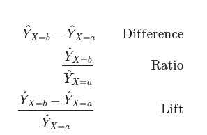

## Week Summary


```{r}
library(tidyverse)
library(broom)
library(tidymodels)
library(marginaleffects)
library(mlr3verse)
library(skimr)
library(ggplot2)
library(patchwork)
okabeito <- c('#E69F00', '#56B4E9', '#009E73', '#F0E442', '#0072B2', '#D55E00', '#CC79A7', '#999999', '#000000')
options(ggplot2.discrete.fill = okabeito)
options(ggplot2.discrete.colour = okabeito)


```

- This week is about visualizing models and uncertainty
- Next week is about dimensionality reduction techniques
- Assignment: Make a model of house sale prices and tell a story about it
- Reading: [Healy Visualization](https://socviz.co/modeling.html#modeling), Fundamentals of Data Visualization 16
- Bonus Readings: [Marginal Effects Book: 2-3, 15](https://marginaleffects.com/bonus/plot.html)


## How to talk about models

- You have just fitted a model
- You have an array of model coefficients, accuracy measures,
and summary statistics
- How do you convey insights from the model to a PM, supervisor, or even a colleague?

## Model Coefficients Hard to Interpret


- Thornton dataset: How much does a monetary incentive impact the decision to get an HIV test?

```{r}
#| echo: true

dat = get_dataset("thornton")
mod_thornton = glm(outcome ~ incentive * (agecat + distance), 
    data = dat, family = binomial)
dat |> head()
```

## Model Coefficients Hard to Interpret

- What do these numbers mean?
- Are log-odds-ratios intuitive to you?

```{r}
mod_thornton$coefficients

```

- Leads to poor decisions (like ignoring everything but sign)

## Model Coefficients Hard to Interpret

- This isn't unique to logistic regression 
- For any model but simple linear regression
- Need a better way to present model results

## Alternative Workflow

- Don't focus on parameter estimates
- Instead transform them to quantities that shed light on your analytic questions
- Predictions, Comparisons, Slopes
- Always Show Uncertainty

## Predictions

- A prediction shows what your model says would happen for 
units with hypothetical predictor values

```{r}

nyc_bnb = read_csv("/home/georgehagstrom/work/Teaching/DATA608/DataStory4/nyc_airbnb_listings.csv")
nyc_bnb = nyc_bnb |> mutate(num_amenities = str_count(amenities,"\"")/2)
nyc_bnb_slim <- nyc_bnb |> select(revenue,neighborhood,neighbourhood_group,bedrooms,num_amenities,room_type,review_scores_rating,review_scores_accuracy,review_scores_cleanliness,review_scores_checkin,review_scores_communication,review_scores_value,review_scores_location,host_has_profile_pic,host_is_superhost,host_response_time,host_response_rate,host_acceptance_rate)
nyc_bnb_slim = nyc_bnb_slim |> 
  mutate( host_response_rate = parse_number(host_response_rate),
      host_acceptance_rate = parse_number(host_acceptance_rate),
      ) |> filter(host_acceptance_rate > 30.0, review_scores_rating > 4.0,
                  neighborhood %in% c("West Village","Williamsburg","Bedford-Stuyvesant","Harlem"),
                  room_type == "Entire home/apt") |> 
  select(-room_type) |> drop_na()

response_levels = c("within an hour",
                    "within a few hours",
                    "within a day",
                    "a few days or more")

nyc_bnb_slim = nyc_bnb_slim |> mutate(host_response_time = fct(host_response_time,levels =response_levels))
nyc_bnb_slim = nyc_bnb_slim |> mutate(host_has_profile_pic = if_else(host_has_profile_pic,1,0))
nyc_bnb_slim = nyc_bnb_slim |> mutate(host_is_superhost = if_else(host_is_superhost,1,0)) |> 
  mutate(neighborhood = as_factor(neighborhood))

airbnb_split = initial_split(nyc_bnb_slim)
test = testing(airbnb_split)
train = training(airbnb_split)

mod = lm(revenue ~ . + host_is_superhost*bedrooms + host_is_superhost*neighborhood + num_amenities*neighborhood +  num_amenities*bedrooms + host_response_time*neighborhood  ,data = nyc_bnb_slim)

plot_predictions(
    mod,
    condition = list(
        "num_amenities",
       bedrooms = 2)) +
  theme_minimal(base_size=16) +
  labs(title = "Impact of Amenities on Revenue",
       subtitle = "Predictions made for 2 Bedroom Airbnbs in NYC", x = "Number of Amenities",y="Revenue ($ per night)")


```

## Counterfactual Comparisons

```{r}


plot_comparisons(mod,
                 variables = "host_is_superhost",
                 condition = c("bedrooms","neighborhood")) +
  theme_minimal(base_size=16) +
  labs(title="Superhost Status has a Major Impact on Revenue,\n Especially in the West Village",subtitle = "Revenue Impact of Superhost Status as a Function of Neighborhood and Bedrooms",y="Revenue Change ($ per night)",x="Number of Bedrooms")


```


## Slopes

```{r}
plot_slopes(mod,
  variables = "num_amenities",
  slope = "eyex",
  condition = list("neighborhood", "bedrooms"=0:3)) +
  theme_minimal(base_size=16) +
  labs(title="Investments in Amenities Scale With Apartment Size",
       subtitle= "Amenities decrease revenue in studios?\n Modeling is hard.",y="Increase in Revenue per Amenity",x="Neighborhood")

```

## Look inside a model object 

```{r}
#| echo: true
ames = read_csv("/home/georgehagstrom/work/Teaching/DATA608/DataStory5/train.csv")
mod = lm(SalePrice ~ YearBuilt + BedroomAbvGr + `1stFlrSF` +
           `2ndFlrSF` + GarageArea + Neighborhood,ames)
mod


```


## `summary` for top level info

```{r}
#| echo: true
mod |> summary()


```

## `str` for all details

```{r}
#| echo: true
mod |> str()


```

## Tidying Model Objects

- `broom` is part of `tidymodels` family and contains function which tidy the model for you
- `tidy()` creates tibble of model components:
```{r}
#| echo: true
#| eval: false
mod |> tidy(conf.int = TRUE) 


```
  
## Model Table from Tidy  {.smaller}
  
```{r}
#| echo: false
mod |> tidy(conf.int = TRUE) |> print(n=30)


```  

## Plotting Coefficients

- `tidy` lets us make plots of coordinates

```{r}
#| echo: true
#| eval: false
tidy_ames = tidy(mod)
tidy_ames |> ggplot(mapping = aes(x = term,
                            y = estimate)) +
  geom_point() +
  coord_flip() +
  theme_minimal(base_size=12) +
  labs(title="Poor Display of Coordinates")
```
  
  
## Plotting Coefficients

- `tidy` lets us make plots of coordinates

```{r}
#| echo: false

tidy_ames = tidy(mod)
tidy_ames |> ggplot(mapping = aes(x = term,
                            y = estimate)) +
  geom_point() +
  coord_flip() +
  theme_minimal(base_size=12) +
  labs(title="Poor Display of Coordinates")
```
  
  
## Select Neighborhood, Clean Names

```{r}
#| echo: true
#| eval: false

tidy_ames |> filter(str_detect(term,"Neighborhood")) |> 
  mutate(term = str_remove_all(term,"Neighborhood")) |> 
  ggplot(mapping = aes(x = term,
                            y = estimate)) +
  geom_point() +
  coord_flip() +
  theme_minimal(base_size=12) +
  labs(title="Neighborhood Effect on Housing Price in Ames",
       subtitle= "Still Needs Uncertainties, to be sorted",
       y="Neighborhood",
       x = "Price Effect (USD)")


```


## Select Neighborhood, Clean Names

```{r}
#| echo: false

tidy_ames |> filter(str_detect(term,"Neighborhood")) |> 
  mutate(term = str_remove_all(term,"Neighborhood")) |> 
  ggplot(mapping = aes(x = term,
                            y = estimate)) +
  geom_point() +
  coord_flip() +
  theme_minimal(base_size=12) +
  labs(title="Neighborhood Effect on Housing Price in Ames",
       subtitle= "Still Needs Uncertainties, to be sorted",
       y="Neighborhood",
       x = "Price Effect (USD)")


```

  
## Sort and add Uncertainty

```{r}
#| echo: true
#| eval: false

tidy_ames |> filter(str_detect(term,"Neighborhood")) |> 
  mutate(term = str_remove_all(term,"Neighborhood")) |> 
  ggplot(mapping = aes(x = reorder(term,estimate),
                       y = estimate,
                       ymin = estimate - std.error, 
                       ymax = estimate + std.error)) +
  geom_pointrange() +
  coord_flip() +
  theme_minimal(base_size=12) +
  labs(title="Neighborhood Effect on Housing Price in Ames", subtitle = "Error bars show 95% confidence interval",
       y = "Price Effect (USD)",
       x = "Neighborhood")


```
    
  
  
## Sort and add Uncertainty

```{r}


tidy_ames |> filter(str_detect(term,"Neighborhood")) |> 
  mutate(term = str_remove_all(term,"Neighborhood")) |> 
  ggplot(mapping = aes(x = reorder(term,estimate),
                       y = estimate,
                       ymin = estimate - std.error, 
                       ymax = estimate + std.error)) +
  geom_pointrange() +
  coord_flip() +
  theme_minimal(base_size=12) +
  labs(title="Neighborhood Effect on Housing Price in Ames", subtitle = "Error bars show 95% confidence interval",
       y = "Price Effect (USD)",
       x = "Neighborhood")

```
  

## Augment adds fits to data

```{r}
#| echo: true
ames_fit = mod |> augment(ames)
ames_fit |> select(SalePrice:.std.resid)
```


## `purrr` and `broom`: work with many models

- Use `gapminder` data on GDP and life expectancy

```{r}
#| echo: true

library(gapminder)
gapminder
```

## `nest` creates a tibble of tibbles

```{r}
#| echo: true
nested_gap = gapminder |> 
  group_by(continent,year) |>
  nest()
nested_gap

```

## Use `map` to fit models

```{r}
#| echo: true
#| eval: false
fit_ols <- function(df) {
    lm(lifeExp ~ log(gdpPercap), data = df)
}

out_tidy = nested_gap |> 
    mutate(model = map(data, fit_ols),
           tidied = map(model, tidy))  |> 
    unnest(tidied, .drop = TRUE)  |> 
    filter(term != "(Intercept)" &
           continent != "Oceania")

out_tidy 


```

## Use `map` to fit models {.smaller}


```{r}

fit_ols <- function(df) {
    lm(lifeExp ~ log(gdpPercap), data = df)
}

out_tidy = nested_gap |> 
    mutate(model = map(data, fit_ols),
           tidied = map(model, tidy))  |> 
    unnest(tidied, .drop = TRUE)  |> 
    filter(term != "(Intercept)" &
           continent != "Oceania")

out_tidy |> head(15)

```

## Use Map to Fit Models

```{r}
p <- ggplot(data = out_tidy,
            mapping = aes(x = year, y = estimate,
                          ymin = estimate - 2*std.error,
                          ymax = estimate + 2*std.error,
                          group = continent, color = continent))

p + geom_pointrange(position = position_dodge(width = 1)) +
    scale_x_continuous(breaks = unique(gapminder$year)) + 
    theme(legend.position = "top") +
    theme_minimal(base_size=16) +
    labs(x = "Year", y = "Estimate", color = "Continent",
         title = "The effect of GDP on Life Expectancy has Converged over Time")

```

## Marginal Effects Package

- `marginaleffects` is a powerful package in both `python` and `R` for model interpretation
- Comes with a book [Marginal Effects](https://marginaleffects.com/)
- Several alternatives exist (detailed there)
- Can be used with nearly any type of model, from statistical, to Bayesian, to Machine Learning


## Plotting Predictions

- `plot_predictions` function (also `predictions`)
- Specify `grid` of data on which to predict
- Do this with `condition`

```{r}
#| echo: true
#| eval: false
mod = lm(revenue ~ . + host_is_superhost*bedrooms +
           host_is_superhost*neighborhood +
           num_amenities*neighborhood + 
           num_amenities*bedrooms  ,
         data = nyc_bnb_slim)

mod |> plot_predictions(condition = c("num_amenities", "neighborhood")) +
  theme_minimal(base_size = 16) +
  labs(title = "Amenities increase revenues",
       x="Number of Amenities",
       y="Revenus (USD)")


```
## Plotting Predictions


```{r}
mod = lm(revenue ~ . + host_is_superhost*bedrooms + host_is_superhost*neighborhood + num_amenities*neighborhood +  num_amenities*bedrooms  ,data = nyc_bnb_slim)

mod |> plot_predictions(condition = c("num_amenities", "neighborhood")) +
  theme_minimal(base_size = 16) +
  labs(title = "Do Amenities Increase Revenue?",
       subtitle = "The model predicts a strong relationship between amenities and revenue in Williamsburg and Harlem,\n but they don't seem to matter in the West Village or Bedford-Stuyvesant",
       x="Number of Amenities",
       y="Revenus (USD)")


```

## Changing the Conditions

- Can provide a range of conditions

```{r}
#| echo: true
#| eval: false


mod |> plot_predictions(condition = 
          list("num_amenities" = 40:60, 
            "neighborhood")) +
  theme_minimal(base_size = 16) +
  labs(title = "Do Amenities Increase Revenue?",
       subtitle = "The model predicts a strong relationship between amenities and revenue in Williamsburg and Harlem,\n but they don't seem to matter in the West Village or Bedford-Stuyvesant",
       x="Number of Amenities",
       y="Revenus (USD)")

```


## Changing the Conditions

- Can provide a range of conditions

```{r}

mod |> plot_predictions(condition = 
          list("num_amenities" = 40:60, 
            "neighborhood")) +
  theme_minimal(base_size = 16) +
  labs(title = "Do Amenities Increase Revenue?",
       subtitle = "The model predicts a strong relationship between amenities and revenue in Williamsburg and Harlem,\n but they don't seem to matter in the West Village or Bedford-Stuyvesant",
       x="Number of Amenities",
       y="Revenus (USD)")

```


## Changing the Conditions

- Can split into subplots

```{r}
#| echo: true
#| eval: false


mod |> plot_predictions(condition = 
          list("num_amenities", 
            "neighborhood",
            "bedrooms" = unique)) +
  theme_minimal(base_size = 16) +
  labs(title = "Do Amenities Increase Revenue?",
       x="Number of Amenities",
       y="Revenus (USD)")


```

## Changing the Conditions


```{r}

mod |> plot_predictions(condition = 
          list("num_amenities", 
            "neighborhood",
            "bedrooms" = unique)) +
  theme_minimal(base_size = 12) +
  labs(title="Amenities help larger Airbnbs more",
       x="Number of Amenities",
       y="Revenus (USD)")
```


## Adding Cases

- "threenum" keyword plots $\mathrm{mean}\pm\mathrm{\sigma}$
- Other options include "minmax", "quartile", check ?plot_predictions

```{r}
#| echo: true
#| eval: false
mod |> plot_predictions(condition = 
          list("num_amenities",
               "review_scores_rating" = "threenum")) +
  theme_minimal(base_size = 16) +
  labs(title = "Do Amenities Increase Revenue?",
       subtitle = "The model predicts a strong relationship between amenities and revenue in Williamsburg and Harlem,\n but they don't seem to matter in the West Village or Bedford-Stuyvesant",
       x="Number of Amenities",
       y="Revenus (USD)")


```


## Adding Cases


```{r}

mod |> plot_predictions(condition = 
          list("num_amenities",
               "review_scores_rating" = "threenum")) +
  theme_minimal(base_size = 16) +
  labs(title = "Both Amenities and Review Scores Increase Revenue",
       x="Number of Amenities",
       y="Revenus (USD)")


```


## Show Your Data

- If you can, plot your data along with predictions

```{r}
#| echo: true
#| eval: false

plot_predictions(
    mod,conf_level = .99,
    condition = list(
        "num_amenities",
        "host_is_superhost"), points = .5, rug = TRUE) +
  theme_minimal(base_size=16) +
  labs(title = "Impact of Amenities on Revenue",
       subtitle = "Predictions made for 2 Bedroom Airbnbs in NYC", x = "Number of Amenities",y="Revenue ($ per night)")


```


## Show Your Data

- If you can, plot your data along with predictions

```{r}
plot_predictions(
    mod,conf_level = .99,
    condition = list(
        "num_amenities",
        "host_is_superhost"), points = .5, rug = TRUE) +
  theme_minimal(base_size=16) +
  labs(title = "Impact of Amenities on Revenue",
       subtitle = "Predictions made for 2 Bedroom Airbnbs in NYC", x = "Number of Amenities",y="Revenue ($ per night)")


```


## Marginal Predictions

- Marginal prediction is averaged over a grouping
- Use `by` keyword to specify aggregation

```{r}
#| echo: true
#| eval: false

mod |> plot_predictions(by = c("neighborhood", "host_response_time")) +
  theme_minimal(base_size=16) +
  labs(title = "Modeled revenue increases with host response rate",
       y = "Revenue (USD)",
       x = "Neighborhood")

```


## Marginal Predictions


```{r}

mod |> plot_predictions(by = c("neighborhood", "host_response_time")) +
  theme_minimal(base_size=16) +
  labs(title = "Modeled revenue increases with host response rate",
       y = "Revenue (USD)",
       x = "Neighborhood")


```


## Plotting Comparisons

- Comparisons with `plot_comparisons`
- Similar syntax to `plot_predictions`
- Very useful for categorical outcomes

## Thornton Revisited

- Thornton dataset: How much does a monetary incentive impact the decision to get an HIV test?

```{r}

summary(mod)

```


## Comparisons

- `variable` is what is compared across
- `by` provides additional levels

```{r}
#| echo: true
#| eval: false

plot_comparisons(mod_thornton,
  variables = c("incentive"),
  by = c("agecat"),
  comparison = "lift") +
  theme_minimal(base_size=16) +
  labs(title = "Impact of a monetary incentive on choice to get an HIV test", y = "Lift",x="Age Category")

```


## Comparisons

```{r}


plot_comparisons(mod_thornton,
  variables = c("incentive"),
  by = c("distance","agecat"),
  comparison = "lift") +
  theme_minimal(base_size=16) +
  labs(title = "Impact of a monetary incentive on choice to get an HIV test", y = "Lift",x="Distance")

```


## Comparison Functions

- `difference`, `ratio`, `odds`, arbitrary functions possible




## Slopes

- The slope is the sensitivity of outcome to a predictor
- `eyex` keyword computes elasticity
```{r}
#| echo: true
#| eval: false

plot_slopes(mod,
  variables = "num_amenities",
  slope = "eyex",
  condition = list("neighborhood", "bedrooms"= 0:3)) +
  theme_minimal(base_size=16) +
  labs(title="Investments in Amenities Scale With Apartment Size",
       subtitle= "Decrease in revenue for studios suggests either a flaw in model formulation or very unusual dynamics",y="Increase in Revenue per Amenity",x="Neighborhood")

```


## Slopes

```{r}


plot_slopes(mod,
  variables = "num_amenities",
  slope = "eyex",
  condition = list("neighborhood", "bedrooms"= 0:3)) +
  theme_minimal(base_size=16) +
  labs(title="Benefit of Amenities Scale With Apartment Size",
       subtitle= "Amenities decrease revenue in studios?\n Modeling is hard.",y="Increase in Revenue per Amenity",x="Neighborhood")


```


## Thanks!