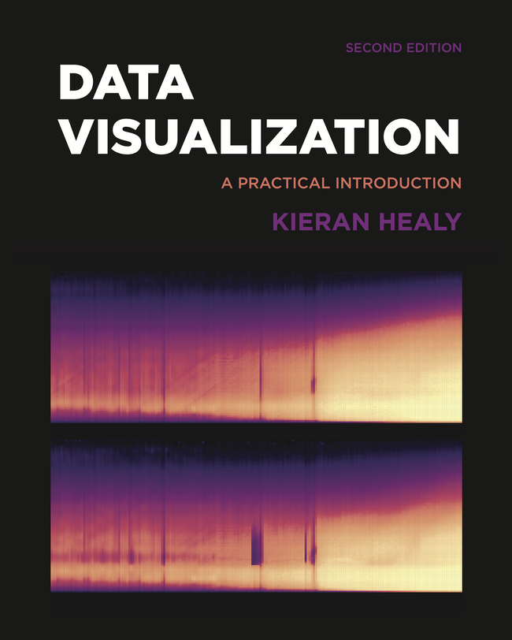
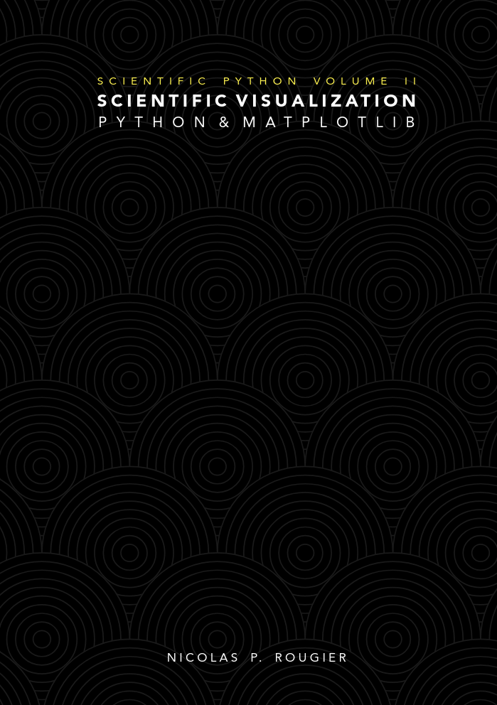

## About Me {.smaller}

:::: {.columns}

::: {.column width="60%"}

- Doctoral Lecturer at CUNY SPS 
- [Past research experience](https://scholar.google.com/citations?user=2La77skAAAAJ&hl=en):
  - Plasma physics and Applied Mathematics (NYU)
  - Ecology and Evolutionary Biology (Princeton)
- Bayesian methods and genomic data to improve
global scale ocean and climate models
- Taught math at NYU

:::

::: {.column width="40%"}

:::

::::

## People Remember Visualizations {.smaller}

- Three themes:
  - Visualizations tell a story
  - Research on visualizations
  - Design principles

## Course Website

- Brightspace to submit homework

## Course Website

- [https://georgehagstrom.github.io/DATA608Fall2026/](https://georgehagstrom.github.io/DATA608Fall2026/)

## Course Meetup

- Course Meetup: Monday 8:00-9:00PM
- [Zoom Link](
https://us02web.zoom.us/s/81858708616?pwd=eE9ZGJFco9iicq3BsmANIfWUVLwy0x.1)

## Slack Channel

:::: {.columns}
::: {.column width="50%"}
- Course slack channel for messaging and rapid communications
- [https://cuny-msds.slack.com](https://cuny-msds.slack.com)
- [Invite Link](https://join.slack.com/t/cuny-msds/shared_invite/zt-3ans1b3dz-5HhIols06wNraCMUhZ~jXw)

:::

::: {.column width="50%"}

:::

::::

## Textbooks

:::: {.columns}
::: {.column width="50%"}

1. Fundamentals of Data Visualization
  - Available free online [Wilke-dataviz](https://clauswilke.com/dataviz/)

:::

::: {.column width="50%"}

:::

::::

## Textbooks

:::: {.columns}

::: {.column width="50%"}

2. Data Visualization: A Practical Introduction
  - Available free online [Wilke-dataviz](https://socviz.co/)

:::

::: {.column width="50%"}

:::

::::

## Textbooks

:::: {.columns}
::: {.column width="50%"}

For pythonistas:

3. [Scientific Visualization: Python + Matplotlib](https://inria.hal.science/hal-03427242/document)

:::

::: {.column width="50%"}

:::
::::

## Textbooks

:::: {.columns}
::: {.column width="50%"}

Useful for the story/business framing

4. Storytelling with data
  - Available free online at Baruch-Newman library [Storytelling](https://onlinelibrary-wiley-com.remote.baruch.cuny.edu/doi/book/10.1002/9781119055259)
  
:::

::: {.column width="50%"}

:::

::::

## Textbooks

:::: {.columns}
::: {.column width="50%"}

Useful for the story/business framing

4. Storytelling with data
  - Available free online at library [Storytelling](https://onlinelibrary-wiley-com.remote.baruch.cuny.edu/doi/book/10.1002/9781119055259)
  
:::

::: {.column width="50%"}

:::
::::

## Assignments

:::: {.columns}
::: {.column width="50%"}
- 6 Lab Assignments (80\%)
- Final Project (20\%)
:::

::: {.column width="50%"}

:::
::::

## Looking forward to a great semester!

Thanks for watching

